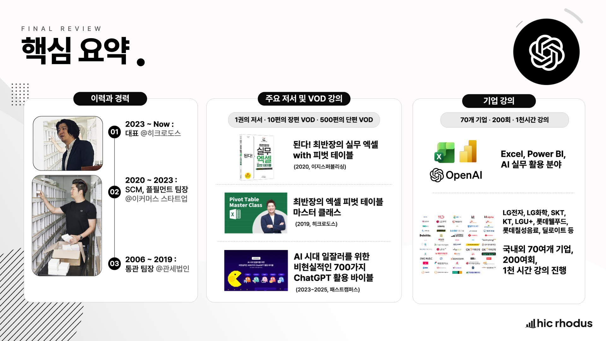
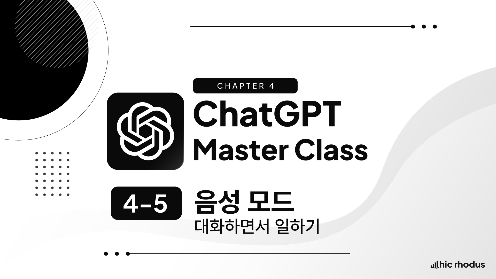

# ChatGPT 마스터 클래스 GitHub·위키독스 제작 및 운영 설명서

- 문서 버전: 1.0
- 최초 작성일: 2026-07-24
- 적용 리포지토리: `hicrhodus/ChatGPTMasterClass`
- 위키독스: https://wikidocs.net/book/20536
- 관리 주체: Hic Rhodus
- 문서 목적: 강의 콘텐츠 제작, GitHub 관리 및 위키독스 발행 작업의 표준화

## 변경 이력

| 버전 | 날짜 | 변경 내용 |
| --- | --- | --- |
| 1.0 | 2026-07-24 | 최초 작성 |

# ChatGPT 마스터 클래스 GitHub·위키독스 제작 및 운영 설명서

## 1. 문서의 목적

이 문서는 **ChatGPT 마스터 클래스** 의 강의 원고와 유튜브 영상을 GitHub에서 관리하고, 위키독스에 자동으로 발행하기 위해 지금까지 협의하고 확정한 작업 방식과 운영 원칙을 정리한 설명서입니다.

이 문서의 목적은 다음과 같습니다.

* 프로젝트의 배경과 최종 목표를 명확하게 정의합니다.
* GitHub와 위키독스의 역할을 구분합니다.
* 강의 원고를 위키독스용 책 콘텐츠로 변환하는 기준을 통일합니다.
* 페이지, 영상, 이미지, 프롬프트 등의 작성 규칙을 표준화합니다.
* 반복 작업에서 발생할 수 있는 경로, 마크다운, 동기화 오류를 예방합니다.
* 향후 GitHub 웹사이트 작업에서 VS Code 기반 작업으로 확장할 수 있는 기반을 마련합니다.
* 새로운 강의가 추가되더라도 같은 품질과 구조로 지속해서 관리할 수 있도록 합니다.

이 설명서는 단순한 업로드 절차서가 아닙니다.

**ChatGPT 마스터 클래스라는 지식 자산을 장기적으로 관리하고 발행하기 위한 콘텐츠 운영 표준** 입니다.

---

## 2. 프로젝트의 배경

### 2.1 프로젝트 대상

이 프로젝트의 대상은 최재완 강사의 온라인 VOD 강의인 **ChatGPT 마스터 클래스** 입니다.

ChatGPT 마스터 클래스는 다음과 같은 방향으로 기획되었습니다.

* ChatGPT를 처음 접하는 입문자가 무엇부터 배워야 하는지 안내합니다.
* 기능을 단편적으로 소개하는 것이 아니라 체계적인 학습 순서를 제공합니다.
* OpenAI 공식 자료와 검증 가능한 자료를 기준으로 내용을 구성합니다.
* 지나치게 기술적인 LLM 이론보다는 실제 사용에 필요한 개념과 기능에 집중합니다.
* ChatGPT를 단순한 질문·답변 도구가 아니라 업무 생산성을 높이는 AI 협업 도구로 활용하도록 돕습니다.
* 강의 영상을 시청하면서 함께 참고할 수 있는 읽기 자료를 제공합니다.

### 2.2 기존 콘텐츠의 성격

기존 강의별 콘텐츠는 주로 다음 자료를 기반으로 제작되었습니다.

1. 강의 제작 전 조사한 원본 지식 자산
2. 강의 촬영을 위해 각색한 대본
3. 실제 편집된 영상의 자막 또는 스크립트
4. 영상 강의의 보조 자료로 작성된 HTML 게시물
5. 강의용 프롬프트와 실습 자료
6. 유튜브에 게시된 최종 강의 영상

기존 HTML 자료는 영상 강의를 보조하기 위한 게시물이었기 때문에, 그대로 책으로 옮기기에는 다음과 같은 한계가 있었습니다.

* 영상 설명에 의존하는 부분이 있었습니다.
* 이미지가 없으면 내용이 완결되지 않는 부분이 있었습니다.
* 화면 캡처나 영상 진행 순서를 기준으로 작성된 문장이 있었습니다.
* 촬영용 멘트와 독자용 설명이 혼재되어 있었습니다.
* 페이지마다 구성과 깊이가 균일하지 않았습니다.
* 책처럼 연속해서 읽을 때는 내용의 흐름이 충분하지 않았습니다.

따라서 기존 HTML을 그대로 복사하는 것이 아니라, **온라인 책으로 읽어도 내용이 완결되는 형태로 재구성**하기로 했습니다.

---

## 3. 프로젝트의 최종 목표

이 프로젝트의 최종 목표는 다음과 같습니다.

> ChatGPT 마스터 클래스의 강의 원고, 실습 프롬프트, 유튜브 영상을 GitHub에서 체계적으로 관리하고, 위키독스에 자동으로 동기화하여 무료 온라인 교재로 발행한다.

현재 공개된 위키독스 책 주소는 다음과 같습니다.

<pre><code>https://wikidocs.net/book/20536</code></pre>

GitHub 리포지토리는 다음과 같습니다.

<pre><code>hicrhodus/ChatGPTMasterClass</code></pre>

장기적으로는 다음과 같은 확장도 고려합니다.

* 새로운 강의가 추가될 때 기존 구조에 맞춰 페이지를 계속 추가합니다.
* 강의 내용이 변경되면 GitHub에서 수정 이력을 관리합니다.
* ChatGPT 기능이 업데이트되면 관련 페이지만 선택적으로 개정합니다.
* 이미지, 영상, 프롬프트 등 강의 자산을 일관된 규칙으로 관리합니다.
* 향후 출판 제안이 들어오면 온라인 원고를 출판용 원고의 기반으로 활용합니다.
* GitHub 웹사이트 중심의 작업에서 VS Code 기반 로컬 편집 방식으로 확장합니다.

---

## 4. GitHub와 위키독스의 역할

### 4.1 GitHub의 역할

GitHub는 이 프로젝트에서 다음 역할을 담당합니다.

* 모든 마크다운 원고를 저장합니다.
* 이미지 파일을 저장합니다.
* 책의 목차 구조를 관리합니다.
* 파일명과 페이지 경로를 관리합니다.
* 모든 변경 이력을 기록합니다.
* 잘못 수정했을 때 이전 버전을 확인하거나 복구할 수 있게 합니다.
* 향후 여러 사람이 협업할 수 있는 기반을 제공합니다.
* 위키독스에 전달할 원본 저장소 역할을 합니다.

즉, GitHub는 **원고 저장소이자 버전 관리 시스템** 입니다.

### 4.2 위키독스의 역할

위키독스는 다음 역할을 담당합니다.

* 독자에게 최종 책 형태로 콘텐츠를 보여줍니다.
* GitHub의 마크다운 파일을 페이지로 변환합니다.
* `TOC.md` 를 기준으로 책의 계층 구조를 생성합니다.
* `README.md` 의 내용을 책 소개 또는 요약으로 사용합니다.
* GitHub의 이미지 경로를 위키독스 이미지 주소로 변환합니다.
* 유튜브 iframe을 실제 영상 플레이어로 표시합니다.
* 공개·비공개, 저작권, 광고 등의 책 설정을 관리합니다.

즉, 위키독스는 **최종 발행 및 독자 열람 플랫폼** 입니다.

### 4.3 두 서비스의 렌더링 차이

GitHub와 위키독스는 같은 마크다운 파일을 사용하지만, 모든 요소가 동일하게 보이지는 않습니다.

대표적인 차이는 유튜브 iframe입니다.

위키독스에서는 아래 iframe이 영상 플레이어로 표시됩니다.

<pre><code>&lt;iframe width="560" height="315" src="https://www.youtube.com/embed/영상ID" title="YouTube video player" frameborder="0" allow="accelerometer; autoplay; clipboard-write; encrypted-media; gyroscope; picture-in-picture; web-share" referrerpolicy="strict-origin-when-cross-origin" allowfullscreen&gt;&lt;/iframe&gt;</code></pre>

그러나 GitHub에서는 보안 정책 때문에 iframe이 영상 플레이어로 렌더링되지 않을 수 있습니다.

따라서 이 프로젝트의 판정 기준은 다음과 같습니다.

| 요소         | 최종 확인 기준                  |
| ---------- | ------------------------- |
| 일반 마크다운    | GitHub와 위키독스 모두 확인        |
| 이미지        | GitHub와 위키독스 모두 확인        |
| 유튜브 iframe | 위키독스 최종 화면을 기준으로 확인       |
| 책 목차와 계층   | 위키독스 최종 화면을 기준으로 확인       |
| 파일 경로와 링크  | GitHub 원본과 위키독스 결과를 모두 확인 |

GitHub 화면은 원고와 경로를 확인하는 용도이고, 최종 독자 경험은 위키독스에서 확인합니다.

---

## 5. 현재 작업 환경

### 5.1 현재 작업 방식

현재는 다음 환경에서 작업합니다.

* GitHub 웹사이트에서 직접 파일을 작성하고 수정합니다.
* 별도의 GitHub Desktop은 설치하지 않았습니다.
* VS Code 또는 Cursor도 아직 설치하지 않았습니다.
* 변경 후 GitHub 웹사이트에서 직접 커밋합니다.
* GitHub push 또는 커밋 이후 위키독스에서 자동 동기화 결과를 확인합니다.

### 5.2 향후 확장 방향

현재 프로젝트가 안정적으로 완성된 이후 다음 단계로 확장할 수 있습니다.

1. Git 설치
2. GitHub Desktop 설치
3. VS Code 설치
4. GitHub 리포지토리 로컬 복제
5. 여러 마크다운 파일 동시 편집
6. 이미지 일괄 관리
7. 로컬 마크다운 미리보기
8. 변경 사항 일괄 커밋 및 push
9. 브랜치와 Pull Request 기반 실험

그러나 현재 단계에서는 GitHub 사용 경험을 안정적으로 쌓는 것을 우선하며, 무리하게 로컬 환경으로 전환하지 않습니다.

---

## 6. 역할과 책임

### 6.1 최재완 강사의 역할

최재완 강사는 다음 작업을 수행합니다.

* 원본 KA, HTML, 영상 스크립트 등 강의 자료를 제공합니다.
* 페이지 파일명과 유튜브 iframe을 제공합니다.
* 제공된 위키독스용 원고를 검토합니다.
* GitHub 웹사이트에서 마크다운 파일에 원고를 붙여넣습니다.
* 변경 사항을 커밋합니다.
* 이미지 파일을 준비하고 GitHub에 업로드합니다.
* 이미지의 삽입 위치와 대체 텍스트를 최종 결정합니다.
* 위키독스에서 실제 렌더링 결과를 확인합니다.
* 강의 내용의 사실성과 교육 방향을 최종 승인합니다.

### 6.2 ChatGPT의 역할

ChatGPT는 다음 작업을 지원합니다.

* KA와 HTML 원고를 통합 분석합니다.
* 영상 강의용 원고를 책용 콘텐츠로 재구성합니다.
* 강의마다 완결된 마크다운 본문을 작성합니다.
* 제목과 본문 섹션에 일관된 넘버링을 적용합니다.
* 실습 프롬프트를 복사하기 쉬운 블록으로 변환합니다.
* 유튜브 iframe을 본문 마지막에 배치합니다.
* GitHub와 위키독스 경로 오류를 진단합니다.
* 커밋 메시지를 제안합니다.
* 이미지 삽입용 마크다운 코드를 작성합니다.
* GitHub 초보자가 따라갈 수 있도록 작업을 한 단계씩 안내합니다.

ChatGPT는 GitHub 계정에 직접 로그인하거나 사용자를 대신해 커밋하지 않습니다.

실제 GitHub 편집과 커밋은 최재완 강사가 수행하며, ChatGPT는 절차와 코드를 제공합니다.

---

## 7. 리포지토리의 표준 구조

현재 리포지토리는 다음 구조를 사용합니다.

<pre><code>ChatGPTMasterClass/
├── README.md
├── TOC.md
├── assets/
│   ├── ChatGPT_3Dbook.png
│   ├── 01-1-1_flow.jpg
│   ├── 04-5-2_Intro.jpg
│   └── ...
└── pages/
    ├── 01-1-instructor-intro.md
    ├── 01-2-course-overview.md
    ├── 02-1-hello-chatgpt.md
    ├── 02-2-signup-and-plans.md
    ├── 02-3-chatgpt-ui.md
    ├── 02-4-custom-instructions.md
    ├── 02-5-memory.md
    ├── 03-1-prompt.md
    ├── 03-2-prompt-engineering.md
    ├── 03-3-markdown-basics.md
    ├── 03-4-prompt-framework.md
    ├── 04-1-chat-management.md
    ├── 04-2-group-chats.md
    ├── 04-3-temporary-chat.md
    ├── 04-4-voice-dictation.md
    └── 04-5-voice-mode.md</code></pre>

### 7.1 `README.md`

`README.md` 는 책의 소개와 요약을 담당합니다.

위키독스에서는 `README.md` 의 첫 번째 제목을 제외한 내용이 책 요약으로 사용될 수 있습니다.

따라서 `README.md` 에는 다음 내용을 중심으로 작성합니다.

* 책 소개
* 학습 대상
* 학습 목표
* 제작 정보

`README.md` 에는 이미지를 넣지 않는 것을 기본 원칙으로 합니다.

GitHub에서는 이미지가 정상적으로 보이더라도, 위키독스의 책 요약 영역에서는 이미지 마크다운이 텍스트로 표시될 수 있기 때문입니다.

### 7.2 `TOC.md`

`TOC.md` 는 위키독스 책의 목차와 페이지 계층을 정의합니다.

예시는 다음과 같습니다.

<pre><code># 목차

- [01. 시작하기](pages/01-start.md)
  - [01-1. 강사 소개](pages/01-1-instructor-intro.md)
  - [01-2. ChatGPT 마스터 클래스 소개](pages/01-2-course-overview.md)
- [02. ChatGPT 시작하기](pages/02-start.md)
  - [02-1. 안녕? ChatGPT?](pages/02-1-hello-chatgpt.md)
  - [02-2. 회원가입과 플랜](pages/02-2-signup-and-plans.md)</code></pre>

위키독스는 페이지 제목을 알파벳순으로 자동 정렬할 수 있으므로, 원하는 순서를 유지하기 위해 제목에 번호를 붙입니다.

### 7.3 `pages/`

`pages/` 폴더에는 실제 강의별 본문이 들어갑니다.

기본 원칙은 다음과 같습니다.

> 강의 한 개를 마크다운 페이지 한 개로 구성합니다.

이 구조를 사용하면 다음 장점이 있습니다.

* 특정 강의만 수정하기 쉽습니다.
* 유튜브 영상과 본문을 일대일로 대응시킬 수 있습니다.
* 이미지도 강의 번호 기준으로 관리할 수 있습니다.
* 변경 이력을 강의별로 추적할 수 있습니다.
* 목차를 강의 커리큘럼과 동일하게 구성할 수 있습니다.

### 7.4 `assets/`

`assets/` 폴더에는 이미지 파일을 저장합니다.

다음과 같은 파일이 포함될 수 있습니다.

* 강의 표지
* 강의 흐름도
* ChatGPT 화면 캡처
* 기능 설명 화면
* 실습 전후 비교 이미지
* 요약 장표
* 3D 책 표지 이미지

GitHub에서는 빈 폴더를 저장할 수 없으므로 처음에는 `.gitkeep` 파일을 사용해 폴더를 만들었습니다.

이미지 파일이 업로드된 이후에는 `.gitkeep` 파일을 삭제해도 됩니다.

---

## 8. 파일명 작성 원칙

### 8.1 마크다운 페이지 파일명

페이지 파일명은 다음 구조를 사용합니다.

<pre><code>강의번호-영문-주제.md</code></pre>

예시는 다음과 같습니다.

<pre><code>02-4-custom-instructions.md
03-2-prompt-engineering.md
04-4-voice-dictation.md</code></pre>

파일명 작성 원칙은 다음과 같습니다.

* 영문 소문자를 사용합니다.
* 단어 사이에는 하이픈을 사용합니다.
* 공백은 사용하지 않습니다.
* 한글 파일명은 피합니다.
* 특수문자는 피합니다.
* 강의 번호를 파일명 앞에 넣습니다.
* 파일명과 `TOC.md` 의 링크를 정확히 일치시킵니다.

### 8.2 이미지 파일명

이미지 파일명은 강의 번호와 이미지 순서를 포함합니다.

현재 실제 파일명 예시는 다음과 같습니다.

<pre><code>01-1-1_flow.jpg
04-5-2_Intro.jpg</code></pre>

장기적으로 권장하는 형식은 다음과 같습니다.

<pre><code>강의번호-두자리순번-간단설명.확장자</code></pre>

예시는 다음과 같습니다.

<pre><code>01-1-01-flow.jpg
04-5-02-intro.jpg
04-5-03-voice-mode-ui.jpg</code></pre>

다만 이미 많은 이미지가 현재 방식으로 정리되어 있다면, 무리하게 모두 변경하지 않아도 됩니다.

가장 중요한 원칙은 다음과 같습니다.

* 실제 업로드된 파일명과 마크다운 경로가 정확히 일치해야 합니다.
* 대소문자를 구분해야 합니다.
* 하이픈과 언더스코어를 구분해야 합니다.
* 확장자 `.jpg`, `.jpeg`, `.png` 를 정확히 입력해야 합니다.

다음 파일은 서로 다른 파일로 취급될 수 있습니다.

<pre><code>04-5-2_Intro.jpg
04-5-2_intro.jpg
04-5-2-Intro.jpg
04-5-2_Intro.png</code></pre>

---

## 9. 콘텐츠 원본과 변환 기준

### 9.1 사용할 수 있는 원본 자료

강의 페이지를 작성할 때 사용할 수 있는 원본 자료는 다음과 같습니다.

1. KA 또는 원본 지식 자산
2. 강의 촬영 대본
3. 실제 편집 영상의 스크립트
4. 기존 HTML 게시물
5. 강의용 프롬프트
6. 실습 자료
7. 최종 유튜브 영상
8. 공식 OpenAI 문서와 검증 가능한 참고 자료

### 9.2 원본 자료의 역할

각 자료는 역할이 다릅니다.

| 자료       | 주요 역할                |
| -------- | -------------------- |
| KA       | 개념적 완결성과 사실 관계 보완    |
| 촬영 대본    | 강의의 설명 순서와 교육 의도 파악  |
| 영상 스크립트  | 실제 강의에서 최종 전달된 표현 파악 |
| HTML 게시물 | 기존 설명, 표, 실습, 예시 활용  |
| 유튜브 영상   | 최종 강의와 페이지 연결        |
| 공식 자료    | 변경 가능성이 있는 기능과 정책 검증 |

### 9.3 KA와 HTML의 통합 원칙

강의 페이지는 KA와 HTML 중 하나만 기계적으로 복사하지 않습니다.

다음 방식으로 통합합니다.

* HTML의 실제 강의 흐름과 설명 방식을 기본 골격으로 사용합니다.
* KA를 활용해 빠진 개념이나 배경 설명을 보완합니다.
* 영상에서 최종적으로 사용된 표현과 예시를 우선합니다.
* 촬영용 인사말, 카메라 지시, 화면 전환 메모 등은 제거합니다.
* 책에서 혼자 읽어도 이해되도록 연결 문장을 추가합니다.
* 중복되는 내용은 통합합니다.
* 강의의 범위를 벗어나는 불필요한 확장은 피합니다.
* 자료에 없는 내용을 사실처럼 추가하지 않습니다.
* 시점에 따라 변할 수 있는 기능은 공식 자료를 확인합니다.

---

## 10. 책용 콘텐츠로 변환하는 핵심 원칙

### 10.1 영상 보조 자료가 아니라 독립적인 읽기 콘텐츠로 작성

위키독스 페이지는 영상의 자막 복사본이 아닙니다.

영상 없이 페이지를 읽더라도 다음이 가능해야 합니다.

* 강의의 핵심 개념을 이해할 수 있어야 합니다.
* 기능의 목적과 사용 상황을 이해할 수 있어야 합니다.
* 실습 절차를 따라 할 수 있어야 합니다.
* 실무에서 언제 사용할지 판단할 수 있어야 합니다.
* 핵심 내용을 다시 확인할 수 있어야 합니다.

### 10.2 한 페이지 안에서 내용 완결

각 강의 페이지는 가능한 한 하나의 완결된 학습 단위로 작성합니다.

다음 페이지를 반드시 봐야만 현재 페이지가 이해되는 방식은 피합니다.

단, 다른 강의에서 자세히 다룰 내용은 간단히 소개할 수 있습니다.

예시는 다음과 같습니다.

> 메모리 관리 방법은 다음 강의에서 더 자세히 살펴봅니다.

그러나 별도의 `다음 강의` 섹션은 만들지 않습니다.

### 10.3 입문자 중심의 설명

강의 대상은 ChatGPT 입문자를 포함합니다.

따라서 다음 원칙을 적용합니다.

* 처음 등장하는 용어는 설명합니다.
* 영문 명칭이 필요한 경우 한글과 함께 씁니다.
* 지나친 기술 이론은 줄입니다.
* 기능 자체보다 언제, 왜 사용하는지를 설명합니다.
* 실제 업무 예시를 포함합니다.
* 초보자가 따라 할 수 있는 절차를 제공합니다.

### 10.4 실무 활용 중심

가능한 경우 다음 내용을 포함합니다.

* 실제 업무 상황
* 일반적인 문제
* ChatGPT 활용 방법
* 추천 프롬프트
* 결과 확인 기준
* 보안과 주의사항
* 반복 업무로 확장하는 방법

### 10.5 변화하는 기능에 대한 작성 방식

ChatGPT의 화면, 플랜, 모델명, 버튼 위치는 바뀔 수 있습니다.

따라서 다음 원칙을 사용합니다.

* 특정 버튼 위치만 암기하도록 쓰지 않습니다.
* 기능의 목적과 개념을 함께 설명합니다.
* 화면이나 메뉴 이름이 바뀔 수 있음을 필요한 경우 알립니다.
* 가격과 플랜 정보는 작성 시점의 공식 정보를 기준으로 합니다.
* 고정 가격을 강조하기보다 플랜의 선택 기준을 설명합니다.
* 모델명을 외우기보다 모델 선택기의 역할을 설명합니다.

---

## 11. 페이지의 표준 구성

강의 페이지는 다음 구조를 기본으로 사용합니다.

<pre><code># 강의번호. 강의 제목

## 1. 이 강의에서 배울 내용

## 2. 개요 또는 문제 상황

## 3. 핵심 개념

## 4. 기능 또는 사용 방법

## 5. 주요 예시

## 6. 실무 활용 방법

## 7. 주의사항

## 8. 실습하기

## 9. 실습 완료 기준

## 10. 핵심 정리

## 11. 영상으로 학습하기

&lt;iframe ...&gt;&lt;/iframe&gt;</code></pre>

모든 페이지가 반드시 완전히 같은 섹션 수를 가져야 하는 것은 아닙니다.

강의 내용에 맞춰 섹션을 추가하거나 줄일 수 있습니다.

다만 다음 항목은 가능한 한 일관되게 유지합니다.

* 이 강의에서 배울 내용
* 핵심 설명
* 실습 또는 활용 예시
* 핵심 정리
* 영상으로 학습하기

---

## 12. 본문 제목과 넘버링 규칙

### 12.1 페이지 제목

페이지의 첫 번째 제목은 강의 번호와 강의 제목을 함께 씁니다.

<pre><code># 04-4. 음성 입력: 긴 프롬프트 빠르게 만들기</code></pre>

### 12.2 주요 섹션

주요 섹션은 숫자로 넘버링합니다.

<pre><code>## 1. 이 강의에서 배울 내용
## 2. 음성 입력이 필요한 이유
## 3. 음성 입력이란 무엇인가</code></pre>

### 12.3 하위 섹션

하위 섹션은 상위 번호를 이어서 작성합니다.

<pre><code>### 5.1 음성 입력 실행하기
### 5.2 전송 전 검수하기</code></pre>

### 12.4 넘버링의 목적

넘버링은 다음 목적을 가집니다.

* 긴 페이지에서 현재 위치를 쉽게 파악하게 합니다.
* 영상 강의의 구조와 페이지를 연결하기 쉽게 합니다.
* 특정 내용을 다시 찾기 쉽게 합니다.
* 독자가 학습 순서를 이해하게 합니다.
* 페이지 간 구조를 통일합니다.

---

## 13. 포함하지 않는 요소

다음 요소는 위키독스 본문에 포함하지 않습니다.

### 13.1 YAML 또는 메타데이터

아래와 같은 정보는 본문에 포함하지 않습니다.

<pre><code>---
title: 강의 제목
date: 2026-07-01
category: ChatGPT
---</code></pre>

### 13.2 영상 삽입용 임시 문구

다음과 같은 placeholder는 포함하지 않습니다.

<pre><code>&lt;!-- 영상 삽입 영역 --&gt;</code></pre>

유튜브 영상은 최종 iframe으로 직접 넣습니다.

### 13.3 강의 자료 다운로드 섹션

`강의 자료 다운로드` 섹션은 포함하지 않습니다.

수강생에게 제공할 별도 파일은 다른 방식으로 관리합니다.

### 13.4 다음 강의 섹션

`다음 강의` 섹션은 포함하지 않습니다.

위키독스의 목차와 페이지 이동 기능을 사용합니다.

### 13.5 이미지 후보 또는 이미지 주석

본문 작성 단계에서는 다음 내용을 넣지 않습니다.

* 이미지 삽입 후보
* 이미지 위치 제안
* 이미지 설명용 주석
* `여기에 이미지 삽입`
* 기존 HTML의 `!image.png`
* 촬영용 이미지 메모

텍스트를 먼저 완결한 뒤 이미지 작업을 별도 단계에서 진행합니다.

---

## 14. 텍스트 우선 제작 원칙

이 프로젝트에서 가장 중요한 작업 순서는 다음과 같습니다.

> 먼저 모든 페이지의 텍스트를 완결한 뒤, 전체 텍스트 입력이 끝난 다음 이미지 삽입을 진행한다.

이 방식을 선택한 이유는 다음과 같습니다.

* 이미지가 없어도 설명이 완결되도록 할 수 있습니다.
* 이미지 위치 때문에 글의 논리 구조가 흔들리는 것을 막습니다.
* 콘텐츠 검수와 이미지 검수를 분리할 수 있습니다.
* 이미지 파일명과 경로를 일괄적으로 관리할 수 있습니다.
* 이미지 없이도 검색과 접근성이 유지됩니다.
* 향후 이미지가 교체되더라도 본문 구조를 유지할 수 있습니다.

따라서 강의 페이지 작성 단계에서는 이미지 관련 내용을 본문에 넣지 않았습니다.

이미지 파일을 모두 준비한 뒤 두 번째 단계에서 실제 위치를 검토하고 삽입합니다.

---

## 15. 프롬프트 블록 작성 규칙

### 15.1 프롬프트의 목적

강의에서 사용하는 프롬프트는 독자가 쉽게 복사해서 ChatGPT에 붙여넣을 수 있어야 합니다.

따라서 본문과 명확하게 구분되는 블록으로 제공합니다.

### 15.2 위키독스 호환 방식

일반적인 마크다운 코드 블록에 임의의 `id` 속성이 붙으면 위키독스에서 코드 블록이 닫히지 않는 문제가 발생했습니다.

문제가 되었던 형식은 다음과 같습니다.

<pre><code>```text id="n54tdy"
프롬프트
```</code></pre>

위키독스 파서가 `id="..."` 부분을 정상적으로 해석하지 못하면, 이후 본문 전체가 코드처럼 표시될 수 있습니다.

따라서 이 프로젝트에서는 프롬프트 블록에 임의의 `id` 속성을 사용하지 않습니다.

현재 가장 안정적으로 사용한 형식은 다음과 같습니다.

<pre><code>&lt;pre&gt;&lt;code&gt;프롬프트 내용&lt;/code&gt;&lt;/pre&gt;</code></pre>

실제 원고에서는 아래와 같이 작성합니다.

<pre><code>&lt;pre&gt;&lt;code&gt;나는 영업기획팀 담당자입니다.

이번 달 영업 실적을 임원 보고용으로 요약해 주세요.

출력 형식:
1. 핵심 요약
2. 주요 이슈
3. 다음 달 대응 계획&lt;/code&gt;&lt;/pre&gt;</code></pre>

### 15.3 프롬프트 블록의 작성 원칙

* 복사해야 하는 내용만 블록 안에 넣습니다.
* 설명 문장은 블록 밖에 씁니다.
* 불필요한 언어 지정자를 붙이지 않습니다.
* 임의의 `id` 속성을 넣지 않습니다.
* 프롬프트의 줄바꿈과 목록 구조를 유지합니다.
* 실제 회사명이나 개인정보가 필요한 예시는 가상 정보로 바꿉니다.
* 긴 프롬프트는 역할, 상황, 조건, 출력 형식으로 구조화합니다.

---

## 16. 유튜브 영상 삽입 규칙

### 16.1 영상의 위치

유튜브 영상은 반드시 본문 맨 마지막에 배치합니다.

섹션 이름은 다음과 같이 통일합니다.

<pre><code>## 마지막번호. 영상으로 학습하기</code></pre>

`영상으로 복습하기`라는 표현은 사용하지 않습니다.

### 16.2 임베드 방식

공유용 URL이 아니라 iframe 형식을 사용합니다.

공유용 URL 예시:

<pre><code>https://youtu.be/SD_-NsZ1x2M</code></pre>

이 주소는 링크로 이동할 때 사용하는 주소입니다.

위키독스 본문에는 아래와 같은 embed 주소를 사용합니다.

<pre><code>&lt;iframe width="560" height="315" src="https://www.youtube.com/embed/SD_-NsZ1x2M?si=..." title="YouTube video player" frameborder="0" allow="accelerometer; autoplay; clipboard-write; encrypted-media; gyroscope; picture-in-picture; web-share" referrerpolicy="strict-origin-when-cross-origin" allowfullscreen&gt;&lt;/iframe&gt;</code></pre>

### 16.3 GitHub 표시 문제

GitHub에서는 iframe이 영상으로 보이지 않거나 URL·HTML처럼 표시될 수 있습니다.

이는 오류가 아니라 GitHub의 HTML 보안 정책 때문입니다.

최종 판정 기준은 다음과 같습니다.

* GitHub에서 iframe 코드가 저장되어 있는지 확인합니다.
* 위키독스에서 영상이 실제로 재생 가능한 상태로 보이는지 확인합니다.

---

## 17. 이미지 관리 원칙

### 17.1 이미지 저장 위치

모든 이미지는 리포지토리 최상위의 `assets/` 폴더에 저장합니다.

올바른 경로:

<pre><code>assets/01-1-1_flow.jpg</code></pre>

잘못된 경로:

<pre><code>pages/assets/01-1-1_flow.jpg
assets/assets/01-1-1_flow.jpg</code></pre>

### 17.2 이미지 업로드 방식

현재 GitHub 웹사이트에서 이미지를 업로드할 때는 다음 순서를 사용합니다.

1. GitHub 리포지토리의 `assets` 폴더로 들어갑니다.
2. `Add file`을 누릅니다.
3. `Upload files`를 선택합니다.
4. PC의 이미지 폴더를 엽니다.
5. 폴더 자체가 아니라 이미지 파일들을 전체 선택합니다.
6. 업로드 영역으로 드래그합니다.
7. 업로드된 파일 목록을 확인합니다.
8. 커밋 메시지를 입력합니다.
9. `Commit changes`를 실행합니다.

GitHub의 `assets` 폴더 안에서 PC의 `assets` 폴더 자체를 업로드하면 다음과 같은 중복 경로가 생길 수 있습니다.

<pre><code>assets/assets/파일명.jpg</code></pre>

따라서 GitHub의 `assets` 폴더 안에서는 이미지 파일만 선택해 업로드합니다.

### 17.3 페이지에서의 이미지 경로

`pages/` 폴더 안의 마크다운 문서는 `assets/` 폴더보다 한 단계 아래에 있습니다.

따라서 다음 경로를 사용합니다.

<pre><code></code></pre>

예시:

<pre><code></code></pre>

경로의 의미는 다음과 같습니다.

* `..` : 현재 `pages/` 폴더에서 한 단계 위로 이동
* `/assets/` : 최상위의 `assets` 폴더로 이동
* `파일명.jpg` : 실제 이미지 파일 선택

### 17.4 경로에서 자주 발생하는 오류

잘못된 예시:

<pre><code></code></pre>

`..` 뒤에 `/`가 빠졌습니다.

올바른 예시:

<pre><code></code></pre>

### 17.5 `README.md` 의 이미지 경로

GitHub의 `README.md` 는 `assets/` 폴더와 같은 최상위 경로에 있습니다.

GitHub에서 이미지를 표시하려면 다음과 같이 작성할 수 있습니다.

<pre><code></code></pre>

또는 다음과 같이 작성할 수 있습니다.

<pre><code></code></pre>

그러나 위키독스의 책 요약 영역에서는 이미지가 정상 렌더링되지 않고 텍스트처럼 보일 수 있습니다.

따라서 `README.md` 에는 이미지를 넣지 않는 것을 기본 원칙으로 합니다.

3D 책 표지 이미지를 사용하려면 `pages/` 안의 실제 페이지에 삽입합니다.

### 17.6 대체 텍스트

마크다운 이미지 문법의 대괄호 안 문장은 대체 텍스트입니다.

<pre><code></code></pre>

예시:

<pre><code></code></pre>

대체 텍스트는 다음 역할을 합니다.

* 이미지가 로딩되지 않을 때 대신 표시됩니다.
* 스크린 리더가 이미지 내용을 설명할 때 사용합니다.
* 검색엔진과 문서 시스템이 이미지의 의미를 이해하는 데 도움을 줍니다.
* 원고 편집자가 어떤 이미지인지 식별할 수 있게 합니다.

좋은 대체 텍스트는 다음 조건을 충족합니다.

* 이미지의 핵심 내용을 짧게 설명합니다.
* `이미지`, `사진` 같은 불필요한 표현은 줄입니다.
* 같은 페이지에서 중복되지 않게 작성합니다.
* 강의 번호나 파일명보다 실제 의미를 설명합니다.

---

## 18. Excel을 활용한 이미지 마크다운 코드 생성

이미지 수가 많을 경우 Excel을 사용해 마크다운 코드를 일괄 생성할 수 있습니다.

### 18.1 A열에 대체 텍스트, B열에 전체 경로가 있는 경우

* A2: 대체 텍스트
* B2: 이미지 경로
* C2: 마크다운 코드

C2 수식:

<pre><code>=""</code></pre>

빈 셀을 처리하려면 다음 수식을 사용합니다.

<pre><code>=IF(OR(A2="",B2=""),"","")</code></pre>

### 18.2 B열에 파일명만 있는 경우

B2에 다음과 같이 파일명만 입력했다고 가정합니다.

<pre><code>01-1-7_summary.jpg</code></pre>

C2 수식:

<pre><code>=IF(OR(A2="",B2=""),"","")</code></pre>

생성 결과:

<pre><code></code></pre>

이 방식을 사용하면 많은 이미지의 마크다운 코드를 빠르게 만들 수 있습니다.

---

## 19. GitHub 웹사이트에서 페이지 수정하기

### 19.1 기본 수정 절차

1. GitHub 리포지토리로 이동합니다.
2. `pages` 폴더를 엽니다.
3. 수정할 마크다운 파일을 선택합니다.
4. 연필 모양의 `Edit this file`을 누릅니다.
5. 기존 내용을 선택합니다.
6. 제공된 완성 원고로 덮어씁니다.
7. `Preview` 탭에서 가능한 부분을 확인합니다.
8. 아래로 이동해 커밋 메시지를 입력합니다.
9. `Commit changes`를 누릅니다.
10. 위키독스 동기화 결과를 확인합니다.

### 19.2 커밋 메시지 작성

커밋 메시지는 변경 목적을 짧게 설명합니다.

강의 본문 작성 예시:

<pre><code>Update voice mode lesson</code></pre>

마크다운 오류 수정 예시:

<pre><code>Fix custom instructions markdown</code></pre>

이미지 추가 예시:

<pre><code>Add instructor intro images</code></pre>

경로 수정 예시:

<pre><code>Fix course overview file path</code></pre>

목차 수정 예시:

<pre><code>Update TOC course overview link</code></pre>

이미지 일괄 업로드 예시:

<pre><code>Upload lesson images</code></pre>

커밋 메시지는 완벽한 영어 문장일 필요는 없지만, 나중에 변경 이유를 알 수 있어야 합니다.

---

## 20. 파일명 변경과 경로 이동

### 20.1 파일명 변경 시 주의점

GitHub 웹사이트에서 `pages/` 폴더 안의 파일을 편집하는 상태에서 파일명 입력칸에 다시 `pages/` 를 포함하면 다음과 같은 중복 경로가 생길 수 있습니다.

<pre><code>pages/pages/01-2-course-overview.md</code></pre>

이는 현재 위치가 이미 `pages/` 폴더이기 때문입니다.

### 20.2 상위 폴더로 이동하는 방법

잘못 생성된 파일을 한 단계 위로 이동할 때 파일명 앞에 `../` 를 입력할 수 있습니다.

현재 경로:

<pre><code>pages/pages/01-2-course-overview.md</code></pre>

파일명 입력칸:

<pre><code>../01-2-course-overview.md</code></pre>

결과:

<pre><code>pages/01-2-course-overview.md</code></pre>

### 20.3 파일명 변경 후 반드시 확인할 항목

파일명을 변경했다면 `TOC.md` 의 링크도 수정해야 합니다.

기존:

<pre><code>- [01-2. ChatGPT 마스터 클래스 소개](pages/01-course-overview.md)</code></pre>

변경:

<pre><code>- [01-2. ChatGPT 마스터 클래스 소개](pages/01-2-course-overview.md)</code></pre>

파일과 `TOC.md` 링크가 다르면 위키독스 페이지 연결이 끊길 수 있습니다.

---

## 21. 위키독스 동기화 확인 절차

GitHub에서 커밋한 후 다음을 확인합니다.

### 21.1 기본 동기화

GitHub 커밋 또는 push가 완료되면 위키독스 웹훅이 변경을 감지해 자동으로 동기화합니다.

### 21.2 자동 반영이 늦는 경우

즉시 반영되지 않는 경우 다음 절차를 사용합니다.

1. 위키독스에 로그인합니다.
2. 책 수정 화면으로 이동합니다.
3. GitHub 연동 탭으로 이동합니다.
4. `지금 동기화` 버튼을 누릅니다.
5. 페이지를 새로고침합니다.
6. 변경 내용을 다시 확인합니다.

### 21.3 동기화 후 확인할 항목

* 페이지 제목이 올바른가?
* 목차 순서가 올바른가?
* 페이지가 올바른 상위 항목 아래에 있는가?
* 본문이 코드 블록처럼 깨지지 않았는가?
* 표가 정상적으로 보이는가?
* 이미지가 표시되는가?
* 이미지 대체 텍스트가 적절한가?
* 유튜브 영상이 임베드되는가?
* 다음 페이지 섹션이 포함되지 않았는가?
* 영상 섹션이 본문 맨 마지막에 있는가?

---

## 22. 품질 검수 체크리스트

각 페이지를 완성한 뒤 다음 항목을 확인합니다.

### 22.1 구조 검수

* [ ] 페이지 첫 줄에 강의 번호와 제목이 있는가?
* [ ] 주요 섹션에 넘버링이 적용되었는가?
* [ ] `이 강의에서 배울 내용`이 포함되어 있는가?
* [ ] 페이지가 독립적으로 읽어도 이해되는가?
* [ ] 내용 순서가 자연스러운가?
* [ ] 중복 설명이 지나치게 많지 않은가?
* [ ] `핵심 정리`가 포함되어 있는가?
* [ ] `영상으로 학습하기`가 맨 마지막에 있는가?

### 22.2 콘텐츠 검수

* [ ] KA와 HTML의 핵심 내용이 반영되었는가?
* [ ] 영상의 최종 설명 방향과 충돌하지 않는가?
* [ ] 자료에 없는 내용을 사실처럼 추가하지 않았는가?
* [ ] 입문자가 이해하기 어려운 용어가 설명되어 있는가?
* [ ] 실무 예시가 강의 주제와 직접 연결되는가?
* [ ] 기능의 목적과 사용 상황이 설명되어 있는가?
* [ ] 보안 또는 개인정보 주의사항이 필요한 경우 포함되어 있는가?

### 22.3 프롬프트 검수

* [ ] 프롬프트가 복사하기 쉬운 블록으로 되어 있는가?
* [ ] 코드 블록에 `id="..."` 속성이 없는가?
* [ ] 프롬프트 안의 줄바꿈이 유지되는가?
* [ ] 실제 개인정보나 기밀정보가 예시에 들어 있지 않은가?
* [ ] 출력 형식이 명확한가?
* [ ] 설명 문장과 복사용 프롬프트가 구분되어 있는가?

### 22.4 이미지 검수

* [ ] 이미지가 `assets/` 폴더에 있는가?
* [ ] 파일명이 실제 업로드 파일과 일치하는가?
* [ ] 대소문자와 확장자가 일치하는가?
* [ ] 페이지에서 `../assets/` 경로를 사용했는가?
* [ ] `..assets/`처럼 슬래시가 빠지지 않았는가?
* [ ] 대체 텍스트가 이미지 내용을 설명하는가?
* [ ] GitHub에서 이미지가 보이는가?
* [ ] 위키독스에서 이미지가 보이는가?

### 22.5 영상 검수

* [ ] 공유 URL이 아니라 iframe을 사용했는가?
* [ ] `youtube.com/embed/영상ID` 형식인가?
* [ ] `영상으로 학습하기` 아래에 배치했는가?
* [ ] 영상 섹션이 페이지의 맨 마지막인가?
* [ ] 위키독스에서 영상이 실제로 재생되는가?

### 22.6 GitHub 검수

* [ ] 올바른 파일을 수정했는가?
* [ ] 파일이 `pages/pages/`처럼 중복 경로에 들어가지 않았는가?
* [ ] `TOC.md` 링크와 파일명이 일치하는가?
* [ ] 커밋 메시지가 변경 내용을 설명하는가?
* [ ] 커밋이 정상적으로 완료되었는가?

---

## 23. 자주 발생한 오류와 해결 방법

### 23.1 본문 중간부터 모두 코드처럼 표시됨

원인:

<pre><code>```text id="임의값"</code></pre>

위키독스가 코드 블록 시작 문법을 정상적으로 해석하지 못해 이후 내용을 모두 코드로 처리한 경우입니다.

해결:

* 모든 `id="..."` 속성을 제거합니다.
* 프롬프트는 `<pre><code>...</code></pre>` 방식으로 작성합니다.

### 23.2 이미지가 텍스트로 표시됨

확인할 사항:

* 코드 블록 안에 이미지 문법을 넣지 않았는가?
* 이미지 경로가 올바른가?
* `..assets/`가 아니라 `../assets/`인가?
* 파일명 대소문자가 일치하는가?
* 실제 파일이 `assets/` 폴더에 있는가?

### 23.3 GitHub에서는 이미지가 보이지만 위키독스에서는 텍스트로 보임

`README.md` 의 책 요약 영역에서 발생할 수 있습니다.

해결:

* `README.md` 에서는 이미지를 제거합니다.
* 이미지는 `pages/` 안의 실제 강의 페이지에 삽입합니다.

### 23.4 위키독스에서는 영상이 보이지만 GitHub에서는 HTML이나 URL로 보임

원인:

* GitHub가 iframe을 보안상 렌더링하지 않기 때문입니다.

해결:

* 오류로 판단하지 않습니다.
* 위키독스 최종 화면에서 정상 임베드되는지 확인합니다.

### 23.5 파일 경로가 `pages/pages/`로 생성됨

원인:

* `pages/` 폴더 안에서 파일명을 수정하면서 파일명 앞에 다시 `pages/`를 입력했습니다.

해결:

* 편집 화면에서 파일명 앞에 `../`를 입력해 한 단계 위로 이동합니다.
* `TOC.md` 링크를 확인합니다.

### 23.6 이미지가 `assets/assets/`에 업로드됨

원인:

* GitHub의 `assets` 폴더 안에서 PC의 `assets` 폴더 자체를 업로드했습니다.

해결:

* GitHub의 `assets` 폴더 안에서는 이미지 파일만 선택해 업로드합니다.
* 잘못된 중복 폴더의 파일을 올바른 위치로 이동합니다.

### 23.7 이미지 경로에서 슬래시가 빠짐

잘못된 형식:

<pre><code></code></pre>

올바른 형식:

<pre><code></code></pre>

### 23.8 위키독스에 변경 내용이 바로 반영되지 않음

해결 순서:

1. GitHub 커밋 완료 여부 확인
2. 잠시 기다린 뒤 위키독스 새로고침
3. 위키독스 책 수정의 GitHub 탭으로 이동
4. `지금 동기화` 실행
5. 파일명과 `TOC.md` 경로 확인
6. GitHub 웹훅 상태 확인

---

## 24. 표준 작업 프로세스

새로운 강의를 추가하거나 기존 강의를 개정할 때는 다음 순서로 진행합니다.

### 24.1 1단계: 작업 대상 확인

다음 정보를 준비합니다.

* 페이지 파일명
* 강의 제목
* KA
* HTML 또는 기존 게시물
* 영상 스크립트
* 유튜브 iframe
* 관련 이미지 파일
* 이미지 대체 텍스트

### 24.2 2단계: 텍스트 콘텐츠 통합

* KA와 HTML을 함께 검토합니다.
* 영상 스크립트와 실제 강의 흐름을 확인합니다.
* 중복 내용을 정리합니다.
* 빠진 설명을 보완합니다.
* 촬영 지시와 이미지 placeholder를 제거합니다.
* 책에서 독립적으로 읽히는 글로 재작성합니다.

### 24.3 3단계: 표준 구조 적용

* 페이지 제목을 작성합니다.
* `이 강의에서 배울 내용`을 작성합니다.
* 본문 섹션에 넘버링을 적용합니다.
* 실습 프롬프트를 복사용 블록으로 변환합니다.
* 실습 완료 기준을 작성합니다.
* 핵심 정리를 작성합니다.
* 유튜브 영상을 맨 마지막에 넣습니다.

### 24.4 4단계: GitHub 페이지 입력

* 해당 마크다운 파일을 엽니다.
* 기존 내용을 완성 원고로 덮어씁니다.
* 프리뷰에서 구조를 확인합니다.
* 커밋 메시지를 작성합니다.
* 변경 사항을 커밋합니다.

### 24.5 5단계: 위키독스 동기화 확인

* 자동 동기화를 기다립니다.
* 필요하면 `지금 동기화`를 실행합니다.
* 본문, 표, 프롬프트, 영상을 확인합니다.
* 오류가 있으면 GitHub에서 수정 후 다시 커밋합니다.

### 24.6 6단계: 이미지 삽입

텍스트가 완결된 뒤 이미지 작업을 진행합니다.

* 이미지 파일을 `assets/` 폴더에 업로드합니다.
* 이미지가 들어갈 문맥을 검토합니다.
* 적절한 대체 텍스트를 작성합니다.
* `../assets/파일명` 경로로 삽입합니다.
* GitHub와 위키독스에서 모두 확인합니다.

### 24.7 7단계: 최종 검수

* 목차 순서
* 파일 경로
* 페이지 제목
* 본문 넘버링
* 프롬프트 블록
* 이미지
* 영상
* 보안 표현
* 오탈자
* 모바일 가독성

위 항목을 모두 확인한 뒤 페이지를 완료 처리합니다.

---

## 25. 현재까지 확정된 핵심 운영 규칙

현재 프로젝트에서 최종 확정한 규칙은 다음과 같습니다.

1. 강의 한 개당 마크다운 페이지 한 개를 사용합니다.
2. 원고는 KA와 HTML을 통합해 책용으로 재구성합니다.
3. 영상 없이 읽어도 내용이 완결되도록 작성합니다.
4. 텍스트를 먼저 모두 완성한 뒤 이미지를 별도로 삽입합니다.
5. 이미지 후보나 이미지 관련 주석은 본문에 넣지 않습니다.
6. 별도의 `.md` 파일을 생성하지 않고, ChatGPT에서는 글쓰기 블록으로 제공합니다.
7. 제목 위의 YAML 또는 메타정보는 본문에 포함하지 않습니다.
8. 영상 placeholder는 넣지 않습니다.
9. `강의 자료 다운로드` 섹션은 넣지 않습니다.
10. `다음 강의` 섹션은 넣지 않습니다.
11. `이 글에서 배울 내용` 대신 `이 강의에서 배울 내용`을 사용합니다.
12. 주요 본문 섹션에는 넘버링을 적용합니다.
13. 프롬프트는 쉽게 복사할 수 있는 블록으로 제공합니다.
14. 코드 블록에 임의의 `id` 속성을 붙이지 않습니다.
15. 유튜브 영상은 iframe으로 삽입합니다.
16. 유튜브 영상은 본문 맨 마지막에 배치합니다.
17. 영상 섹션명은 `영상으로 학습하기`로 통일합니다.
18. 모든 이미지는 최상위 `assets/` 폴더에 저장합니다.
19. `pages/` 문서에서 이미지는 `../assets/파일명`으로 참조합니다.
20. `README.md` 는 텍스트 기반 책 소개로 유지하며 이미지를 넣지 않습니다.
21. 파일명과 이미지 경로는 대소문자까지 정확히 일치시킵니다.
22. GitHub와 위키독스의 렌더링 차이를 인정하고, 최종 독자 화면은 위키독스를 기준으로 판단합니다.
23. ChatGPT는 원고와 절차를 제공하고, 실제 GitHub 편집과 커밋은 최재완 강사가 수행합니다.
24. 현재는 GitHub 웹사이트에서 작업하고, 프로젝트 안정화 후 VS Code 방식으로 확장합니다.
25. 변경되는 ChatGPT 기능과 정책은 가능한 한 OpenAI 공식 자료를 기준으로 확인합니다.

---

## 26. 향후 운영 권장 사항

### 26.1 강의별 상태표 관리

Excel 또는 별도 관리표에서 다음 항목을 관리하는 것을 권장합니다.

| 항목         | 예시                 |
| ---------- | ------------------ |
| 강의 번호      | 04-5               |
| 강의 제목      | 음성 모드              |
| 페이지 파일명    | 04-5-voice-mode.md |
| KA 준비      | 완료                 |
| HTML 준비    | 완료                 |
| 텍스트 변환     | 완료                 |
| GitHub 업로드 | 완료                 |
| 영상 삽입      | 완료                 |
| 이미지 준비     | 완료                 |
| 이미지 삽입     | 진행 중               |
| 위키독스 검수    | 완료                 |
| 최종 수정일     | 2026-07-24         |

### 26.2 이미지 목록표 관리

이미지가 많아지면 다음과 같은 표를 사용합니다.

| 강의   | 순번 | 파일명              | 대체 텍스트      | 삽입 위치  | 적용 여부 |
| ---- | -- | ---------------- | ----------- | ------ | ----- |
| 01-1 | 1  | 01-1-1_flow.jpg  | 강사 소개 강의 흐름 | 개요 다음  | 완료    |
| 04-5 | 2  | 04-5-2_Intro.jpg | 음성 모드 시작 화면 | 사용법 섹션 | 대기    |

### 26.3 수정 이력 관리

중요한 개정은 커밋 메시지에 목적을 남깁니다.

예시:

<pre><code>Update ChatGPT plans for July 2026
Revise temporary chat privacy section
Add voice mode screenshots
Fix broken image paths
Update TOC for new lessons</code></pre>

### 26.4 정기 점검

ChatGPT는 빠르게 변화하므로 다음 항목을 정기적으로 점검합니다.

* 플랜 이름과 가격
* 메뉴와 버튼 위치
* 모델 선택 방식
* 메모리 기능
* 임시 채팅 정책
* 그룹 채팅 기능
* 음성 모드 제공 범위
* 데이터 제어 설정
* 새로 추가되거나 종료된 기능
* 유튜브 영상과 위키독스 페이지의 불일치

---

## 27. 이 프로젝트가 지향하는 최종 형태

ChatGPT 마스터 클래스 위키독스는 단순히 영상 링크와 자막을 모은 사이트가 아닙니다.

최종적으로 다음과 같은 지식 자산을 지향합니다.

* 처음 시작하는 사람이 순서대로 학습할 수 있는 입문 표준 교재
* 유튜브 강의와 텍스트 학습을 결합한 멀티미디어 교재
* 필요한 기능을 빠르게 찾아보는 실무 참고서
* 프롬프트를 복사하고 직접 실습할 수 있는 워크북
* ChatGPT 업데이트에 맞춰 지속적으로 개정되는 살아 있는 문서
* GitHub를 통해 변경 이력과 원본이 관리되는 체계적인 콘텐츠 자산
* 향후 종이책이나 전자책 출간으로 확장할 수 있는 원고 기반
* 최재완 강사와 Hic Rhodus의 전문성과 교육 철학을 보여주는 대표 콘텐츠

이 프로젝트의 핵심은 콘텐츠를 한 번 게시하고 끝내는 것이 아닙니다.

> 정확한 원고를 만들고, 구조화해서 관리하고, 변경 이력을 남기며, 지속해서 개선하는 것입니다.

GitHub는 이 지식 자산을 관리하는 기반이고, 위키독스는 독자에게 전달하는 출판 플랫폼입니다.

두 서비스를 연결함으로써 ChatGPT 마스터 클래스는 강의 영상, 원고, 프롬프트, 이미지가 하나의 체계 안에서 관리되는 장기적인 교육 자산이 됩니다.


