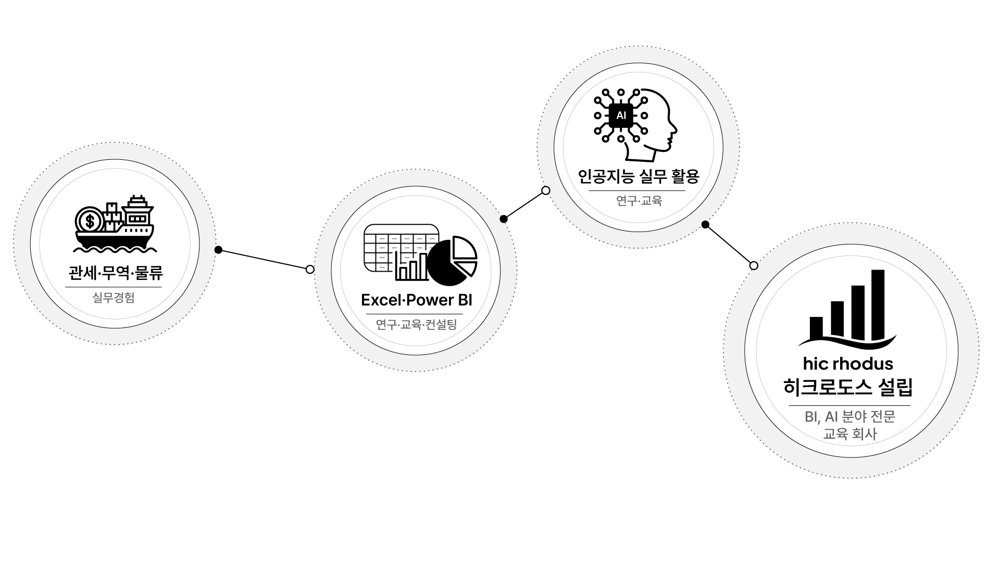
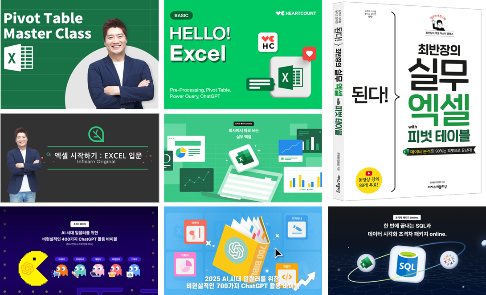

# 01-1. 강사 소개

## 1. 이 강의에서 배울 내용

이번 강의에서는 `ChatGPT 마스터 클래스`를 진행하는 최재완 강사가 어떤 배경을 가지고 있는지, 그리고 왜 이 강의를 만들게 되었는지 소개합니다.

이 강의를 통해 다음 내용을 이해할 수 있습니다.

* 강사의 17년 실무 배경과 Excel, Power BI, AI 연구 여정을 이해합니다.
* 이 강의가 단순한 기능 소개가 아니라 실무 생산성 향상을 목표로 한다는 점을 이해합니다.
* ChatGPT 를 “한 번 입력하면 알아서 다 해주는 도구”가 아니라, 내 역량을 증폭시키는 협업 파트너로 바라보는 관점을 갖습니다.
* 앞으로의 학습에서 무엇을 기대하면 좋을지 기준점을 세웁니다.

## 2. 이 강의가 출발하는 지점

새로운 기술은 매일 끊임없이 쏟아지고 있습니다. 변화 속도가 워낙 빠르다 보니, 열심히 따라가는데도 어딘가 뒤처지는 느낌이 들 때가 있습니다.

ChatGPT 와 생성형 AI 도 마찬가지입니다. 누군가는 이미 능숙하게 쓰는 것 같고, 누군가는 새로운 기능이 나올 때마다 빠르게 따라가는 것처럼 보입니다. 그러다 보면 “나도 빨리 배워야 하는데 어디서부터 시작해야 하지?”라는 막막함이 생깁니다.

이 강의는 바로 그 지점에서 출발합니다.

이 강의가 중요하게 보는 것은 남들이 어떤 도구를 쓰는지 따라가는 것이 아닙니다. 더 중요한 것은 **내 일의 본질을 이해하고, 그 위에 AI 를 연결하는 것** 입니다.

AI 는 일을 대신해 주는 마법 같은 버튼이 아닙니다. 하지만 내가 하고 있는 일을 잘 이해하고 있다면, AI 는 생각을 정리하고, 자료를 만들고, 반복 업무를 줄이고, 더 나은 결과물을 만드는 강력한 협업 파트너가 될 수 있습니다.

## 3. 강사 소개

### 3.1 17년간의 관세·무역·물류 실무 경험

최재완 강사는 관세, 무역, 물류 분야에서 약 17년 동안 실무 경험을 쌓아왔습니다.

관세법인과 이커머스 스타트업 등 다양한 업무 환경에서 일하며, 어떻게 하면 일을 조금 더 효율적으로 만들 수 있을지 계속 고민하고 실험해 왔습니다.

이 경험은 이후 Excel, Power BI, 생성형 AI 교육의 중요한 기반이 되었습니다. 단순히 도구의 기능을 설명하는 것이 아니라, 실제 업무에서 어떤 문제가 생기고, 그 문제를 어떤 방식으로 해결할 수 있는지에 집중하게 된 이유도 여기에 있습니다.

따라서 이 강의를 포함한 모든 콘텐츠는 항상 **실무를 기반** 으로 합니다. 실제 현업에서 바로 적용할 수 있는 방식으로 일과 도구를 바라보고, 콘텐츠를 만듭니다.

### 3.2 Excel 과 Power BI 실무 활용 연구

실무 효율화를 실험하는 과정에서 자연스럽게 Excel 과 Power BI 를 깊이 있게 활용하게 되었습니다.

Excel 은 단순한 표 계산 도구가 아니라, 실무자가 데이터를 정리하고 분석하고 업무 흐름을 개선하는 데 가장 널리 사용하는 도구입니다. Power BI 는 데이터를 시각화하고, 조직의 의사결정에 필요한 정보를 구조화하는 데 강력한 역할을 합니다.

최재완 강사는 이 두 도구를 중심으로 업무 생산성을 높이는 방법을 연구하고, 실제 업무에 적용하고, 기업 교육 콘텐츠로 발전시켜 왔습니다.

### 3.3 생성형 AI 의 실무 활용 연구

ChatGPT 를 비롯한 생성형 AI 가 등장한 이후에는 기존 업무 방식에 AI 를 어떻게 연결할 수 있을지 연구하고 있습니다.

AI 를 단순히 “새로운 유행 도구”로 보는 것이 아니라, 문서 작성, 데이터 분석, 업무 자동화, 교육 콘텐츠 제작, 컨설팅 업무 등 실제 업무 흐름 안에서 어떻게 활용할 수 있는지 탐구하고 있습니다.

이 강의는 그러한 연구와 실무 경험을 바탕으로 만들어졌습니다. ChatGPT 를 처음 접하는 분들도 기본 개념부터 차근차근 익히고, 나아가 자신의 업무에 연결할 수 있도록 설계했습니다.

### 3.4 Hic Rhodus

2023년부터는 **히크로도스(Hic Rhodus)** 라는 회사를 창업해, 생성형 AI 와 Excel, Power BI 같은 도구를 업무 생산성에 어떻게 활용할 수 있을지를 연구하고 있습니다.

히크로도스는 교육, 콘텐츠 제작, 개발, 컨설팅을 통해 사람들이 좋은 도구를 더 잘 사용하고, 실제 업무 생산성을 높일 수 있도록 돕는 것을 목표로 합니다.

국내 다양한 기업의 임직원을 대상으로 다수의 강의를 진행해 왔으며, 실무 기반의 현장감 있는 내용에 대해 많은 평가를 받아 왔습니다.

## 4. 강사 이력 한눈에 보기

### 4.1 주요 경력

| 기간            | 내용                    |
| ------------- | --------------------- |
| 2023년 ~ 현재    | 히크로도스 대표              |
| 2020년 ~ 2023년 | 이커머스 스타트업 SCM·풀필먼트 팀장 |
| 2006년 ~ 2019년 | 관세법인 통관 팀장            |

### 4.2 주요 저서 및 VOD 강의

| 구분     | 내용                                         |
| ------ | ------------------------------------------ |
| 저서     | `된다! 최반장의 실무 엑셀 with 피벗 테이블`               |
| VOD 강의 | `최반장의 엑셀 피벗 테이블 마스터 클래스`                   |
| AI 강의  | `AI 시대 일잘러를 위한 비현실적인 700가지 ChatGPT 활용 바이블` |

최재완 강사는 Excel, Power BI, AI 실무 활용 분야를 중심으로 장편 VOD 강의와 단편 콘텐츠를 제작해 왔습니다.

### 4.3 기업 강의

Excel, Power BI, AI 실무 활용 분야에서 국내외 다양한 기업을 대상으로 강의를 진행해 왔습니다.

주요 강의 분야는 다음과 같습니다.

* Excel 실무 활용
* Power BI 데이터 시각화
* Power Query 와 데이터 정리 자동화
* 생성형 AI 업무 활용
* ChatGPT 프롬프트와 실무 적용
* 기업 생산성 향상을 위한 AI 활용 전략

## 5. 이 강의를 만든 이유

### 5.1 우리의 일을 이해하고 AI 활용하기

새로운 기술은 계속 등장합니다. ChatGPT 도 빠르게 변하고 있고, 관련 기능과 활용법도 끊임없이 늘어나고 있습니다.

하지만 이런 흐름 속에서도 너무 걱정하거나 두려워할 필요는 없습니다. 생성형 AI 는 아직 본격적으로 확산되고 있는 중이며, 지금부터 차근차근 익혀도 충분합니다.

중요한 것은 남들이 얼마나 빠르게 따라가고 있는지가 아닙니다. 더 중요한 것은 **내가 지금 하고 있는 일의 본질을 얼마나 이해하고 있는지** 입니다.

AI 를 잘 활용하려면 먼저 내 일을 이해해야 합니다. 내가 어떤 문제를 해결해야 하는지, 어떤 결과물이 필요한지, 어떤 조건과 제약이 있는지 알아야 합니다. 그래야 ChatGPT 에게도 더 좋은 지시를 할 수 있습니다.

### 5.2 AI 는 협업 파트너입니다

이 강의는 단순히 한 번의 입력으로 “딸깍” 하고 완성된 결과물을 얻는 방법을 알려주는 강의가 아닙니다.

물론 ChatGPT 는 많은 일을 빠르게 도와줄 수 있습니다. 하지만 진짜 중요한 것은 AI 가 무언가를 대신 만들어 주는 것이 아니라, 우리가 이미 가지고 있는 지식과 경험, 실무 역량을 더 크게 증폭시켜 주는 것입니다.

이 강의에서 바라보는 AI 는 자동 생성 버튼이 아니라 **협업 파트너** 입니다.

AI 에게 일을 맡기는 것이 아니라, AI 와 함께 생각하고, 정리하고, 만들고, 검토하는 방법을 배우는 것이 이 강의의 방향입니다.

## 6. 이 강의가 지향하지 않는 것과 지향하는 것

| 구분              | 내용                                                |
| --------------- | ------------------------------------------------- |
| 이 강의가 지향하지 않는 것 | 한 번의 입력으로 완벽한 결과물이 나오길 기대하는 요행식 AI 사용             |
| 이 강의가 지향하는 것    | 내 일의 본질 이해 위에, 지식·경험·실무 역량을 증폭시키는 협업 파트너로서의 AI 활용 |

ChatGPT 를 잘 쓰는 사람은 단순히 프롬프트 문장을 많이 아는 사람이 아닙니다.

자신이 원하는 결과를 분명히 알고, 필요한 맥락을 설명하고, 결과물을 검토하고, 다시 개선할 수 있는 사람입니다.

이 강의는 바로 그 기본기를 만드는 것을 목표로 합니다.

## 7. 앞으로의 학습 방향

이 강의는 ChatGPT 를 처음 배우는 분들이 기본 개념부터 실무 활용까지 차근차근 익힐 수 있도록 구성되어 있습니다.

앞으로의 학습에서는 다음 관점을 계속 기억하면 좋습니다.

1. ChatGPT 는 검색엔진이 아니라 대화형 AI 도구입니다.
2. 좋은 결과를 얻으려면 좋은 맥락과 지시가 필요합니다.
3. AI 결과물은 그대로 받아들이는 것이 아니라 검토하고 개선해야 합니다.
4. AI 는 내 일을 대신하는 도구가 아니라, 내 역량을 증폭시키는 협업 파트너입니다.
5. 중요한 것은 기능을 많이 아는 것이 아니라, 내 업무에 연결해 실제로 활용하는 것입니다.

## 8. 핵심 정리

* 이 강의는 관세·무역·물류 실무 경험과 Excel, Power BI, AI 연구 경험을 바탕으로 만들어진 실무 기반 강의입니다.
* AI 활용에서 중요한 것은 남들의 속도가 아니라, **내 일의 본질에 대한 이해** 입니다.
* ChatGPT 는 한 번 입력하면 모든 것을 해결해 주는 “딸깍” 도구가 아닙니다.
* 이 강의가 소개하는 AI 는 내가 가진 지식, 경험, 실무 역량을 **증폭시켜 주는 협업 파트너** 입니다.
* 앞으로의 학습에서는 기능을 외우는 것보다, ChatGPT 를 내 업무와 어떻게 연결할지에 집중해야 합니다.

## 9. 영상으로 학습하기

<iframe width="560" height="315" src="https://www.youtube.com/embed/7_DJj_cks4c?si=t6XEBrz9u1-qInng" title="YouTube video player" frameborder="0" allow="accelerometer; autoplay; clipboard-write; encrypted-media; gyroscope; picture-in-picture; web-share" referrerpolicy="strict-origin-when-cross-origin" allowfullscreen></iframe>
