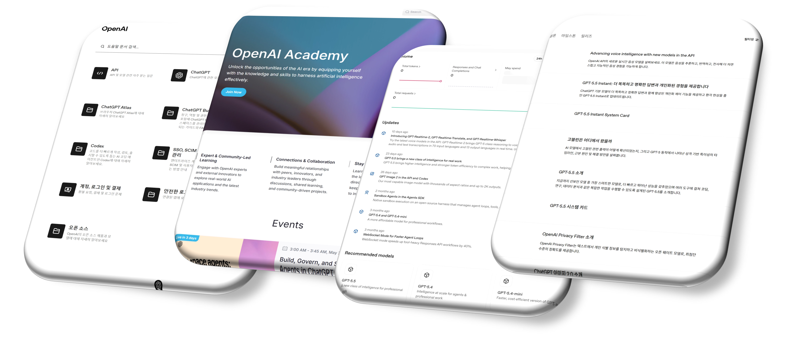
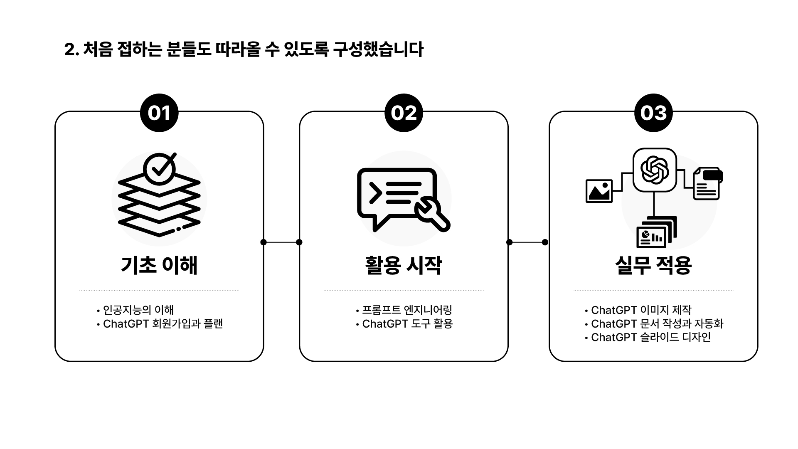
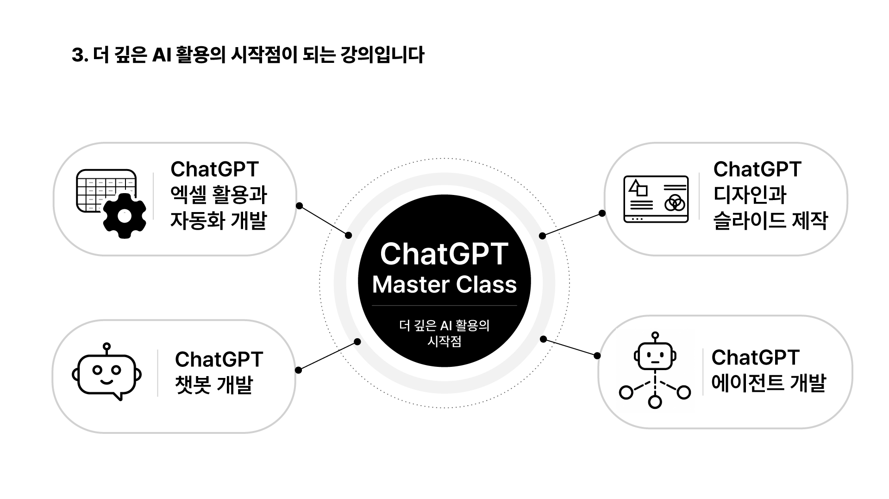

# 01-2. ChatGPT 마스터 클래스 소개

## 1. 이 강의에서 배울 내용

이번 강의에서는 `ChatGPT 마스터 클래스`가 어떤 강의인지, 누구를 위한 강의인지, 그리고 앞으로 어떤 관점으로 학습하면 좋은지 소개합니다.

이 강의를 통해 다음 내용을 이해할 수 있습니다.

* ChatGPT 마스터 클래스가 어떤 목적과 방향으로 만들어졌는지 이해합니다.
* 이 강의가 누구를 대상으로 하는지 파악합니다.
* 이 강의의 다섯 가지 특징을 이해합니다.
* ChatGPT 를 단순한 질문·답변 도구가 아니라 실무 생산성을 높이는 AI 협업 도구로 바라보는 관점을 갖습니다.
* 앞으로의 학습에서 무엇을 기대하면 좋을지 기준점을 세웁니다.

## 2. 왜 ChatGPT 마스터 클래스인가

이제 우리는 AI 를 잘 활용할 수 있어야 합니다. 일상에서도 그렇고, 업무에서도 마찬가지입니다.

중요한 것은 단순히 남들이 사용하니까 따라가는 것이 아닙니다. AI 를 활용해서 나와 우리 조직의 **생산성과 가치를 더 높일 수 있어야** 합니다. 그리고 그 시작점에 가장 많이 활용되고 있는 도구 중 하나가 바로 ChatGPT 입니다.

ChatGPT 는 단순히 질문을 입력하고 답변을 받는 도구처럼 보일 수 있습니다. 하지만 실제로는 글쓰기, 자료 조사, 아이디어 정리, 문서 작성, 데이터 분석 보조, 자동화 아이디어 발굴 등 다양한 업무 흐름에 연결할 수 있습니다.

문제는 처음 시작하는 사람에게는 무엇부터 배워야 할지 판단하기 어렵다는 점입니다.

어떤 사람은 프롬프트부터 배우라고 하고, 어떤 사람은 최신 기능부터 써보라고 합니다. 또 어떤 사람은 AI 를 쓰면 모든 일이 자동으로 해결될 것처럼 말합니다. 하지만 실제 업무에서 ChatGPT 를 제대로 활용하려면 기능 하나하나를 아는 것보다 더 중요한 것이 있습니다.

바로 **AI 와 어떻게 협업할 것인가** 라는 관점입니다.

이 강의는 그 관점을 잡기 위한 출발점입니다.

## 3. 이 강의의 대상

ChatGPT 마스터 클래스는 ChatGPT 를 처음 시작하는 분부터 실제 업무에 활용하고 싶은 분까지를 대상으로 합니다.

특히 다음과 같은 분들에게 적합합니다.

* ChatGPT 를 처음 체계적으로 배우고 싶은 분
* ChatGPT 를 검색엔진처럼만 사용하고 있는 분
* 어떤 기능부터 어떤 순서로 배워야 할지 막막한 분
* 업무 문서 작성, 자료 조사, 아이디어 정리 등에 AI 를 활용하고 싶은 분
* 생성형 AI 를 생활과 업무 생산성 향상에 연결하고 싶은 분
* 기업이나 조직에서 AI 활용의 기본기를 갖추고 싶은 분

이 강의는 깊은 기술 이론을 먼저 다루지 않습니다. 인공지능의 수학적 원리나 모델 구조를 깊게 설명하기보다, 일반 사용자가 실제로 ChatGPT 를 어떻게 이해하고 사용해야 하는지에 집중합니다.

즉, 이 강의의 핵심 질문은 다음과 같습니다.

> ChatGPT 를 내 일과 생활에 어떻게 연결할 것인가?

## 4. 이 강의의 다섯 가지 특징

### 4.1 검증된 자료를 기반으로 제작했습니다

생성형 AI 는 변화 속도가 굉장히 빠릅니다. 그래서 인터넷에는 오래된 정보나 검증되지 않은 활용 방법도 많습니다.

이 강의는 OpenAI 의 공식 문서와 발표 자료, 최신 기능 안내, 논문 등을 기반으로 제작했습니다.

대표적인 출처는 다음과 같습니다.

* OpenAI Research
* OpenAI Help Center
* OpenAI Platform 기술 문서
* OpenAI Academy

이 강의는 단순한 팁 모음이 아닙니다. 실제로 확인 가능한 정보와 활용 방법을 중심으로 구성했습니다.

물론 ChatGPT 는 계속 업데이트되는 도구입니다. 따라서 특정 화면이나 기능 이름은 시간이 지나면서 달라질 수 있습니다. 하지만 이 강의에서는 단순히 버튼 위치를 외우는 것이 아니라, 변화하는 기능을 이해하고 업무에 적용할 수 있는 기본 관점을 함께 다룹니다.

### 4.2 처음 접하는 분들을 위해 단계적으로 구성했습니다

처음 생성형 AI 를 접하면 생각보다 어려움을 느끼는 경우가 많습니다.

무엇을 질문해야 하는지, 어떻게 활용해야 하는지, 무엇부터 시작해야 하는지 막막하게 느껴질 수 있습니다. 그래서 이 강의는 처음 시작하는 분들도 차근차근 따라올 수 있도록 **기초부터 단계적으로** 구성했습니다.

회원 가입과 기본 설정부터 시작해 ChatGPT 의 화면 구성, 프롬프트 작성 방법, 다양한 채팅 모드, 파일과 웹 검색 기능, 글쓰기와 문서 작업, 자동화와 이미지 생성까지 순서대로 다룹니다.

필요한 부분을 사전처럼 찾아보는 방식도 가능합니다. 하지만 처음 학습한다면 시작부터 하나씩 쌓아 올리는 방식으로 학습하는 것을 추천합니다.

이 강의에서는 깊은 기술 이론 자체를 다루기보다, 실무와 일상에서 ChatGPT 를 어떻게 활용할지에 초점을 맞춥니다.

| 구분              | 내용                             |
| --------------- | ------------------------------ |
| 이 강의에서 다루지 않는 것 | 인공지능의 깊은 기술 이론 그 자체            |
| 이 강의가 집중하는 것    | 실무와 일상에서 ChatGPT 를 어떻게 활용할 것인가 |

### 4.3 이 강의는 AI 학습의 시작점입니다

이 강의는 인공지능 기술 그 자체가 아니라 **인공지능의 실무 활용** 에 집중합니다.

단순한 ChatGPT 사용법 강의에 머물지 않고, 앞으로 AI 를 활용한 자동화, 데이터 분석, 문서 작성, 리서치, 업무 생산성 향상 등 더 다양한 영역으로 확장해 나가기 위한 기반을 다룹니다.

즉, 이 강의는 ChatGPT 기능 목록을 외우는 과정이 아닙니다.

AI 와 함께 일하는 방식을 익혀가는 과정에 가깝습니다.

ChatGPT 를 제대로 활용하면 다음과 같은 일들이 가능해집니다.

* 생각을 빠르게 구조화하기
* 긴 문서를 요약하고 핵심을 정리하기
* 이메일, 보고서, 기획서 초안 만들기
* 자료 조사와 비교 분석을 빠르게 수행하기
* Excel, Power BI, 자동화 업무의 아이디어를 구체화하기
* 반복 업무를 줄이기 위한 작업 흐름 설계하기

이 강의는 그런 확장 학습의 출발선입니다.

### 4.4 지속적인 업데이트를 고려해 제작하고 있습니다

ChatGPT 와 생성형 AI 는 지금 이 순간에도 계속 변화하고 있습니다.

새로운 기능이 추가되기도 하고, 기존 기능의 사용 방식이 달라지기도 합니다. 따라서 ChatGPT 강의는 한 번 만들고 끝나는 형태가 되기 어렵습니다.

이 강의 역시 일회성 강의가 아니라, 주요 기능 변화와 신규 기능 출시에 맞춰 지속적으로 업데이트할 것을 전제로 제작하고 있습니다.

ChatGPT 를 배우는 사람에게 중요한 태도는 “한 번 배워서 끝낸다” 가 아닙니다.

중요한 것은 변화하는 기능을 계속 따라가되, 그 변화에 흔들리지 않는 기본기를 갖추는 것입니다.

이 강의에서는 그 기본기를 만드는 데 집중합니다.

### 4.5 ChatGPT 의 주요 기능을 폭넓게 다룹니다

많은 분들이 ChatGPT 를 단순히 질문하고 답변받는 도구 정도로 생각합니다. 하지만 실제로 ChatGPT 는 훨씬 더 다양한 기능과 가능성을 가지고 있습니다.

이 강의에서는 ChatGPT 의 주요 기능과 도구를 폭넓게 다룹니다.

예를 들어 다음과 같은 내용을 학습하게 됩니다.

* ChatGPT 계정과 플랜 이해
* 기본 화면과 대화 구조
* 맞춤 설정과 메모리
* 프롬프트 작성법
* 마크다운 문법
* 대화 관리
* 임시 채팅과 그룹 채팅
* 음성 입력과 음성 모드
* 파일 추가와 웹 검색
* 심층 리서치
* 글쓰기와 문서 작업
* 일정과 예약 작업
* 프로젝트
* 이미지 생성

이 과정의 목표는 단순히 기능을 많이 아는 것이 아닙니다.

각 기능이 어떤 업무 상황에 적합한지 이해하고, 실제 업무 흐름 안에서 연결해 사용하는 것입니다.

## 5. 이 강의가 지향하는 학습 방식

ChatGPT 를 잘 활용하려면 단순히 프롬프트 예시를 많이 외우는 것만으로는 부족합니다.

중요한 것은 다음과 같은 흐름을 익히는 것입니다.

1. 내가 해결하려는 문제를 이해합니다.
2. 필요한 맥락과 조건을 정리합니다.
3. ChatGPT 에게 적절한 방식으로 요청합니다.
4. 결과물을 검토합니다.
5. 부족한 부분을 추가 질문으로 보완합니다.
6. 최종 결과물을 내 업무에 맞게 적용합니다.

이 강의에서는 이 흐름을 반복적으로 다룹니다.

AI 는 점점 더 강력해지고 있습니다. 하지만 AI 를 잘 쓰는 사람과 그렇지 않은 사람의 차이는 단순히 최신 기능을 아는지 여부만으로 결정되지 않습니다.

자신의 문제를 잘 정의하고, 필요한 정보를 구조화하고, AI 의 결과물을 비판적으로 검토할 수 있는 사람이 더 좋은 결과를 얻습니다.

## 6. AI 와 함께 일하는 관점

저는 인공지능이 단순한 도구를 넘어서, 앞으로 **함께 일하는 동반자에 가까운 방향** 으로 발전할 것이라고 생각합니다.

물론 AI 가 모든 것을 대신해 주지는 않습니다. 하지만 내가 하고자 하는 일을 명확히 알고 있다면, AI 는 생각의 속도를 높이고, 결과물의 초안을 만들고, 복잡한 정보를 정리하고, 새로운 아이디어를 제안하는 강력한 협업 파트너가 될 수 있습니다.

이 강의에서는 ChatGPT 를 “정답을 알려주는 기계” 로 다루지 않습니다.

대신 다음과 같은 관점으로 접근합니다.

* AI 와 대화하며 생각을 정리한다.
* AI 에게 일을 시키기 전에 맥락을 제공한다.
* AI 의 결과물을 그대로 믿지 않고 검토한다.
* AI 를 내 업무 흐름 안에 연결한다.
* AI 를 통해 나의 생산성과 결과물의 품질을 높인다.

이것이 ChatGPT 마스터 클래스가 지향하는 학습 방향입니다.

## 7. 앞으로 다룰 내용

이 강의 이후부터는 ChatGPT 를 본격적으로 다루기 시작합니다.

먼저 ChatGPT 를 처음 시작하는 데 필요한 기본 사용법을 익힙니다. 이후 프롬프트 작성법, 다양한 채팅 모드와 관리 기능, 파일과 웹 검색, 리서치 기능, 글쓰기와 문서 작업, 업무 자동화, 이미지 생성 등으로 확장해 나갑니다.

전체 흐름은 다음과 같습니다.

| 단계            | 주요 내용                              |
| ------------- | ---------------------------------- |
| 시작하기          | 계정, 플랜, 기본 화면, 맞춤 설정               |
| 프롬프트 기본기      | 프롬프트, 마크다운, 출력 형식, 프롬프트 프레임워크      |
| 대화 관리         | 대화 삭제, 보관, 고정, 이름 변경, 임시 채팅, 음성 기능 |
| 자료 조사와 리서치    | 파일 추가, 웹 검색, 심층 리서치, 공부 모드         |
| 글쓰기와 문서 작업    | 글쓰기 블록, 코드 블록, 이메일·보고서·기획서         |
| 업무 자동화와 작업 환경 | 예약 작업, 에이전트 모드, 앱 연결, 프로젝트         |
| 이미지 생성        | 이미지 생성 원리, 프롬프트, 실무 이미지 활용         |

이 과정을 통해 ChatGPT 를 단순한 호기심의 대상이 아니라, 실제 업무와 학습에 연결할 수 있는 도구로 익혀 가게 됩니다.

## 8. 핵심 정리

* ChatGPT 마스터 클래스는 ChatGPT 를 처음 시작하는 사람부터 실무에 활용하고 싶은 사람까지를 위한 입문 강의입니다.
* 이 강의는 OpenAI 공식 자료와 검증 가능한 정보를 기반으로 제작되었습니다.
* 처음 접하는 분들도 따라올 수 있도록 기초부터 단계적으로 구성되어 있습니다.
* 이 강의는 깊은 기술 이론보다 **실무 활용** 에 집중합니다.
* ChatGPT 는 단순한 질문·답변 도구가 아니라, 업무 생산성과 사고의 확장을 돕는 AI 협업 도구입니다.
* 중요한 것은 최신 기능을 많이 아는 것이 아니라, AI 를 내 일과 어떻게 연결할지 이해하는 것입니다.
* 이 강의는 앞으로 자동화, 데이터 분석, 리서치, 문서 작업 등으로 확장해 가기 위한 AI 학습의 출발점입니다.

## 9. 영상으로 학습하기

<iframe width="560" height="315" src="https://www.youtube.com/embed/RtzPdhQZ63A?si=orhMpKgxWblV5vtz" title="YouTube video player" frameborder="0" allow="accelerometer; autoplay; clipboard-write; encrypted-media; gyroscope; picture-in-picture; web-share" referrerpolicy="strict-origin-when-cross-origin" allowfullscreen></iframe>
