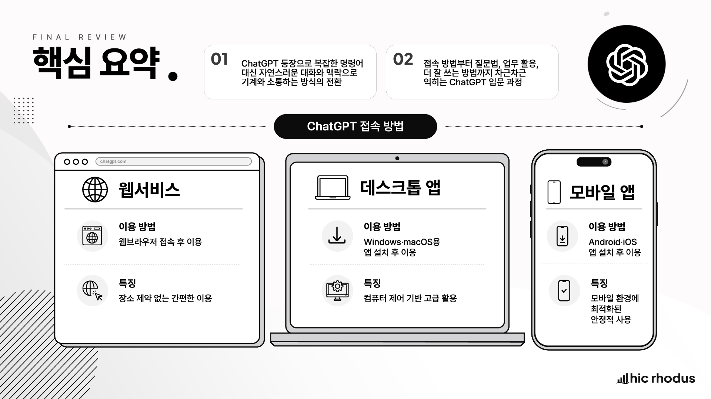

# 02-1. 안녕? ChatGPT?

## 1. 이 강의에서 배울 내용

이번 강의에서는 ChatGPT 가 무엇인지, 기존 검색 서비스와 무엇이 다른지, 그리고 왜 AI 학습의 시작점으로 ChatGPT 를 먼저 다루는지 살펴봅니다.

이 강의를 통해 다음 내용을 이해할 수 있습니다.

* ChatGPT 가 기존 검색 서비스와 무엇이 다른지 설명할 수 있습니다.
* 수많은 AI 도구 중 왜 ChatGPT 부터 시작하는지 이해할 수 있습니다.
* ChatGPT 를 웹, 데스크톱 앱, 모바일 앱에서 사용할 수 있다는 점을 이해할 수 있습니다.
* 공식 앱을 확인하는 기준을 알 수 있습니다.
* ChatGPT 를 단순한 검색 도구가 아니라 협업 도구로 바라보는 관점을 갖습니다.

## 2. 사람은 어떻게 소통하는가

우리는 배가 고플 때도 여러 가지 방식으로 표현합니다.

그냥 “배가 고파요” 라고 직접 말할 수도 있고, 표정이나 몸짓만으로도 충분히 전달할 수 있습니다. 때로는 말하지 않아도 상황과 맥락만으로 상대방이 알아차리기도 합니다.

중요한 것은 표현 방식이 하나만 있는 것이 아니라는 점입니다.

사람은 말과 글, 표정과 몸짓, 그리고 맥락까지 활용하면서 서로 소통합니다. 우리는 상대방이 말한 문장만 듣는 것이 아니라, 그 사람이 어떤 상황에 있는지, 앞에서 어떤 대화를 했는지, 어떤 의도로 말하는지도 함께 해석합니다.

그렇다면 사람은 **기계와도** 이런 방식으로 소통할 수 있을까요?

이번 강의는 이 질문에서 출발합니다.

## 3. 내 말을 이해하는 기계

사람과 기계의 소통은 오랫동안 과학자와 개발자들에게 중요한 과제였습니다.

오랫동안 사람이 기계를 다루려면 복잡한 명령어를 입력해야 했습니다. 기계는 정해진 형식과 규칙 안에서만 반응했고, 사람이 그 방식에 맞춰야 했습니다.

즉, 기계와의 소통은 인간의 언어가 아니라 **기계의 언어에 사람이 맞춰야 하는 구조** 였습니다.

그런데 ChatGPT 가 등장하면서 이 흐름이 크게 바뀌기 시작했습니다.

이제는 사람이 기계의 언어를 억지로 배울 필요가 없습니다. 사람이 평소 말하듯 질문하고, 설명하고, 수정하고, 대화를 이어가면서 원하는 결과에 가까워질 수 있게 되었습니다.

이 변화의 핵심은 단순히 “AI 가 더 똑똑해졌다” 가 아닙니다.

핵심은 **사람과 기계가 소통하는 방식 그 자체가 달라졌다** 는 점입니다.

## 4. ChatGPT 란 무엇인가

ChatGPT 는 OpenAI 가 개발한 대표적인 **대화형 AI 서비스** 입니다.

이 서비스의 가장 큰 특징은 인간과 대화하듯 상호작용할 수 있다는 점입니다.

예전의 검색 서비스는 질문을 입력하면 관련 정보를 찾아 보여주는 방식에 가까웠습니다. 사용자는 검색어를 입력하고, 검색 결과 목록을 보고, 그중에서 필요한 정보를 직접 찾아야 했습니다.

반면 ChatGPT 는 질문의 의도를 이해하고, 앞서 나눈 대화의 맥락을 이어받아, 그 흐름 안에서 답을 만들어냅니다.

즉, ChatGPT 는 단순히 정보를 찾아주는 도구가 아닙니다.

다음과 같은 방식으로 활용할 수 있습니다.

* 생각을 정리하기
* 글을 다듬기
* 아이디어를 확장하기
* 자료를 요약하기
* 보고서나 이메일 초안을 만들기
* 복잡한 내용을 쉽게 설명하도록 요청하기
* 업무 흐름을 설계하기

ChatGPT 는 처음 공개된 이후 매우 빠르게 확산되었습니다. 지금은 다양한 생성형 AI 서비스가 등장했지만, ChatGPT 는 여전히 가장 대표적인 생성형 AI 서비스 가운데 하나이며, 많은 사람들이 가장 먼저 접하는 AI 도구이기도 합니다.

## 5. 왜 ChatGPT 부터 시작하는가

그렇다면 왜 수많은 AI 서비스 가운데 ChatGPT 부터 시작해야 할까요?

이 부분은 Excel 을 떠올리면 이해가 쉽습니다.

Excel 이 모든 상황에서 유일한 정답은 아닙니다. 데이터 분석, 데이터베이스 관리, 시각화, 자동화에는 각각 더 전문적인 도구가 있을 수 있습니다.

하지만 스프레드시트를 처음 배울 때 Excel 로 시작하는 것은 매우 좋은 선택입니다.

이유는 명확합니다.

* 가장 많은 사용자가 사용하고 있습니다.
* 기능이 풍부합니다.
* 학습 자료와 활용 사례가 많습니다.
* 기본 개념을 익히기에 적합합니다.
* 다른 도구로 확장하기 위한 출발점이 됩니다.

ChatGPT 도 마찬가지입니다.

앞으로 AI 를 전혀 사용하지 않고 일하기는 점점 더 어려워질 것입니다. 어떤 AI 도구가 더 강력해질지는 계속 바뀔 수 있습니다. 하지만 지금 시점에서 ChatGPT 는 가장 널리 알려져 있고, 가장 많은 활용 사례가 축적되어 있으며, AI 활용의 기본 개념을 익히기에 좋은 출발점입니다.

ChatGPT 를 배운다는 것은 단순히 하나의 서비스를 익히는 것이 아닙니다.

**AI 와 협업하는 방식 자체를 배우는 시작점** 으로 이해하는 것이 좋습니다.

## 6. ChatGPT 는 어디에서 사용할 수 있는가

ChatGPT 를 사용하는 방법은 다양합니다.

처음에는 웹 브라우저에서 접속해 사용하는 방식이 중심이었지만, 지금은 데스크톱 앱과 모바일 앱까지 지원되기 때문에 자신의 작업 환경에 맞게 선택해서 사용할 수 있습니다.

같은 계정으로 로그인하면 여러 기기에서 대화 기록과 작업 흐름을 이어갈 수 있습니다. 사무실에서는 PC 로 사용하고, 이동 중에는 스마트폰으로 이어서 활용하는 방식도 가능합니다.

이 점은 실제 업무 활용에서 매우 큰 강점이 됩니다.

### 6.1 웹 서비스

가장 기본이 되는 방식은 웹 브라우저로 접속하는 방법입니다.

별도 설치가 필요 없고, 인터넷만 연결되어 있으면 바로 시작할 수 있습니다. 처음 ChatGPT 를 접하는 분들에게는 가장 쉽고 빠른 시작점입니다.

다만 공용 PC 에서 사용할 때는 주의해야 합니다.

로그인 상태를 그대로 두면 다른 사람이 내 대화 기록이나 계정 정보에 접근할 수 있습니다. 공용 PC 에서 사용했다면 반드시 로그아웃하는 습관을 가져야 합니다.

### 6.2 데스크톱 앱

Windows 나 Mac 에서는 전용 앱을 설치해 사용할 수 있습니다.

데스크톱 앱의 장점은 ChatGPT 를 브라우저 안의 웹사이트가 아니라 **하나의 독립된 생산성 도구처럼** 사용할 수 있다는 점입니다.

업무 중 자주 호출해서 활용하거나, 일상적인 업무 루틴 안에 자연스럽게 포함시키고 싶은 분들에게 특히 잘 맞습니다.

단순 체험이 아니라 ChatGPT 를 업무 도구로 정착시키고 싶다면 데스크톱 앱이 더 편하게 느껴질 수 있습니다.

### 6.3 모바일 앱

스마트폰이나 태블릿에서도 전용 모바일 앱으로 ChatGPT 를 사용할 수 있습니다.

iPhone 과 iPad 는 물론, Android 기기에서도 사용할 수 있습니다.

모바일 앱의 가장 큰 강점은 **즉시성** 입니다.

이동 중에도 바로 질문할 수 있고, 짧은 시간 안에 빠르게 답을 받을 수 있습니다. 예를 들어 다음과 같은 상황에서 유용합니다.

* 메일 문구를 빠르게 점검할 때
* 회의 전에 생각을 정리할 때
* 이동 중 떠오른 아이디어를 메모하듯 질문할 때
* 문서를 읽다가 궁금한 내용을 즉시 물어볼 때
* 업무 메시지를 작성하기 전에 표현을 다듬을 때

모바일 앱은 손안에서 언제든 꺼내 쓰는 개인 AI 도구처럼 활용할 수 있습니다.

### 6.4 공식 앱 확인하기

앱스토어나 플레이스토어에서 ChatGPT 를 검색하면 이름과 로고가 비슷한 앱이 많이 보일 수 있습니다.

처음 사용하는 분들은 ChatGPT 라고 생각하고 설치했는데, 실제로는 다른 서비스인 경우도 있습니다. 심지어 불필요한 결제를 하게 되는 경우도 생길 수 있습니다.

따라서 앱을 설치할 때는 반드시 개발사가 **OpenAI** 인지 확인해야 합니다.

처음 가입하는 분이라면 가능하면 공식 웹사이트에서 먼저 계정을 만든 뒤, 같은 계정으로 앱에 로그인하는 방식을 권장합니다. 이 한 가지 확인만으로도 불필요한 결제나 서비스 혼동을 크게 줄일 수 있습니다.

### 6.5 세 가지 이용 방식 비교

| 구분     | 웹 서비스               | 데스크톱 앱                      | 모바일 앱                                |
| ------ | ------------------- | --------------------------- | ------------------------------------ |
| 이용 방법  | 웹 브라우저로 접속해서 이용     | Windows 또는 Mac 에 앱을 설치해서 이용 | iPhone, iPad, Android 기기에 앱을 설치해서 이용 |
| 장점     | 설치 없이 바로 사용 가능      | 독립된 생산성 도구처럼 사용 가능          | 이동 중에도 즉시 사용 가능                      |
| 적합한 상황 | 처음 시작할 때, 가볍게 사용할 때 | 업무 중 자주 호출해 사용할 때           | 이동 중, 회의 전후, 짧은 아이디어 정리              |
| 주의할 점  | 공용 PC 에서 로그아웃 필요    | 공식 경로에서 설치 필요               | 개발사가 OpenAI 인지 확인 필요                 |

## 7. 검색을 넘어 협업으로

ChatGPT 를 처음 사용할 때는 검색 서비스처럼 사용하는 경우가 많습니다.

예를 들어 다음처럼 질문할 수 있습니다.

```text
ChatGPT 가 뭐야?
```

이런 질문도 가능하지만, ChatGPT 의 장점은 여기서 끝나지 않습니다.

ChatGPT 는 한 번의 질문에 답하는 도구라기보다, 대화를 이어가며 결과를 함께 만들어가는 도구에 가깝습니다.

예를 들어 다음처럼 사용할 수 있습니다.

```text
ChatGPT 를 처음 배우는 직장인을 대상으로 10분짜리 설명을 하려고 합니다.
검색 서비스와 다른 점을 중심으로 쉽게 설명해 주세요.
표현은 너무 기술적이지 않게 해 주세요.
```

이렇게 요청하면 ChatGPT 는 단순 정의를 넘어서, 목적과 대상에 맞는 설명을 만들어 줍니다. 이후에도 “조금 더 쉽게 바꿔줘”, “예시를 추가해줘”, “표로 정리해줘”처럼 대화를 이어갈 수 있습니다.

이것이 검색과 ChatGPT 의 큰 차이입니다.

검색은 내가 정보를 찾는 방식에 가깝고, ChatGPT 는 내가 원하는 결과물을 만들기 위해 함께 대화하는 방식에 가깝습니다.

## 8. 핵심 정리

* ChatGPT 는 사람이 기계와 대화하듯 상호작용할 수 있게 만든 대표적인 생성형 AI 서비스입니다.
* 핵심 변화는 AI 가 똑똑해진 것만이 아니라, **사람과 기계가 소통하는 방식 자체가 달라졌다** 는 점입니다.
* ChatGPT 는 기존 검색 서비스처럼 정보를 찾는 도구로도 쓸 수 있지만, 더 중요한 가치는 대화를 통해 결과물을 함께 만들어가는 데 있습니다.
* Excel 이 스프레드시트 학습의 좋은 출발점이듯, ChatGPT 는 AI 활용 학습의 좋은 출발점입니다.
* ChatGPT 는 웹, 데스크톱 앱, 모바일 앱에서 사용할 수 있습니다.
* 앱 설치 시에는 반드시 개발사가 **OpenAI** 인지 확인해야 합니다.
* ChatGPT 를 배운다는 것은 하나의 서비스를 익히는 것을 넘어, AI 와 협업하는 방식을 배우는 일입니다.




## 9. 영상으로 학습하기

<iframe width="560" height="315" src="https://www.youtube.com/embed/13QpKOrCTo0?si=D8A9A3FbD1P2LzFB" title="YouTube video player" frameborder="0" allow="accelerometer; autoplay; clipboard-write; encrypted-media; gyroscope; picture-in-picture; web-share" referrerpolicy="strict-origin-when-cross-origin" allowfullscreen></iframe>
