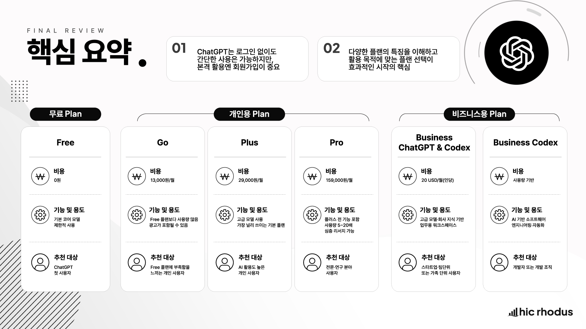

# 02-2. ChatGPT 시작하기: 회원가입과 플랜

## 1. 이 강의에서 배울 내용

이번 강의에서는 ChatGPT 를 처음 시작하는 방법을 다룹니다. ChatGPT 에 접속해 첫 대화를 나눠 보고, 회원가입과 로그인을 진행한 뒤, 개인용 플랜과 비즈니스용 플랜의 차이를 이해합니다.

이 강의를 통해 다음 내용을 익힐 수 있습니다.

* ChatGPT 에 접속해 첫 대화를 시작할 수 있습니다.
* 로그인 없이 사용할 때와 로그인 후 사용할 때의 차이를 이해할 수 있습니다.
* 회원가입과 로그인 방법을 이해할 수 있습니다.
* Free, Go, Plus, Pro 등 개인용 플랜의 차이를 구분할 수 있습니다.
* Business 와 Enterprise 등 조직용 플랜의 기본 구조를 이해할 수 있습니다.
* 자신의 사용 목적에 맞는 플랜 선택 기준을 세울 수 있습니다.

## 2. ChatGPT 에 접속하기

ChatGPT 를 시작해 보겠습니다.

ChatGPT 는 웹 브라우저에서 사용할 수 있고, PC 또는 Mac 용 앱, 모바일 앱으로도 사용할 수 있습니다. 다만 처음 시작할 때는 별도 설치가 필요 없는 웹 버전이 가장 간단합니다.

웹 브라우저를 열고 `chatgpt.com` 에 접속합니다.

처음 접속하면 로그인하지 않은 상태에서도 간단한 대화를 시작할 수 있습니다. 가운데 입력창에 직접 질문을 입력해 보세요.

예를 들어 오랫동안 못 본 친구에게 안부 인사를 하듯이 말을 걸어도 좋고, 평소 궁금했던 건강 관리 방법이나 공부 방법을 물어봐도 좋습니다.

처음이라 무엇을 입력해야 할지 모르겠다면 아래 문장을 그대로 입력해 보세요.

```text
안녕하세요. 반갑습니다.
당신은 무엇을 할 수 있습니까?
당신에 대해서 소개해 주시겠어요?
```

입력한 뒤 `Enter` 키를 누르면 ChatGPT 가 답변을 생성합니다.

여기서 입력한 문장을 **프롬프트** 라고 합니다. 프롬프트는 ChatGPT 에게 전달하는 질문, 요청, 지시문을 의미합니다.

## 3. 로그인하지 않고 사용할 때의 한계

로그인하지 않은 상태에서도 ChatGPT 와 대화할 수 있습니다. 하지만 이 상태는 어디까지나 가볍게 체험해 보는 수준에 가깝습니다.

로그인하지 않고 사용할 때는 다음과 같은 제한이 있습니다.

1. 대화가 저장되지 않습니다.
2. 사용량에 제한이 있을 수 있습니다.
3. 파일 처리, 데이터 분석, 이미지 생성 등 다양한 도구 사용이 제한될 수 있습니다.
4. 이전 대화를 다시 열어 이어서 작업하기 어렵습니다.
5. 개인 설정이나 맞춤형 사용 환경을 적용하기 어렵습니다.

따라서 ChatGPT 를 한두 번 체험해 보는 것이 아니라, 실제 학습과 업무에 활용하려면 회원가입과 로그인을 진행하는 것이 좋습니다.

## 4. 회원가입과 로그인하기

ChatGPT 에 접속한 뒤 화면에서 `로그인` 또는 `가입하기` 버튼을 선택합니다. 표시되는 버튼 이름은 접속 환경이나 화면 상태에 따라 조금 다를 수 있습니다.

회원가입은 크게 두 가지 방식으로 진행할 수 있습니다.

### 4.1 간편 가입

Google, Apple, Microsoft 계정 등을 활용해 간편 가입할 수 있습니다.

이미 자주 사용하는 계정이 있다면 이 방식이 가장 빠릅니다. 별도의 비밀번호를 새로 관리하지 않아도 되고, 이후 다른 기기에서 로그인할 때도 편리합니다.

### 4.2 이메일 가입

이메일 주소를 직접 입력해 가입할 수도 있습니다.

이때 사용하는 이메일 주소가 앞으로 ChatGPT 계정의 ID 역할을 합니다. OpenAI 에서 보내는 안내나 알림도 이 이메일로 전달될 수 있으므로, 자주 확인하는 이메일을 사용하는 것이 좋습니다.

회사 업무에 사용할 계획이라면 개인 이메일과 회사 이메일 중 무엇을 사용할지도 미리 생각해 보는 것이 좋습니다. 조직의 보안 정책이나 비용 처리 방식에 따라 적절한 계정이 달라질 수 있기 때문입니다.

## 5. 로그인 후 달라지는 점

회원가입과 로그인을 완료하면 기본적으로 Free 플랜 상태로 ChatGPT 를 사용할 수 있습니다.

로그인 후에는 가장 큰 변화가 생깁니다. 바로 **대화 기록이 저장된다** 는 점입니다.

로그인하지 않은 상태에서는 대화가 일회성으로 끝날 수 있습니다. 반면 로그인 후에는 내가 나눈 대화가 기록으로 남고, 나중에 다시 열어 이어서 작업할 수 있습니다.

이 차이는 생각보다 큽니다.

ChatGPT 는 한 번 질문하고 끝내는 도구가 아닙니다. 이전 대화를 바탕으로 생각을 이어가고, 초안을 수정하고, 조건을 추가하고, 결과물을 계속 개선하는 방식으로 활용할 때 가치가 커집니다.

로그인 후에는 다음과 같은 활용이 가능해집니다.

* 이전 대화를 다시 열어 이어서 질문하기
* 진행 중인 문서 작성 흐름을 계속 유지하기
* 대화 제목을 보고 과거 작업을 다시 찾기
* 맞춤 설정이나 메모리 등 개인화 기능 활용하기
* 플랜에 따라 파일, 이미지, 데이터 분석 등 다양한 도구 사용하기

즉, 로그인은 단순한 계정 절차가 아니라 ChatGPT 를 본격적인 업무 도구로 쓰기 위한 시작점입니다.

## 6. ChatGPT 플랜 이해하기

ChatGPT 는 월 구독 방식의 여러 플랜을 제공합니다.

플랜은 크게 **개인용 플랜** 과 **비즈니스용 플랜** 으로 나누어 이해하면 쉽습니다.

개인용 플랜은 개인 사용자가 자신의 계정으로 구독하는 방식입니다. 비즈니스용 플랜은 조직이 여러 구성원을 관리하면서 사용하는 방식입니다.

가격, 제공 기능, 사용량, 보안 정책은 시간이 지나면서 변경될 수 있습니다. 따라서 실제 결제 전에는 반드시 ChatGPT 의 업그레이드 화면이나 OpenAI 공식 가격 안내를 확인해야 합니다.

## 7. 개인용 플랜

개인용 플랜은 일반 사용자가 가장 먼저 접하게 되는 플랜입니다.

대표적으로 Free, Go, Plus, Pro 플랜이 있습니다.

### 7.1 Free 플랜

Free 플랜은 회원가입 후 기본적으로 사용할 수 있는 무료 플랜입니다.

처음 ChatGPT 를 체험하고 기본 대화를 익히는 데 적합합니다. 대화 기록 저장, 기본적인 채팅, 일부 기능 사용이 가능하지만 사용량과 고급 기능에는 제한이 있을 수 있습니다.

Free 플랜은 다음 사용자에게 적합합니다.

* ChatGPT 를 처음 체험해 보는 사용자
* 가끔 간단한 질문을 하는 사용자
* 유료 구독 전에 기본 사용감을 확인하고 싶은 사용자

다만 업무에 본격적으로 활용하기에는 사용량이나 기능 면에서 부족함을 느낄 수 있습니다.

### 7.2 Go 플랜

Go 플랜은 Free 플랜보다 더 넉넉한 사용 경험을 제공하는 저가형 유료 플랜입니다.

Free 플랜의 제한이 아쉽지만 Plus 플랜까지는 부담스러운 사용자에게 중간 선택지가 될 수 있습니다.

Go 플랜은 다음 사용자에게 적합합니다.

* Free 플랜보다 더 자주 ChatGPT 를 사용하고 싶은 사용자
* 비용 부담을 줄이면서 유료 기능을 경험하고 싶은 사용자
* 가벼운 실무 활용을 시작하려는 사용자

다만 제공 기능과 사용량은 지역, 시점, OpenAI 정책에 따라 달라질 수 있으므로 실제 화면에서 확인해야 합니다.

### 7.3 Plus 플랜

Plus 플랜은 개인 사용자가 가장 표준적으로 검토할 수 있는 유료 플랜입니다.

문서 작성, 보고서 초안, 아이디어 정리, 데이터 분석 보조, 리서치, 이미지 생성 등 ChatGPT 를 업무와 학습에 적극적으로 활용하려는 사용자에게 적합합니다.

Plus 플랜은 다음 사용자에게 적합합니다.

* ChatGPT 를 업무에 자주 사용하는 개인 사용자
* 더 넉넉한 사용량과 고급 기능이 필요한 사용자
* 문서 작성, 데이터 분석, 리서치, 이미지 생성 등을 폭넓게 활용하려는 사용자
* 이 강의를 따라오면서 다양한 기능을 실습해 보고 싶은 사용자

이번 클래스는 기본적으로 Plus 플랜을 기준으로 설명하는 경우가 많습니다. 다만 일부 기능은 Free 플랜에서도 가능하고, 일부 기능은 플랜이나 시점에 따라 제공 범위가 달라질 수 있습니다.

### 7.4 Pro 플랜

Pro 플랜은 개인용 플랜 중 상위 플랜입니다.

더 높은 사용량과 고성능 기능이 필요한 전문가, 연구자, 개발자, 고강도 AI 활용 사용자에게 적합합니다.

Pro 플랜은 다음 사용자에게 적합합니다.

* 복잡한 추론 작업을 자주 수행하는 사용자
* 심층 리서치나 고급 분석을 많이 사용하는 사용자
* AI 를 업무의 핵심 도구로 매일 강도 높게 사용하는 사용자
* 고성능 모델과 넉넉한 사용량이 중요한 사용자

일반적인 직장인이나 입문자가 처음부터 Pro 플랜을 선택할 필요는 많지 않습니다. 대부분은 Free 또는 Plus 수준에서 시작한 뒤, 실제 사용량과 필요에 따라 상위 플랜을 검토하면 됩니다.

## 8. 비즈니스용 플랜

비즈니스용 플랜은 개인이 아니라 팀이나 조직 단위로 사용하는 플랜입니다.

조직에서 여러 구성원이 함께 ChatGPT 를 사용하려면 개별 사용자가 각자 구독하는 방식보다, 조직 단위로 계정과 좌석을 관리하는 방식이 더 적합할 수 있습니다.

### 8.1 Business 플랜

Business 플랜은 관리자가 워크스페이스를 만들고, 필요한 인원 수만큼 좌석을 추가해 구성원을 초대하는 방식으로 운영됩니다.

개인용 플랜과 비교했을 때 Business 플랜은 다음과 같은 차이가 있습니다.

* 관리자가 구성원을 초대하고 관리할 수 있습니다.
* 팀 단위 또는 조직 단위로 비용 처리가 가능합니다.
* 업무용 보안과 관리 기능을 활용할 수 있습니다.
* 조직 내부에서 사용할 GPT 나 업무 도구 연결 기능을 함께 운영할 수 있습니다.
* 개인의 생산성을 넘어 조직 생산성 향상을 목표로 사용할 수 있습니다.

회사에서 ChatGPT 도입을 검토한다면 두 가지 방식이 가능합니다.

첫째, 임직원이 각자 개인용 플랜을 구독하고 비용을 처리하는 방식입니다.
둘째, 조직 차원에서 Business 플랜을 도입해 중앙에서 계정과 비용을 관리하는 방식입니다.

조직에서 실제 업무 데이터를 다루는 경우에는 단순 비용뿐 아니라 보안, 관리, 데이터 처리 정책까지 함께 검토해야 합니다.

### 8.2 Enterprise 플랜

Enterprise 플랜은 대규모 조직을 위한 플랜입니다.

Business 플랜보다 더 큰 규모의 조직, 고급 보안 요구사항, 별도 계약, 조직 맞춤형 지원이 필요한 경우에 검토할 수 있습니다.

Enterprise 플랜은 일반 사용자가 직접 선택하는 구독형 플랜이라기보다, OpenAI 와 별도 협의를 통해 도입하는 기업용 플랜에 가깝습니다.

## 9. 나에게 맞는 플랜 선택 기준

처음 시작하는 사용자라면 너무 복잡하게 생각할 필요는 없습니다.

아래 기준으로 선택하면 됩니다.

| 사용 목적                       | 추천 시작점        |
| --------------------------- | ------------- |
| ChatGPT 를 처음 체험하고 싶다        | Free 플랜       |
| 무료 사용량이 부족하지만 비용 부담은 줄이고 싶다 | Go 플랜         |
| 업무와 학습에 적극적으로 활용하고 싶다       | Plus 플랜       |
| 고성능 모델과 높은 사용량이 필요하다        | Pro 플랜        |
| 팀이나 조직 단위로 관리하고 싶다          | Business 플랜   |
| 대규모 조직과 고급 보안 요구사항이 있다      | Enterprise 플랜 |

입문자라면 Free 플랜으로 시작해도 됩니다. 다만 이 강의를 따라가며 다양한 기능을 충분히 실습하려면 Plus 플랜을 사용하면 더 편리합니다.

중요한 것은 처음부터 가장 비싼 플랜을 선택하는 것이 아닙니다. 자신의 사용 목적, 사용 빈도, 필요한 기능, 조직의 보안 정책을 기준으로 판단하는 것입니다.

## 10. 실습 완료 기준

이번 강의의 실습은 다음 기준으로 완료할 수 있습니다.

* `chatgpt.com` 에 접속해 로그인 없이 프롬프트를 한 번 입력해 보았다.
* 회원가입과 로그인을 완료했다.
* 로그인 후 대화가 저장되는 것을 확인했다.
* 계정 메뉴에서 플랜 업그레이드 화면을 확인했다.
* Free, Go, Plus, Pro 의 차이를 대략적으로 이해했다.
* 개인용 플랜과 비즈니스용 플랜의 차이를 이해했다.
* 내 사용 목적에 맞는 시작 플랜을 정했다.

## 11. 핵심 정리

* ChatGPT 는 로그인하지 않아도 간단히 체험할 수 있지만, 본격적으로 활용하려면 회원가입과 로그인이 필요합니다.
* ChatGPT 에 입력하는 질문이나 요청을 **프롬프트** 라고 합니다.
* 같은 프롬프트를 입력해도 생성형 AI 의 응답은 조금씩 달라질 수 있습니다.
* 로그인 후에는 대화가 저장되어 이전 작업을 다시 열고 이어서 대화할 수 있습니다.
* ChatGPT 플랜은 크게 개인용 플랜과 비즈니스용 플랜으로 나누어 이해하면 쉽습니다.
* 개인용 플랜은 Free, Go, Plus, Pro 로 구분할 수 있습니다.
* 팀이나 조직에서 사용할 때는 Business 또는 Enterprise 플랜을 검토할 수 있습니다.
* 플랜 선택은 가격보다 사용 목적, 사용 빈도, 필요한 기능, 조직 보안 정책을 기준으로 판단해야 합니다.
* 실제 가격과 제공 기능은 변경될 수 있으므로 결제 전 공식 화면에서 반드시 확인해야 합니다.



## 12. 영상으로 학습하기

<iframe width="560" height="315" src="https://www.youtube.com/embed/Ik3Ip-sSaTY?si=dCp_tcrjufxW3QwQ" title="YouTube video player" frameborder="0" allow="accelerometer; autoplay; clipboard-write; encrypted-media; gyroscope; picture-in-picture; web-share" referrerpolicy="strict-origin-when-cross-origin" allowfullscreen></iframe>
