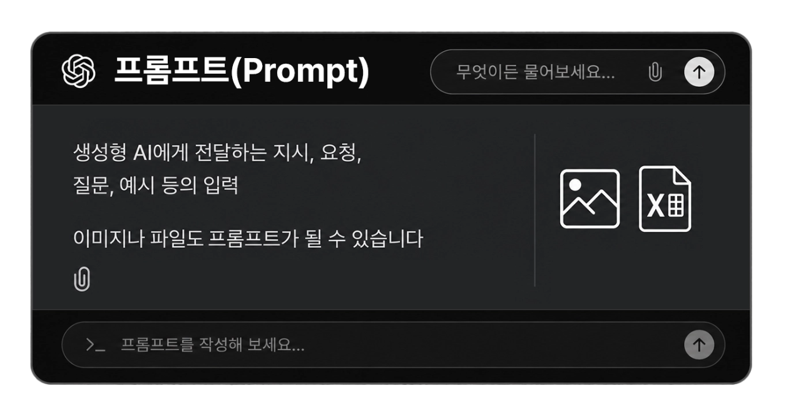
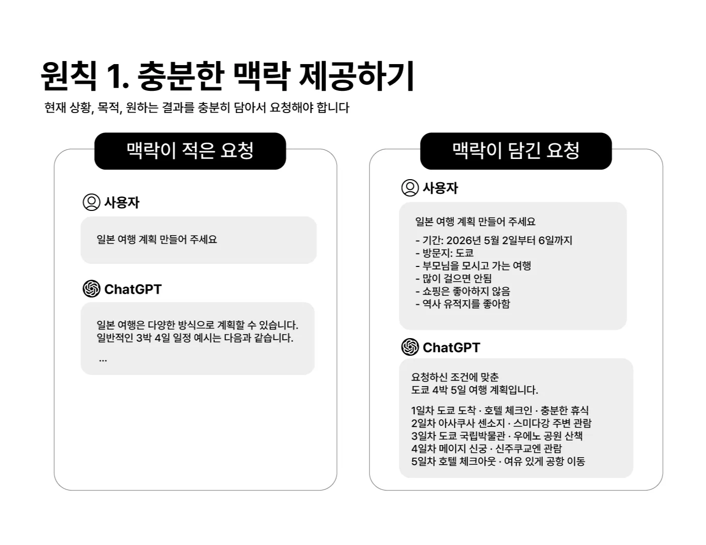
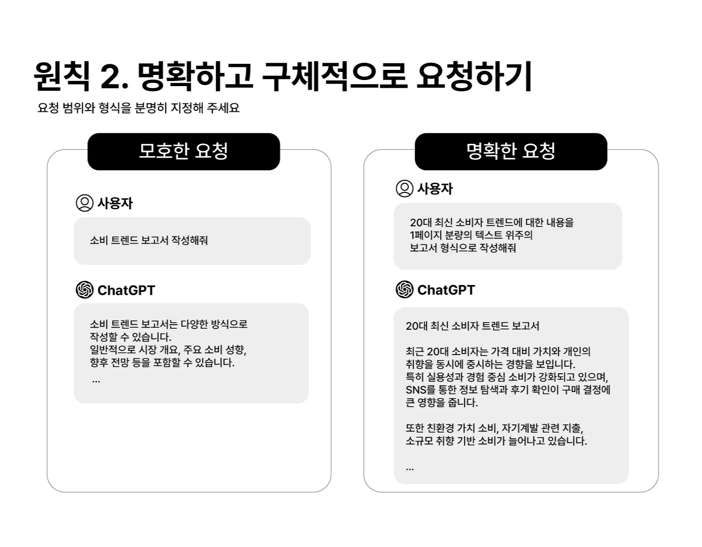
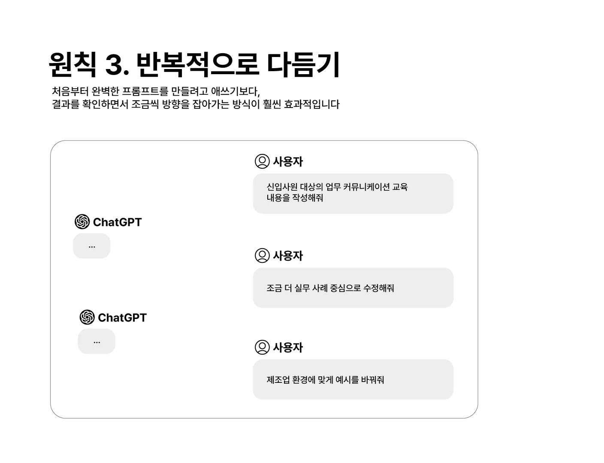
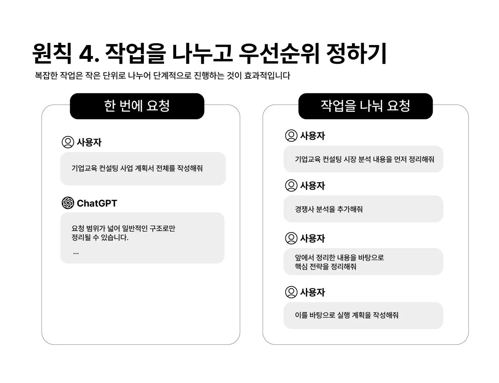
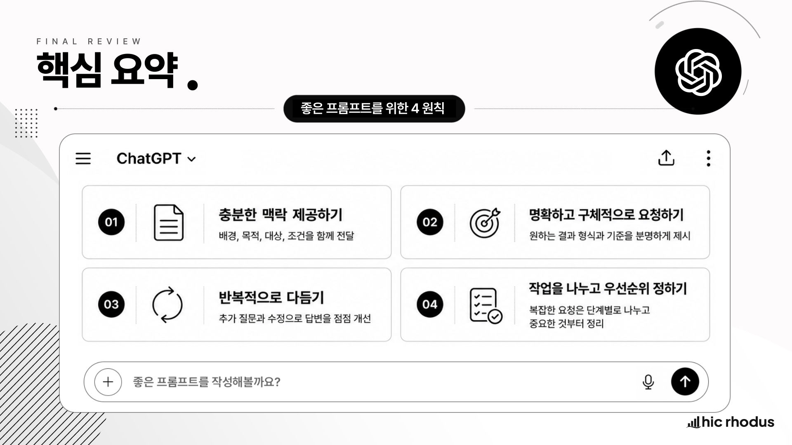

# 03-1. 프롬프트

## 1. 이 강의에서 배울 내용

이번 강의에서는 ChatGPT 를 사용할 때 가장 기본이 되는 개념인 **프롬프트** 를 다룹니다.

ChatGPT 에게 같은 요청을 하더라도 어떤 사람은 원하는 결과를 빠르게 얻고, 어떤 사람은 엉뚱한 답변만 받는 경우가 있습니다. 이 차이는 AI 자체의 성능 차이만으로 설명되지 않습니다.

중요한 것은 **AI 에게 어떻게 요청하느냐** 입니다.

이 강의를 통해 다음 내용을 익힐 수 있습니다.

* 프롬프트가 무엇인지 이해할 수 있습니다.
* 좋은 프롬프트가 왜 중요한지 설명할 수 있습니다.
* 충분한 맥락을 제공하는 방법을 익힐 수 있습니다.
* 명확하고 구체적으로 요청하는 방법을 익힐 수 있습니다.
* 한 번의 요청으로 끝내지 않고 반복적으로 다듬는 방법을 익힐 수 있습니다.
* 복잡한 작업을 나누고 우선순위를 정하는 방법을 익힐 수 있습니다.

## 2. 프롬프트란 무엇인가

프롬프트란 생성형 AI 에게 전달하는 **지시, 요청, 질문, 예시 등의 입력** 을 의미합니다.

쉽게 말하면, AI 에게 말을 거는 모든 것이 프롬프트입니다.

가장 많이 사용하는 형태는 텍스트입니다. ChatGPT 입력창에 타이핑해서 보내는 문장들이 대표적인 프롬프트입니다.

하지만 프롬프트가 반드시 텍스트일 필요는 없습니다.

다음과 같은 입력도 모두 프롬프트가 될 수 있습니다.

* 텍스트 질문
* 업무 지시문
* 예시 문장
* 이미지
* 음성
* 파일
* 표 데이터
* 코드
* 긴 문서

예를 들어 ChatGPT 에게 “보고서 초안을 작성해줘” 라고 입력하는 것도 프롬프트입니다. 이미지를 첨부하고 “이 이미지의 내용을 설명해줘” 라고 요청하는 것도 프롬프트입니다. 파일을 올리고 “이 자료를 요약해줘” 라고 요청하는 것도 프롬프트입니다.

정리하면 다음과 같습니다.

> 프롬프트는 생성형 AI 에게 원하는 작업을 요청하기 위해 제공하는 모든 입력입니다.

## 3. 왜 프롬프트가 중요한가

ChatGPT 는 사용자의 의도와 맥락을 바탕으로 답변을 생성합니다.

그런데 사용자가 충분한 정보를 주지 않으면 ChatGPT 는 사용자의 상황을 정확히 알 수 없습니다. AI 는 사용자의 마음을 읽을 수 없습니다.

따라서 프롬프트가 짧고 모호하면 결과도 일반적이고 모호해질 가능성이 높습니다. 반대로 상황, 목적, 조건, 원하는 결과물 형식을 잘 알려주면 더 적절한 답변을 받을 수 있습니다.

예를 들어 아래처럼 요청할 수 있습니다.

<pre><code>회의 자료 만들어줘</code></pre>

이 요청은 너무 짧습니다. 어떤 회의인지, 대상이 누구인지, 어떤 내용을 포함해야 하는지 알 수 없습니다.

반면 아래처럼 요청하면 결과가 훨씬 좋아집니다.

<pre><code>팀장 대상 주간 회의용으로 매출 현황과 주요 이슈를 정리한 PPT 초안을 만들어줘</code></pre>

두 요청의 차이는 단순히 길이의 차이가 아닙니다.

두 번째 요청에는 다음 정보가 들어 있습니다.

* 회의 대상: 팀장
* 회의 종류: 주간 회의
* 필요한 내용: 매출 현황과 주요 이슈
* 결과물 형식: PPT 초안

이처럼 프롬프트는 AI 의 답변 품질을 결정하는 중요한 입력입니다.

## 4. 좋은 프롬프트를 위한 4가지 원칙

좋은 프롬프트를 작성하기 위한 핵심 원칙은 네 가지로 정리할 수 있습니다.

1. 충분한 맥락 제공하기
2. 명확하고 구체적으로 요청하기
3. 반복적으로 다듬기
4. 작업을 나누고 우선순위 정하기

이 네 가지를 익히면 ChatGPT 와 대화하는 방식이 달라집니다.

처음부터 완벽한 프롬프트를 쓰려고 할 필요는 없습니다. 다만 이 네 가지 원칙을 기준으로 요청을 조금씩 개선하면, ChatGPT 의 결과물도 훨씬 안정적으로 좋아집니다.

## 5. 원칙 1: 충분한 맥락 제공하기

많은 사용자는 네이버나 구글 같은 검색 엔진을 사용하던 습관 때문에 AI 에게도 짧은 키워드 중심으로 요청합니다.

예를 들어 다음처럼 입력할 수 있습니다.

<pre><code>일본 여행 계획 만들어 주세요.</code></pre>

이 요청만으로도 ChatGPT 는 답변을 만들 수 있습니다. 하지만 이 프롬프트에는 중요한 정보가 빠져 있습니다.

ChatGPT 는 다음을 알 수 없습니다.

* 언제 가는 여행인지
* 어느 지역을 방문하는지
* 누구와 함께 가는지
* 여행 목적이 무엇인지
* 예산은 어느 정도인지
* 걷는 것을 선호하는지
* 쇼핑, 역사, 음식, 자연 중 무엇을 좋아하는지

그래서 결과는 일반적인 일본 여행 계획이 되기 쉽습니다.

이제 맥락을 추가해 보겠습니다.

<pre><code>일본 여행 계획 만들어 주세요.

- 기간: 2026년 5월 2일부터 6일까지
- 방문지: 도쿄
- 부모님을 모시고 가는 여행
- 많이 걸으면 안 됨
- 쇼핑은 좋아하지 않음
- 역사 유적지를 좋아함</code></pre>

첫 문장은 동일합니다. 하지만 뒤에 구체적인 상황이 추가되었습니다.

이제 ChatGPT 는 단순히 “일본 여행” 이 아니라, **부모님과 함께 가는 도쿄 여행** 이며, **많이 걷지 않는 일정** 이 필요하고, **역사 유적지 중심** 으로 구성해야 한다는 것을 알 수 있습니다.

좋은 답변은 좋은 맥락에서 나옵니다.

프롬프트를 작성할 때는 다음 질문을 스스로 해보면 좋습니다.

* 지금 어떤 상황인가?
* 누구를 위한 결과물인가?
* 무엇을 얻고 싶은가?
* 어떤 조건을 반드시 반영해야 하는가?
* 어떤 형식으로 받고 싶은가?

이 질문에 대한 답을 프롬프트에 담으면 결과가 훨씬 좋아집니다.

## 6. 원칙 2: 명확하고 구체적으로 요청하기

두 번째 원칙은 **명확하고 구체적으로 요청하기** 입니다.

ChatGPT 는 어느 정도 사용자의 의도를 추론할 수 있습니다. 하지만 요청이 모호하면 결과도 모호해질 가능성이 높습니다.

예를 들어 다음과 같이 요청해 보겠습니다.

<pre><code>소비 트렌드 보고서 작성해줘</code></pre>

이 요청은 너무 넓습니다.

ChatGPT 는 다음을 알 수 없습니다.

* 어느 세대의 소비 트렌드인지
* 어느 국가나 시장을 기준으로 하는지
* 보고서 분량은 어느 정도인지
* 보고서 형식인지, 발표 자료인지, 블로그 글인지
* 분석 수준은 어느 정도여야 하는지
* 실무용인지 학습용인지

이제 조금 더 구체적으로 바꿔보겠습니다.

<pre><code>20대 최신 소비자 트렌드에 대한 내용을 1페이지 분량의 텍스트 위주의 보고서 형식으로 작성해줘</code></pre>

이 프롬프트에는 중요한 조건이 들어 있습니다.

* 대상: 20대
* 주제: 최신 소비자 트렌드
* 분량: 1페이지
* 형식: 텍스트 위주의 보고서

이렇게 작성하면 ChatGPT 는 훨씬 더 명확한 방향으로 답변을 생성할 수 있습니다.

명확하고 구체적인 프롬프트를 작성할 때는 다음 요소를 고려합니다.

| 요소 | 설명            | 예시                   |
| -- | ------------- | -------------------- |
| 대상 | 누구를 위한 결과물인가  | 20대 소비자, 팀장, 신입사원    |
| 목적 | 왜 필요한가        | 회의 보고, 교육 자료, 의사결정   |
| 범위 | 어디까지 다룰 것인가   | 최근 1년, 국내 시장, 핵심 3가지 |
| 형식 | 어떤 형태로 받을 것인가 | 보고서, 표, 목록, 이메일      |
| 분량 | 어느 정도 길이인가    | 1페이지, 500자, 5개 항목    |
| 톤  | 어떤 문체가 필요한가   | 전문적, 친근한, 간결한        |

프롬프트가 구체적일수록 ChatGPT 는 사용자의 의도에 가까운 결과를 낼 수 있습니다.

## 7. 원칙 3: 반복적으로 다듬기

세 번째 원칙은 **반복적으로 다듬기** 입니다.

많은 사용자가 한 번의 요청으로 완벽한 결과를 얻으려고 합니다. 하지만 ChatGPT 같은 대화형 AI 는 하나의 대화 안에서 요청과 응답을 누적하며 맥락을 이해합니다.

따라서 처음부터 완벽한 프롬프트를 작성하려고 하기보다, 결과를 확인하면서 조금씩 수정하고 보완하는 방식이 더 효과적입니다.

처음에는 이렇게 요청할 수 있습니다.

<pre><code>신입사원 대상의 업무 커뮤니케이션 교육 내용을 작성해줘</code></pre>

그러면 ChatGPT 는 일반적인 교육 내용을 제안할 것입니다.

이후 결과를 보면서 추가로 요청합니다.

<pre><code>조금 더 실무 사례 중심으로 수정해줘</code></pre>

그다음 다시 요청할 수 있습니다.

<pre><code>제조업 환경에 맞게 예시를 바꿔줘</code></pre>

이렇게 하면 처음에는 일반적인 교육 내용이었던 결과물이 점점 더 실무적이고 구체적인 내용으로 바뀝니다.

문장 스타일도 후속 요청으로 바꿀 수 있습니다.

<pre><code>슬라이드 발표용 문장 스타일로 바꿔줘</code></pre>

또는 다음처럼 요청할 수도 있습니다.

<pre><code>분량을 절반 정도로 줄여줘</code></pre>

<pre><code>마지막에 실습 과제를 추가해줘</code></pre>

<pre><code>팀장급 교육에 맞게 난이도를 높여줘</code></pre>

이처럼 ChatGPT 와의 대화는 일회성 명령이 아니라 **결과물을 함께 만들어가는 과정** 입니다.

처음 결과가 마음에 들지 않는다고 해서 실패한 것이 아닙니다. 오히려 그 결과를 바탕으로 더 구체적인 방향을 알려줄 수 있습니다.

반복적으로 다듬을 때 사용할 수 있는 표현은 다음과 같습니다.

| 목적    | 후속 프롬프트 예시                  |
| ----- | --------------------------- |
| 더 구체화 | 예시를 더 추가해줘                  |
| 실무화   | 실제 업무 사례 중심으로 바꿔줘           |
| 축약    | 핵심만 남기고 절반 분량으로 줄여줘         |
| 확장    | 각 항목을 더 자세히 설명해줘            |
| 문체 변경 | 임원 보고용 문체로 바꿔줘              |
| 형식 변경 | 표 형식으로 다시 정리해줘              |
| 대상 변경 | 신입사원 대상이 아니라 팀장 대상 교육으로 바꿔줘 |

좋은 프롬프트는 한 번에 완성되는 것이 아니라, 대화 속에서 점점 완성됩니다.

## 8. 원칙 4: 작업을 나누고 우선순위 정하기

네 번째 원칙은 **작업을 나누고 우선순위를 정하기** 입니다.

생성형 AI 는 개별 작업은 매우 잘 수행할 수 있습니다. 하지만 여러 조건과 단계가 동시에 얽혀 있는 복잡한 작업에서는 결과 품질이 불안정해질 수 있습니다.

예를 들어 다음처럼 요청할 수 있습니다.

<pre><code>기업교육 컨설팅 사업 계획서 전체를 작성해줘</code></pre>

이 요청은 한 번에 너무 많은 것을 요구합니다.

사업계획서에는 보통 다음과 같은 내용이 포함됩니다.

* 시장 분석
* 고객 분석
* 경쟁사 분석
* 핵심 전략
* 서비스 구성
* 가격 정책
* 마케팅 계획
* 실행 계획
* 재무 계획
* 리스크 관리

이 모든 내용을 한 번에 요청하면 결과가 만들어지기는 하지만, 각 항목의 깊이가 얕아질 수 있습니다.

따라서 복잡한 작업은 단계별로 나누는 것이 좋습니다.

예를 들어 다음 순서로 진행할 수 있습니다.

<pre><code>기업교육 컨설팅 사업 계획서의 목차를 먼저 설계해줘</code></pre>

그다음 시장 분석을 요청합니다.

<pre><code>목차 중 시장 분석 내용을 먼저 자세히 작성해줘</code></pre>

그다음 경쟁사 분석을 요청합니다.

<pre><code>앞에서 작성한 시장 분석을 바탕으로 경쟁사 분석을 추가해줘</code></pre>

그다음 전략을 정리합니다.

<pre><code>시장 분석과 경쟁사 분석을 바탕으로 핵심 전략을 정리해줘</code></pre>

마지막으로 실행 계획을 작성합니다.

<pre><code>이를 바탕으로 실행 계획을 작성해줘</code></pre>

이렇게 단계별로 진행하면 ChatGPT 가 한 번에 너무 많은 조건을 처리하지 않아도 됩니다. 각 단계의 결과를 확인하면서 다음 단계로 넘어갈 수 있기 때문에 결과 품질도 좋아집니다.

복잡한 작업을 나눌 때는 다음 기준을 사용할 수 있습니다.

| 기준    | 나누는 방법                 |
| ----- | ---------------------- |
| 문서 구조 | 목차 → 섹션별 작성 → 통합       |
| 업무 단계 | 조사 → 분석 → 전략 → 실행 계획   |
| 난이도   | 쉬운 작업 → 복잡한 작업         |
| 자료 흐름 | 입력 자료 정리 → 요약 → 결론 도출  |
| 검토 방식 | 초안 작성 → 오류 검토 → 개선안 작성 |

## 9. 우선순위도 함께 알려주기

복잡한 작업에서는 우선순위를 알려주는 것도 중요합니다.

ChatGPT 는 사용자가 무엇을 가장 중요하게 생각하는지 모르면 균형 잡힌 답변을 만들려고 합니다. 하지만 실무에서는 항상 우선순위가 있습니다.

예를 들어 같은 사업계획서라도 목적에 따라 방향이 달라집니다.

실행 가능성이 가장 중요하다면 이렇게 요청할 수 있습니다.

<pre><code>실행 가능성을 가장 중요하게 고려해서 작성해줘</code></pre>

비용 절감이 중요하다면 이렇게 요청할 수 있습니다.

<pre><code>비용 절감 효과를 중심으로 정리해줘</code></pre>

임원 보고가 목적이라면 이렇게 요청할 수 있습니다.

<pre><code>임원 보고용으로 핵심 의사결정 포인트가 잘 보이도록 정리해줘</code></pre>

초보자 교육이 목적이라면 이렇게 요청할 수 있습니다.

<pre><code>초보자도 이해할 수 있도록 전문 용어를 줄이고 쉬운 예시를 포함해줘</code></pre>

우선순위는 ChatGPT 의 답변 방향을 정하는 기준입니다.

따라서 중요한 작업일수록 “무엇을 가장 중요하게 볼 것인지” 를 함께 알려주는 것이 좋습니다.

## 10. 실습하기

이번 강의에서는 같은 요청을 서로 다른 방식으로 입력해 보고 결과 차이를 확인하는 것이 중요합니다.

### 10.1 맥락 비교 실습

먼저 아래처럼 짧게 요청합니다.

<pre><code>일본 여행 계획 만들어 주세요.</code></pre>

그다음 맥락을 넣어 다시 요청합니다.

<pre><code>일본 여행 계획 만들어 주세요.

- 기간: 2026년 5월 2일부터 6일까지
- 방문지: 도쿄
- 부모님을 모시고 가는 여행
- 많이 걸으면 안 됨
- 쇼핑은 좋아하지 않음
- 역사 유적지를 좋아함</code></pre>

두 답변의 차이를 비교합니다.

비교할 기준은 다음과 같습니다.

* 일정이 더 구체적인가?
* 부모님과 함께하는 여행이라는 점이 반영되었는가?
* 도보 부담이 적은 일정인가?
* 역사 유적지 취향이 반영되었는가?
* 일반적인 답변이 아니라 내 상황에 맞춘 답변인가?

### 10.2 구체성 비교 실습

먼저 아래처럼 요청합니다.

<pre><code>소비 트렌드 보고서 작성해줘</code></pre>

그다음 구체적으로 요청합니다.

<pre><code>20대 최신 소비자 트렌드에 대한 내용을 1페이지 분량의 텍스트 위주의 보고서 형식으로 작성해줘</code></pre>

두 답변의 차이를 비교합니다.

비교할 기준은 다음과 같습니다.

* 대상이 명확한가?
* 보고서 형식이 반영되었는가?
* 분량이 적절한가?
* 내용의 초점이 더 분명한가?

### 10.3 반복 개선 실습

처음에는 아래처럼 요청합니다.

<pre><code>신입사원 대상의 업무 커뮤니케이션 교육 내용을 작성해줘</code></pre>

이후 아래와 같이 순서대로 후속 요청을 입력합니다.

<pre><code>조금 더 실무 사례 중심으로 수정해줘</code></pre>

<pre><code>제조업 환경에 맞게 예시를 바꿔줘</code></pre>

<pre><code>슬라이드 발표용 문장 스타일로 바꿔줘</code></pre>

처음 결과와 마지막 결과를 비교합니다.

### 10.4 작업 분해 실습

복잡한 작업을 한 번에 요청해 봅니다.

<pre><code>기업교육 컨설팅 사업 계획서 전체를 작성해줘</code></pre>

이후 단계별로 나누어 요청합니다.

<pre><code>기업교육 컨설팅 사업 계획서의 목차를 먼저 설계해줘</code></pre>

<pre><code>목차 중 시장 분석 내용을 먼저 자세히 작성해줘</code></pre>

<pre><code>앞에서 작성한 시장 분석을 바탕으로 경쟁사 분석을 추가해줘</code></pre>

<pre><code>시장 분석과 경쟁사 분석을 바탕으로 핵심 전략을 정리해줘</code></pre>

<pre><code>이를 바탕으로 실행 계획을 작성해줘</code></pre>

한 번에 요청한 결과와 단계별로 요청한 결과를 비교해 보세요.

## 11. 실습 완료 기준

이번 강의의 실습은 다음 기준으로 완료할 수 있습니다.

* 프롬프트가 무엇인지 설명할 수 있다.
* 같은 요청을 짧게 한 번, 맥락을 담아 한 번 입력해 보았다.
* 두 답변의 차이를 직접 확인했다.
* 모호한 요청과 구체적인 요청의 차이를 확인했다.
* 첫 결과에 만족하지 않고 후속 프롬프트로 두 번 이상 다듬어 보았다.
* 복잡한 작업 하나를 단계별로 나누어 요청해 보았다.
* 우선순위를 알려주는 프롬프트를 한 번 이상 사용해 보았다.

## 12. 핵심 정리

* 프롬프트는 생성형 AI 에게 전달하는 지시, 요청, 질문, 예시 등 모든 입력입니다.
* 텍스트뿐 아니라 이미지, 음성, 파일도 프롬프트가 될 수 있습니다.
* ChatGPT 는 검색 엔진이 아니라 대화형 AI 이므로, 짧은 키워드보다 맥락이 담긴 요청이 더 효과적입니다.
* 좋은 프롬프트를 위한 첫 번째 원칙은 충분한 맥락을 제공하는 것입니다.
* 두 번째 원칙은 명확하고 구체적으로 요청하는 것입니다.
* 세 번째 원칙은 한 번에 끝내려 하지 말고 반복적으로 다듬는 것입니다.
* 네 번째 원칙은 복잡한 작업을 나누고 우선순위를 정하는 것입니다.
* 좋은 결과는 한 번의 완벽한 프롬프트보다, 대화 속에서 점진적으로 개선하는 과정에서 만들어집니다.

## 13. 영상으로 학습하기

<iframe width="560" height="315" src="https://www.youtube.com/embed/3rOSCXxp-uQ?si=KH85cKcn1YTniKBA" title="YouTube video player" frameborder="0" allow="accelerometer; autoplay; clipboard-write; encrypted-media; gyroscope; picture-in-picture; web-share" referrerpolicy="strict-origin-when-cross-origin" allowfullscreen></iframe>
