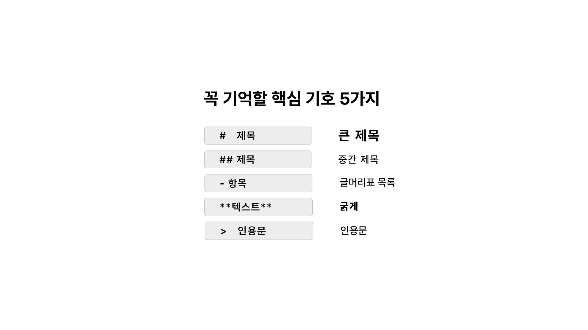
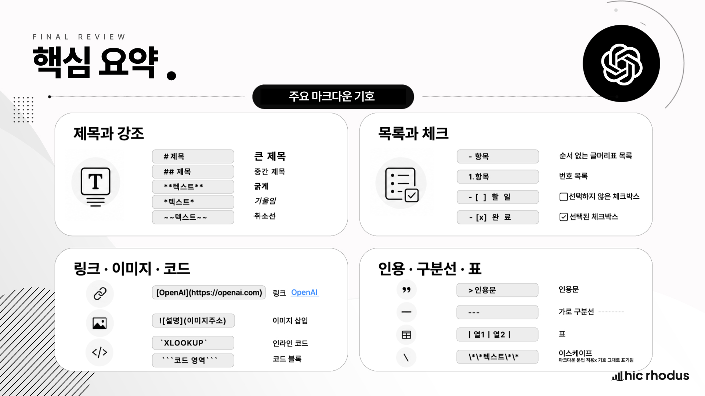

# 03-3. 마크다운 기본 문법

## 1. 이 강의에서 배울 내용

이번 강의에서는 AI 시대의 중요한 문서 작성 문법인 **마크다운(Markdown)** 을 다룹니다.

ChatGPT 를 사용하다 보면 답변 안에 제목, 목록, 굵은 글씨, 인용문, 코드 블록 등이 자연스럽게 정리되어 있는 것을 볼 수 있습니다. 이런 구조화된 표현의 기반이 되는 문법이 바로 마크다운입니다.

이 강의를 통해 다음 내용을 익힐 수 있습니다.

* 마크다운이 무엇인지 이해할 수 있습니다.
* ChatGPT 답변이 마크다운 기반 구조로 표현되는 이유를 이해할 수 있습니다.
* 제목, 목록, 강조, 인용문 등 핵심 마크다운 문법을 사용할 수 있습니다.
* ChatGPT 의 캔버스 또는 마크다운 편집기에서 마크다운을 직접 입력해 볼 수 있습니다.
* 마크다운을 프롬프트에 활용해 요청 사항, 조건, 출력 형식을 구조화할 수 있습니다.
* 마크다운을 AI 와 더 정확하게 협업하기 위한 구조화 도구로 이해할 수 있습니다.

## 2. 왜 마크다운을 배워야 하는가

ChatGPT 에게 질문을 하면 답변이 단순한 줄글로만 나오지 않는 경우가 많습니다.

어떤 문장은 제목처럼 크고 굵게 표시되고, 어떤 내용은 목록으로 정리됩니다. 중요한 단어는 굵게 강조되기도 하고, 단계별 설명에는 번호가 붙기도 합니다.

이것은 단순히 보기 좋게 꾸민 결과가 아닙니다.

많은 생성형 AI 서비스는 제목, 목록, 강조, 인용문, 코드 블록 같은 구조화된 표현을 자주 사용합니다. 그리고 이런 결과는 마크다운 기반 형식으로 작성되거나 렌더링되는 경우가 많습니다.

마크다운을 이해하면 두 가지 점에서 유리합니다.

첫째, AI 가 만들어 준 답변의 구조를 더 잘 이해할 수 있습니다.

둘째, 내가 AI 에게 요청할 때도 요청 사항과 조건을 더 명확하게 전달할 수 있습니다.

즉, 마크다운은 단순한 문서 꾸미기 문법이 아닙니다.

> 마크다운은 AI 와 더 효과적으로 협업하기 위한 구조화 도구입니다.

## 3. AI 답변에 숨어 있는 구조 확인하기

먼저 ChatGPT 의 답변이 어떻게 구조화되는지 확인해 보겠습니다.

새 채팅을 열고 아래 프롬프트를 입력합니다.

<pre><code>분식집 스타일의 라면 레시피를 알려주세요.</code></pre>

ChatGPT 는 보통 제목, 재료 목록, 조리 순서, 팁 등을 구조화해서 답변합니다.

결과를 보면 다음과 같은 특징을 확인할 수 있습니다.

* 제목이 크게 표시됩니다.
* 재료가 목록으로 정리됩니다.
* 조리 순서가 단계별로 정리됩니다.
* 중요한 내용이 굵게 강조될 수 있습니다.

이제 방금 받은 답변이 실제로 어떤 구조로 작성되었는지 확인해 보겠습니다.

같은 대화에서 이어서 아래 프롬프트를 입력합니다.

<pre><code>결과를 마크다운 형식으로 보여주세요.</code></pre>

그러면 화면에서 보기 좋게 보이던 답변이 마크다운 코드 형태로 표시됩니다.

예를 들어 다음과 같은 형태를 볼 수 있습니다.

<pre><code># 분식집 스타일 라면 레시피

## 재료
- 라면 1봉지
- 물 550ml
- 대파 약간
- 계란 1개

## 조리 순서
1. 냄비에 물을 넣고 끓입니다.
2. 물이 끓으면 면과 스프를 넣습니다.
3. 대파와 계란을 넣고 조금 더 끓입니다.

**팁:** 마지막에 후추를 조금 넣으면 분식집 느낌이 더 살아납니다.</code></pre>

여기서 확인할 수 있는 것이 바로 마크다운 문법입니다.

* `#` 은 큰 제목을 만듭니다.
* `##` 은 중간 제목을 만듭니다.
* `-` 는 목록을 만듭니다.
* `1.` 은 번호 목록을 만듭니다.
* `**텍스트**` 는 글자를 굵게 강조합니다.

우리가 화면에서 본 깔끔한 답변은 이런 기호로 작성된 마크다운 문서가 렌더링된 결과입니다.

## 4. 마크다운이란 무엇인가

마크다운은 특수 기호를 사용해 제목, 목록, 강조, 인용문, 코드 블록 같은 문서 구조를 표현하는 **경량 문법** 입니다.

쉽게 말하면, 복잡한 프로그램 없이 간단한 기호 몇 개만으로 문서의 구조를 표현하는 방식입니다.

예를 들어 다음과 같이 작성할 수 있습니다.

<pre><code># 제목

## 소제목

- 첫 번째 항목
- 두 번째 항목

**중요한 내용**

> 참고 메모</code></pre>

이 문법은 사람이 보기에도 간단하고, AI 가 보기에도 정보의 역할을 구분하기 쉽습니다.

마크다운의 핵심은 단순한 디자인이 아니라 **구조** 입니다.

| 표현    | 의미                 |
| ----- | ------------------ |
| 제목    | 문서의 큰 단위 구분        |
| 소제목   | 하위 주제 구분           |
| 목록    | 조건, 항목, 절차 정리      |
| 강조    | 중요한 내용 표시          |
| 인용문   | 참고, 메모, 주의사항 구분    |
| 코드 블록 | 프롬프트, 코드, 예시 문장 구분 |

생성형 AI 는 구조화된 텍스트를 더 안정적으로 해석하는 경향이 있습니다. 따라서 프롬프트나 참고 문서를 마크다운 형식으로 작성하면, AI 가 요청 사항, 조건, 예시, 출력 형식을 더 명확하게 구분할 수 있습니다.

## 5. 핵심 마크다운 문법

마크다운 문법은 다양하지만, 처음부터 모든 문법을 외울 필요는 없습니다.

ChatGPT 를 실무에서 활용하기 위해서는 우선 가장 많이 쓰는 핵심 기호만 익히면 충분합니다.

| 기호                            | 역할          | 예시                |
| ----------------------------- | ----------- | ----------------- |
| `#`                           | 1단계 제목      | `# 제목`            |
| `##`                          | 2단계 제목      | `## 소제목`          |
| `###`                         | 3단계 제목      | `### 하위 제목`       |
| `-`                           | 목록          | `- 항목`            |
| `1.`                          | 번호 목록       | `1. 첫 번째 단계`      |
| `**텍스트**`                     | 굵게 강조       | `**중요**`          |
| `>`                           | 인용문         | `> 메모`            |
| `<pre><code>...</code></pre>` | 코드 또는 예시 블록 | 프롬프트, 코드, 긴 예시 표시 |

이 중에서 가장 먼저 익힐 것은 다섯 가지입니다.

* 제목을 만드는 `#`
* 소제목을 만드는 `##`
* 목록을 만드는 `-`
* 굵게 강조하는 `**텍스트**`
* 인용문을 만드는 `>`

이 다섯 가지만 사용할 수 있어도 프롬프트와 문서의 구조를 훨씬 명확하게 만들 수 있습니다.

## 6. 마크다운 실습 1: AI 답변을 마크다운 코드로 확인하기

먼저 ChatGPT 에게 간단한 글 생성을 요청합니다.

새 채팅에서 아래 프롬프트를 입력합니다.

<pre><code>인공지능의 역사에 대해서 간략하게 소개해 주세요.</code></pre>

ChatGPT 는 보통 인공지능의 역사를 시기별 또는 단계별로 정리해 줍니다.

이제 이어서 아래 프롬프트를 입력합니다.

<pre><code>결과를 마크다운 코드로 보여주세요.</code></pre>

그러면 앞에서 보기 좋게 표시되던 답변이 마크다운 원본 코드로 표시됩니다.

이 실습에서 확인할 것은 두 가지입니다.

첫째, 화면에서 보던 답변 뒤에는 마크다운 구조가 숨어 있습니다.

둘째, 같은 내용도 마크다운 코드와 렌더링 결과는 다르게 보입니다.

즉, 마크다운은 작성할 때는 기호가 보이지만, 화면에서는 보기 좋은 문서로 변환되어 표시됩니다.

## 7. 마크다운 실습 2: 캔버스에서 직접 입력하기

이번에는 직접 마크다운을 작성해 보겠습니다.

ChatGPT 새 채팅에서 아래 프롬프트를 입력합니다.

<pre><code>글 작성을 위한 빈 캔버스를 만들어 주세요.</code></pre>

그러면 글 작성을 위한 캔버스가 열릴 수 있습니다.

캔버스는 ChatGPT 안에서 긴 글이나 문서를 작성하고 수정할 수 있는 작업 공간입니다. 이번 강의에서는 캔버스 자체를 깊게 다루지는 않고, 마크다운을 입력해 보는 연습 공간으로 사용합니다.

캔버스가 열리면 아래 내용을 그대로 입력해 보세요.

<pre><code># 주간 업무 보고

## 업무 현황
### 완료 업무
- 거래처 A 견적서 발송

### 진행중 업무
- **중요!** 마감 프로젝트 보고서 작성
- 협력사 계약서 검토

## 이슈 현황
> 이번 주 이슈: 자재 납기 지연으로 일정 재조율 필요</code></pre>

입력 후 결과를 확인합니다.

각 기호는 다음과 같이 작동합니다.

| 입력한 기호           | 화면에서 보이는 결과 |
| ---------------- | ----------- |
| `# 주간 업무 보고`     | 가장 큰 제목     |
| `## 업무 현황`       | 2단계 제목      |
| `### 완료 업무`      | 3단계 제목      |
| `- 거래처 A 견적서 발송` | 목록          |
| `**중요!**`        | 굵게 강조       |
| `> 이번 주 이슈`      | 인용문         |

이 실습의 목적은 마크다운이 문서의 구조를 어떻게 만드는지 직접 확인하는 것입니다.

기호 몇 개만 사용해도 문서가 훨씬 읽기 쉬운 구조로 바뀝니다.

## 8. 캔버스가 실행되지 않을 때

ChatGPT 환경이나 플랜에 따라 캔버스가 바로 실행되지 않을 수 있습니다.

이 경우에는 외부 마크다운 편집기에서 실습할 수 있습니다.

예를 들어 `stackedit.io` 같은 마크다운 편집기 사이트를 사용할 수 있습니다.

사용 방법은 간단합니다.

1. 마크다운 편집기 사이트에 접속합니다.
2. 왼쪽 편집 영역에 마크다운 문법을 입력합니다.
3. 오른쪽 미리보기 영역에서 렌더링 결과를 확인합니다.

중요한 것은 어떤 도구를 쓰느냐가 아닙니다.

핵심은 마크다운 기호가 문서 구조를 어떻게 바꾸는지 직접 확인하는 것입니다.

## 9. 마크다운을 프롬프트에 활용하기

마크다운은 문서를 작성할 때만 유용한 것이 아닙니다.

프롬프트를 작성할 때도 매우 유용합니다.

업무에서 ChatGPT 에게 요청할 때, 요청 사항과 조건과 출력 형식을 한 문단에 길게 쓰는 경우가 많습니다. 하지만 줄글로 길게 작성하면 AI 가 무엇이 핵심 요청이고, 무엇이 조건이고, 무엇이 출력 형식인지 구분하기 어려울 수 있습니다.

마크다운을 사용하면 프롬프트 안에서 정보의 역할을 나눌 수 있습니다.

예를 들어 신규 직원 환영 행사 기획안 초안을 요청한다고 해보겠습니다.

<pre><code># 요청
신규 직원 환영 행사 기획안 초안을 작성해줘.

## 기본 정보
- **일시:** 7월 중
- **대상:** 신규 입사자 5명
- **예산:** 1인당 3만원

## 출력 형식
- 행사명
- 주요 프로그램 3가지
- 준비물</code></pre>

이 프롬프트는 크게 세 부분으로 나뉩니다.

| 구분         | 역할                     |
| ---------- | ---------------------- |
| `# 요청`     | ChatGPT 에게 수행할 작업      |
| `## 기본 정보` | 반드시 반영해야 할 조건          |
| `## 출력 형식` | 결과물을 어떤 형태로 받을지에 대한 요구 |

이렇게 작성하면 ChatGPT 는 사용자의 요청을 더 명확하게 이해할 수 있습니다.

단순히 보기 좋게 꾸민 것이 아니라, AI 가 정보를 처리하기 쉽게 구조화한 것입니다.

## 10. 줄글 프롬프트와 마크다운 프롬프트 비교

같은 요청이라도 줄글로 작성했을 때와 마크다운으로 작성했을 때는 차이가 있습니다.

### 10.1 줄글 프롬프트

<pre><code>신규 직원 환영 행사 기획안 초안을 작성해줘. 일시는 7월 중이고 대상은 신규 입사자 5명이야. 예산은 1인당 3만원이고 행사명, 주요 프로그램 3가지, 준비물을 포함해줘.</code></pre>

이 프롬프트도 충분히 이해할 수 있습니다.

하지만 요청, 조건, 출력 형식이 한 문단 안에 섞여 있습니다.

### 10.2 마크다운 프롬프트

<pre><code># 요청
신규 직원 환영 행사 기획안 초안을 작성해줘.

## 기본 정보
- **일시:** 7월 중
- **대상:** 신규 입사자 5명
- **예산:** 1인당 3만원

## 출력 형식
- 행사명
- 주요 프로그램 3가지
- 준비물</code></pre>

마크다운 프롬프트는 정보의 역할이 분리되어 있습니다.

* 요청은 요청으로 구분됩니다.
* 조건은 조건으로 구분됩니다.
* 출력 형식은 출력 형식으로 구분됩니다.

이 구조는 사용자가 보기에도 좋고, AI 가 해석하기에도 좋습니다.

따라서 실무에서 조건이 많아질수록 마크다운 프롬프트가 유리합니다.

## 11. 마크다운 프롬프트 작성 요령

마크다운을 활용해 프롬프트를 작성할 때는 다음 순서를 추천합니다.

### 11.1 요청을 제목으로 구분하기

먼저 가장 중요한 요청을 `# 요청` 아래에 작성합니다.

<pre><code># 요청
다음 조건을 바탕으로 임원 보고용 보고서 초안을 작성해줘.</code></pre>

### 11.2 기본 정보를 목록으로 정리하기

조건은 목록으로 정리합니다.

<pre><code>## 기본 정보
- **보고 대상:** 임원
- **주제:** 2분기 매출 현황
- **목적:** 주요 성과와 이슈 공유
- **분량:** 1페이지</code></pre>

### 11.3 포함할 내용을 별도로 구분하기

반드시 포함해야 할 내용은 별도 제목 아래 정리합니다.

<pre><code>## 포함할 내용
- 매출 요약
- 전년 대비 변화
- 주요 원인
- 리스크
- 다음 분기 대응 계획</code></pre>

### 11.4 출력 형식을 명시하기

결과물의 형식을 지정합니다.

<pre><code>## 출력 형식
- 제목
- 핵심 요약
- 본문
- 표
- 결론</code></pre>

이렇게 작성하면 ChatGPT 가 답변을 구성할 때 필요한 기준을 더 명확히 파악할 수 있습니다.

## 12. 실습하기

이번 강의에서는 세 가지 실습을 해보면 좋습니다.

### 12.1 마크다운 코드 확인 실습

새 채팅에서 아래 프롬프트를 입력합니다.

<pre><code>분식집 스타일의 라면 레시피를 알려주세요.</code></pre>

이어서 아래 프롬프트를 입력합니다.

<pre><code>결과를 마크다운 형식으로 보여주세요.</code></pre>

화면에서 보던 답변이 어떤 마크다운 구조로 작성되어 있는지 확인합니다.

### 12.2 캔버스 마크다운 입력 실습

새 채팅에서 아래 프롬프트를 입력합니다.

<pre><code>글 작성을 위한 빈 캔버스를 만들어 주세요.</code></pre>

캔버스에 아래 내용을 입력합니다.

<pre><code># 주간 업무 보고

## 업무 현황
### 완료 업무
- 거래처 A 견적서 발송

### 진행중 업무
- **중요!** 마감 프로젝트 보고서 작성
- 협력사 계약서 검토

## 이슈 현황
> 이번 주 이슈: 자재 납기 지연으로 일정 재조율 필요</code></pre>

제목, 목록, 굵은 글씨, 인용문이 각각 어떻게 표시되는지 확인합니다.

### 12.3 마크다운 프롬프트 실습

새 채팅에서 아래 프롬프트를 입력합니다.

<pre><code># 요청
신규 직원 환영 행사 기획안 초안을 작성해줘.

## 기본 정보
- **일시:** 7월 중
- **대상:** 신규 입사자 5명
- **예산:** 1인당 3만원

## 출력 형식
- 행사명
- 주요 프로그램 3가지
- 준비물</code></pre>

결과가 요청, 조건, 출력 형식을 잘 반영하는지 확인합니다.

## 13. 실습 완료 기준

이번 강의의 실습은 다음 기준으로 완료할 수 있습니다.

* ChatGPT 답변이 마크다운 구조로 작성될 수 있다는 점을 확인했다.
* `결과를 마크다운 형식으로 보여주세요.` 라는 요청으로 원본 구조를 확인했다.
* `#`, `##`, `-`, `**텍스트**`, `>` 의 역할을 이해했다.
* 캔버스 또는 마크다운 편집기에서 마크다운을 직접 입력해 보았다.
* 마크다운을 사용해 요청, 기본 정보, 출력 형식을 나눈 프롬프트를 작성해 보았다.
* 마크다운이 단순한 꾸미기 문법이 아니라 AI 와 협업하기 위한 구조화 도구라는 점을 이해했다.

## 14. 핵심 정리

* 마크다운은 특수 기호를 사용해 제목, 목록, 강조, 인용문, 코드 블록 같은 문서 구조를 표현하는 경량 문법입니다.
* ChatGPT 의 답변은 제목, 목록, 강조 등 마크다운 기반 구조로 표현되는 경우가 많습니다.
* `#` 은 1단계 제목, `##` 은 2단계 제목, `-` 는 목록, `**텍스트**` 는 굵은 강조, `>` 는 인용문을 만듭니다.
* 마크다운은 문서를 보기 좋게 꾸미는 기능을 넘어, 정보의 역할과 우선순위를 구분하는 도구입니다.
* 생성형 AI 는 구조화된 텍스트를 더 안정적으로 해석하는 경향이 있습니다.
* 프롬프트에 마크다운을 사용하면 요청 사항, 조건, 출력 형식을 명확하게 구분할 수 있습니다.
* 실무에서 조건이 많거나 출력 형식이 중요한 요청일수록 마크다운 프롬프트가 유용합니다.
* 마크다운은 AI 와 더 정확하게 협업하기 위한 기본 문법입니다.

## 15. 영상으로 학습하기

<iframe width="560" height="315" src="https://www.youtube.com/embed/kGYjkghkyNQ?si=4O-OKDspVj5xv5R_" title="YouTube video player" frameborder="0" allow="accelerometer; autoplay; clipboard-write; encrypted-media; gyroscope; picture-in-picture; web-share" referrerpolicy="strict-origin-when-cross-origin" allowfullscreen></iframe>
