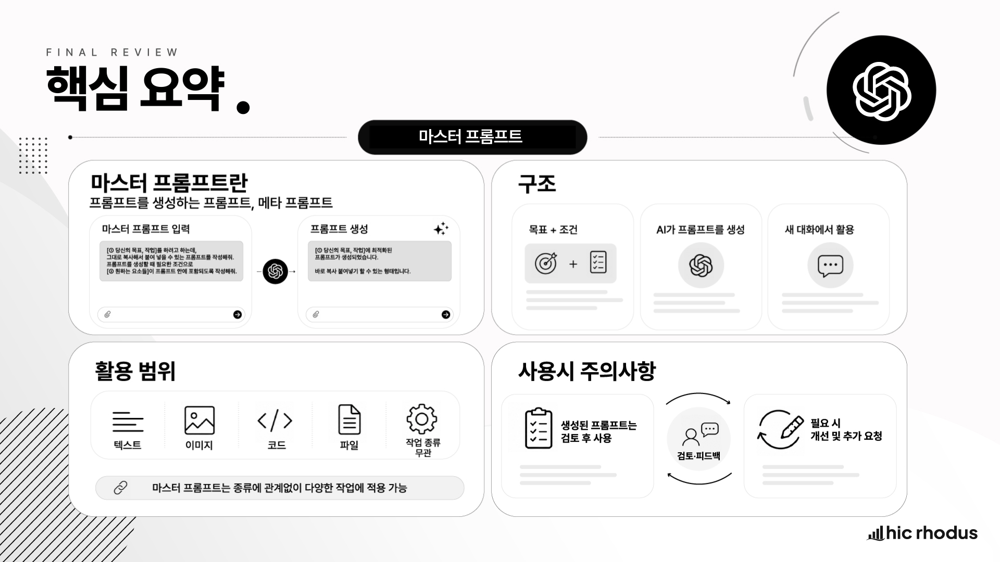

# 03-4. 프롬프트 프레임워크: 마스터 프롬프트

## 1. 이 강의에서 배울 내용

이번 강의에서는 **프롬프트를 만드는 프롬프트** 인 마스터 프롬프트를 다룹니다.

ChatGPT 를 잘 활용하려면 좋은 프롬프트가 필요합니다. 하지만 매번 좋은 프롬프트를 직접 만드는 것은 쉽지 않습니다. 무엇을 어떻게 표현해야 할지 막막해서 AI 활용을 어렵게 느끼는 경우도 많습니다.

이럴 때 사용할 수 있는 방법이 있습니다.

바로 **좋은 프롬프트를 AI 에게 먼저 만들어 달라고 요청하는 것** 입니다.

이 강의를 통해 다음 내용을 익힐 수 있습니다.

* 프롬프트 품질과 결과물 품질의 관계를 이해할 수 있습니다.
* 마스터 프롬프트가 무엇인지 설명할 수 있습니다.
* 목표와 조건을 분리해 프롬프트 생성 요청을 만들 수 있습니다.
* 마스터 프롬프트를 사용해 더 나은 프롬프트를 생성할 수 있습니다.
* 생성된 프롬프트를 새 대화에서 실행해 실제 결과물을 만들 수 있습니다.
* 텍스트, 이미지, 코드, 파일 생성 요청에 마스터 프롬프트를 응용할 수 있습니다.
* AI 가 만든 프롬프트를 검토하고 개선하는 방법을 익힐 수 있습니다.

## 2. 왜 마스터 프롬프트가 필요한가

생성형 AI 의 결과물 품질은 여러 요소의 영향을 받습니다.

대표적으로 다음 요소들이 중요합니다.

* 사용하는 AI 모델의 성능
* 제공한 맥락의 충분성
* 입력 자료의 품질
* 출력 조건의 명확성
* 프롬프트의 구조와 표현 방식

이 중에서 사용자가 직접 조절하기 가장 쉬운 요소가 바로 **프롬프트** 입니다.

프롬프트의 품질과 결과물의 품질은 상당히 밀접하게 연결되어 있습니다. 좋은 프롬프트를 사용하면 AI 가 사용자의 의도를 더 정확하게 이해하고, 더 적절한 결과를 생성할 가능성이 높아집니다.

하지만 좋은 프롬프트를 매번 직접 작성하는 것은 쉽지 않습니다.

예를 들어 다음과 같은 상황이 자주 생깁니다.

* 원하는 결과는 머릿속에 있지만 어떻게 요청해야 할지 모르겠다.
* 조건은 많은데 어떤 순서로 정리해야 할지 모르겠다.
* 내가 쓴 프롬프트가 너무 짧거나 모호한 것 같다.
* AI 가 계속 엉뚱한 결과를 내놓지만 어디를 고쳐야 할지 모르겠다.
* 프롬프트 엔지니어링을 배웠지만 실제 업무에 적용하려니 어렵다.

이럴 때는 프롬프트 작성 자체를 AI 에게 맡길 수 있습니다.

즉, AI 에게 바로 결과물을 요청하는 것이 아니라, 먼저 **그 결과물을 잘 만들 수 있는 프롬프트** 를 만들어 달라고 요청하는 것입니다.

이 방식이 바로 이번 강의에서 다루는 마스터 프롬프트입니다.

## 3. 마스터 프롬프트란 무엇인가

마스터 프롬프트는 **프롬프트를 생성하는 프롬프트** 입니다.

더 일반적으로는 `메타 프롬프트` 또는 `프롬프트 생성 프롬프트` 라고 부를 수도 있습니다.

이 강의에서는 편의상 마스터 프롬프트라고 부르겠습니다.

마스터 프롬프트의 목적은 실제 결과물을 바로 만드는 것이 아닙니다.

목적은 **실제 결과물을 만들기 위한 더 좋은 프롬프트를 먼저 생성하는 것** 입니다.

이 워크플로우의 핵심은 다음과 같습니다.

1. 먼저 AI 에게 좋은 프롬프트를 만들어 달라고 요청합니다.
2. AI 가 만들어 준 프롬프트를 복사합니다.
3. 새 대화에서 그 프롬프트를 실행합니다.
4. 실제 결과물을 생성합니다.

즉, 프롬프트를 생성하는 AI 와 실제 결과물을 생성하는 AI 를 분리하는 방식입니다.

이 방식은 특히 다음 상황에서 유용합니다.

* 프롬프트를 어떻게 작성해야 할지 모를 때
* 복잡한 조건을 정리해야 할 때
* 더 전문적인 지시문이 필요할 때
* 이미지 생성, 코드 생성, 문서 생성처럼 결과물의 조건이 많은 작업을 할 때
* 초보자가 좋은 프롬프트 구조를 학습하고 싶을 때

## 4. 마스터 프롬프트의 기본 구조

마스터 프롬프트의 기본 구조는 단순합니다.

핵심은 두 가지입니다.

| 구분         | 의미                | 입력할 내용                              |
| ---------- | ----------------- | ----------------------------------- |
| ① 목표 또는 작업 | 내가 하고 싶은 일        | 이메일 작성, 여행 코스 추천, 이미지 생성, HTML 작성 등 |
| ② 원하는 요소   | 결과물에 포함되었으면 하는 조건 | 포함할 내용, 형식, 톤, 제약 조건, 출력 방식 등       |

아래 템플릿을 기본형으로 사용할 수 있습니다.

<pre><code>나는 [① 당신의 목표, 작업]를 하려고 하는데, 어떻게 표현해야 할지 잘 모르겠습니다.

그대로 복사해서 붙여 넣을 수 있는 더 나은 프롬프트를 작성해 줄 수 있나요?

프롬프트를 생성할 때 필요한 조건으로 [② 원하는 요소들]이 프롬프트 안에 포함되도록 작성해 주세요.</code></pre>

이 템플릿에서 사용자가 채워야 하는 부분은 두 곳입니다.

첫째, `① 당신의 목표, 작업` 부분입니다.

여기에는 내가 실제로 하고 싶은 일을 씁니다.

예를 들어 다음과 같이 작성할 수 있습니다.

* 고객에게 보낼 사과 이메일 작성
* 서울 근교 당일치기 여행 코스 추천
* 냉장고 재료로 저녁 메뉴 추천
* 감성적인 카페 이미지 생성
* 사내 교육 홍보용 HTML 카드 뉴스 제작
* 매출 현황 대시보드 목업 작성

둘째, `② 원하는 요소들` 부분입니다.

여기에는 결과물에 반드시 포함되었으면 하는 조건을 씁니다.

예를 들어 다음과 같은 항목을 넣을 수 있습니다.

* 반드시 포함할 내용
* 제외할 내용
* 원하는 톤
* 결과물 형식
* 분량
* 대상 독자
* 예산
* 일정
* 기술적 제약
* 평가 기준

마스터 프롬프트의 품질은 ②번 조건을 얼마나 구체적으로 쓰느냐에 따라 달라집니다.

즉, 목표는 ①번에 쓰고, 조건은 ②번에 쓰는 방식입니다.

## 5. 기본 워크플로우

마스터 프롬프트는 아래 순서로 사용합니다.

## 5.1 1단계: 프롬프트 생성 요청하기

먼저 새 대화에서 마스터 프롬프트를 입력합니다.

이때 AI 에게 실제 결과물을 만들어 달라고 하지 않습니다.

대신 실제 결과물을 잘 만들기 위한 **프롬프트를 만들어 달라고** 요청합니다.

## 5.2 2단계: 생성된 프롬프트 확인하기

AI 가 더 구체적이고 전문적인 프롬프트를 만들어 줍니다.

이때 생성된 프롬프트 안에 내가 제시한 조건이 잘 반영되어 있는지 확인합니다.

확인할 항목은 다음과 같습니다.

* 목표가 정확히 반영되었는가?
* 중요한 조건이 빠지지 않았는가?
* 결과물 형식이 명확한가?
* 톤과 목적이 적절한가?
* 불필요하게 모호한 표현은 없는가?

## 5.3 3단계: 새 대화에서 실행하기

생성된 프롬프트가 괜찮다면 복사합니다.

그리고 새 대화를 열어 붙여넣고 실행합니다.

새 대화를 사용하는 이유는 이전 대화의 맥락 영향을 줄이기 위해서입니다. 마스터 프롬프트를 만들던 대화와 실제 결과물을 생성하는 대화를 분리하면, 생성된 프롬프트 자체의 품질을 더 명확하게 확인할 수 있습니다.

정리하면 기본 워크플로우는 다음과 같습니다.

> 생성 요청 → 프롬프트 확인 → 새 대화에서 실행 → 실제 결과물 생성

## 6. 예시 1: 배송 지연 사과 이메일

배송 지연에 대한 사과 이메일을 작성해야 한다고 가정해 보겠습니다.

직접 이메일을 요청해도 되지만, 이번에는 먼저 이메일 작성용 프롬프트를 만들어 달라고 요청합니다.

<pre><code>나는 이메일 작성 지시를 하려고 하는데, 어떻게 표현해야 할지 잘 모르겠습니다.

그대로 복사해서 붙여 넣을 수 있는 더 나은 프롬프트를 작성해 줄 수 있나요?

답변에는 아래의 내용이 포함되었으면 합니다.

1. 태풍으로 인해서 창고 침수
2. 고객께서 주문하신 제품도 침수되어 정상 배송 불가
3. 즉시 새로운 제품을 확보할 예정이지만 7일 정도 소요 예상
4. 배송을 기다려주실 수 있는지, 희망하시는 경우 즉시 취소 가능
5. 진심 어린 사과</code></pre>

이 프롬프트의 목적은 이메일을 직접 작성하는 것이 아닙니다.

목적은 **배송 지연 사과 이메일을 잘 작성할 수 있는 프롬프트를 만드는 것** 입니다.

AI 는 이 요청을 바탕으로 더 정교한 프롬프트를 생성합니다.

예를 들어 생성된 프롬프트에는 다음 요소가 포함될 수 있습니다.

* 고객 커뮤니케이션 전문가 역할
* 태풍으로 인한 창고 침수 상황
* 제품 침수와 정상 배송 불가 안내
* 대체 제품 확보까지 7일 소요 예상
* 고객에게 선택권 제공
* 진심 어린 사과
* 공손하고 신뢰를 회복하는 톤

이제 생성된 프롬프트를 복사합니다.

그다음 새 채팅을 열어 해당 프롬프트를 붙여넣고 실행합니다. 그러면 실제 고객에게 보낼 수 있는 사과 이메일이 생성됩니다.

여기서 중요한 점은 두 단계가 분리되어 있다는 것입니다.

| 단계  | AI 에게 요청하는 것               |
| --- | -------------------------- |
| 1단계 | 좋은 이메일 작성 프롬프트를 만들어 달라고 요청 |
| 2단계 | 생성된 프롬프트로 실제 이메일 작성 요청     |

이 분리가 마스터 프롬프트 워크플로우의 핵심입니다.

## 7. 예시 2: 여행 코스 추천

이번에는 서울 근교 당일치기 여행 코스를 추천받고 싶은 상황입니다.

어떻게 요청해야 할지 모른다면 아래처럼 사용할 수 있습니다.

<pre><code>나는 AI에게 서울 근교 당일치기 여행 코스를 추천받고 싶은데,
어떻게 요청하면 좋을지 모르겠습니다.

그대로 복사해서 사용할 수 있는 프롬프트를 작성해 주세요.

답변에는:
- 대중교통 이동 가능
- 너무 빡빡하지 않은 일정
- 맛집 포함
- 사진 찍기 좋은 장소
- 카페 포함
이 포함되었으면 합니다.</code></pre>

이 요청도 여행 코스를 직접 추천받는 것이 아닙니다.

여행 코스를 추천받기 위한 좋은 프롬프트를 먼저 생성하는 요청입니다.

이 프롬프트에서 ① 목표는 다음입니다.

<pre><code>서울 근교 당일치기 여행 코스를 추천받고 싶다.</code></pre>

② 조건은 다음입니다.

* 대중교통 이동 가능
* 너무 빡빡하지 않은 일정
* 맛집 포함
* 사진 찍기 좋은 장소
* 카페 포함

AI 는 이 조건을 반영해 여행 코스 추천용 프롬프트를 만들어 줍니다.

그 프롬프트를 복사한 뒤 새 채팅에서 실행하면, 조건에 맞는 여행 코스 추천 결과를 받을 수 있습니다.

이때 조건을 더 구체적으로 쓰면 결과도 더 좋아질 수 있습니다.

예를 들어 다음 조건을 추가할 수 있습니다.

* 출발지는 서울역
* 이동 시간은 편도 1시간 30분 이내
* 부모님과 함께 이동
* 많이 걷지 않는 일정
* 점심 예산은 1인당 2만 원 내외
* 비 오는 날에도 가능한 코스

마스터 프롬프트는 사용자가 조건을 세밀하게 정리할수록 더 강력해집니다.

## 8. 예시 3: 저녁 메뉴 추천

마스터 프롬프트는 일상적인 요청에도 사용할 수 있습니다.

예를 들어 냉장고에 있는 재료로 저녁 메뉴를 추천받고 싶다고 가정해 보겠습니다.

<pre><code>나는 AI에게 냉장고에 있는 재료로 만들 수 있는 저녁 메뉴를 추천받고 싶은데,
어떻게 요청하면 좋을지 모르겠습니다.

복사해서 사용할 수 있는 좋은 프롬프트를 작성해 주세요.

답변에는:
- 20분 이내 요리
- 설거지가 적은 메뉴
- 요리 초보도 가능
- 너무 맵지 않은 음식
- 필요한 재료와 조리 순서
가 포함되었으면 합니다.</code></pre>

이 프롬프트는 저녁 메뉴를 바로 추천받는 요청이 아닙니다.

저녁 메뉴 추천을 잘 받아낼 수 있는 프롬프트를 먼저 만들어 달라는 요청입니다.

이 예시에서 중요한 조건은 다음과 같습니다.

* 조리 시간: 20분 이내
* 난이도: 요리 초보도 가능
* 취향: 너무 맵지 않음
* 편의성: 설거지가 적음
* 출력 형식: 필요한 재료와 조리 순서 포함

일상적인 요청이라도 이렇게 조건을 분리하면 AI 가 훨씬 더 실용적인 프롬프트를 만들어 줄 수 있습니다.

## 9. 예시 4: 이미지 생성 프롬프트

마스터 프롬프트는 텍스트 결과물뿐 아니라 이미지 생성에도 활용할 수 있습니다.

이미지 생성을 잘하려면 피사체, 분위기, 조명, 구도, 스타일, 품질 조건 등을 구체적으로 표현해야 합니다. 하지만 처음에는 이런 요소를 어떻게 써야 할지 막막할 수 있습니다.

이때 아래처럼 요청할 수 있습니다.

<pre><code>나는 AI에게 감성적인 카페 분위기 이미지를 생성해 달라고 요청하고 싶은데,
어떻게 표현하면 좋을지 모르겠습니다.

복사해서 바로 사용할 수 있는 프롬프트를 작성해 주세요.

답변에는:
- 따뜻한 분위기
- 자연광 느낌
- 감성 카페 스타일
- 인스타그램 느낌
- 고화질 이미지
가 포함되었으면 합니다.</code></pre>

이 요청의 목적은 이미지를 직접 생성하는 것이 아닙니다.

목적은 이미지 생성 AI 에 입력할 더 정교한 이미지 생성 프롬프트를 만드는 것입니다.

AI 는 사용자의 추상적인 요구를 더 구체적인 이미지 묘사로 바꿔 줄 수 있습니다.

예를 들어 다음 요소를 추가해 줄 수 있습니다.

* 조명: 따뜻한 자연광
* 구도: 창가 테이블 중심
* 분위기: 조용하고 감성적인 카페
* 색감: 베이지, 브라운, 크림톤
* 카메라 느낌: 얕은 심도, 고해상도
* 스타일: 인스타그램 감성 사진

이렇게 만들어진 프롬프트를 복사해 새 대화에서 이미지 생성 요청으로 사용하면 됩니다.

## 10. 예시 5: HTML 카드 뉴스 생성

코드나 파일 생성 요청에도 마스터 프롬프트를 사용할 수 있습니다.

예를 들어 사내 교육 홍보용 카드 뉴스를 HTML 로 만들고 싶다면 아래처럼 요청할 수 있습니다.

<pre><code>나는 AI에게 사내 교육 홍보용 카드 뉴스를 HTML로 만들어 달라고 요청하고 싶은데,
어떻게 표현하면 좋을지 모르겠습니다.

복사해서 사용할 수 있는 프롬프트를 작성해 주세요.

프롬프트에는:
- 주제는 생성형 AI 업무 활용 교육
- 제목, 핵심 혜택, 교육 대상, 교육 시간 포함
- 한 화면에 보기 좋은 카드 형태
- HTML과 CSS만 사용
- 외부 라이브러리는 사용하지 않음
- 복사해서 .html 파일로 저장하면 바로 열 수 있는 형태
- 깔끔하고 전문적인 디자인
이 포함되었으면 합니다.</code></pre>

이 요청을 실행하면 AI 는 HTML 카드 뉴스를 만들기 위한 프롬프트를 생성합니다.

그 프롬프트에는 다음과 같은 조건이 명확히 포함될 수 있습니다.

* HTML 과 CSS 만 사용할 것
* 외부 라이브러리는 사용하지 않을 것
* 한 화면에 보기 좋은 카드 형태일 것
* 제목, 핵심 혜택, 교육 대상, 교육 시간을 포함할 것
* 복사해 `.html` 파일로 저장하면 바로 열 수 있을 것
* 깔끔하고 전문적인 디자인일 것

이처럼 기술적 제약 조건이 있는 작업일수록 마스터 프롬프트가 유용합니다.

조건이 많을수록 직접 프롬프트를 쓰기 어렵기 때문입니다.

## 11. 예시 6: 매출 대시보드 목업 생성

HTML 카드 뉴스와 비슷하게, 대시보드 목업을 만들 때도 마스터 프롬프트를 사용할 수 있습니다.

<pre><code>나는 AI에게 매출 현황 대시보드 목업을 HTML로 만들어 달라고 요청하고 싶은데,
어떻게 표현하면 좋을지 모르겠습니다.

복사해서 사용할 수 있는 프롬프트를 작성해 주세요.

프롬프트에는:
- 월별 매출 현황
- 지역별 매출 비교
- 상품군별 매출 비중
- 핵심 KPI 카드 3개
- 표와 막대 그래프 형태의 시각 요소
- HTML과 CSS만 사용
- 외부 라이브러리 없이 실행 가능
- 샘플 데이터 포함
이 포함되었으면 합니다.</code></pre>

이 요청을 통해 생성된 프롬프트는 단순히 “대시보드 만들어줘” 보다 훨씬 구체적입니다.

특히 다음 조건이 명확해집니다.

* 어떤 지표를 보여줄 것인가
* 어떤 시각 요소를 포함할 것인가
* KPI 카드는 몇 개인가
* 샘플 데이터가 필요한가
* 외부 라이브러리를 사용할 수 있는가
* HTML 과 CSS 만으로 실행 가능한가

실제 파일 생성 가능 여부는 사용하는 AI 서비스와 도구 기능에 따라 달라질 수 있습니다. 하지만 어떤 AI 도구를 사용하든, 이런 식으로 조건이 정리된 프롬프트는 결과물 품질을 높이는 데 도움이 됩니다.

## 12. 마스터 프롬프트의 한계

마스터 프롬프트는 유용하지만 완벽한 방법은 아닙니다.

AI 가 만들어 준 프롬프트가 항상 최선의 프롬프트는 아닙니다.

다음과 같은 문제가 생길 수 있습니다.

* 내가 제시한 조건 일부가 빠질 수 있습니다.
* 불필요하게 장황한 프롬프트가 만들어질 수 있습니다.
* 결과물의 형식이 충분히 명확하지 않을 수 있습니다.
* 모호한 표현이 남아 있을 수 있습니다.
* 내가 의도하지 않은 페르소나나 조건이 추가될 수 있습니다.
* 실제 실행 가능한 범위를 넘어서는 요구가 포함될 수 있습니다.

따라서 생성된 프롬프트를 그대로 사용하기 전에 반드시 한 번 검토해야 합니다.

검토 기준은 다음 네 가지입니다.

| 기준 | 확인 질문                    |
| -- | ------------------------ |
| 목표 | 내가 하려던 작업이 정확히 반영되었는가?   |
| 조건 | 내가 제시한 조건이 빠짐없이 포함되었는가?  |
| 표현 | 결과물의 톤과 방식이 내가 원하는 방향인가? |
| 누락 | 빠진 정보나 추가해야 할 기준은 없는가?   |

마스터 프롬프트는 최종본을 보장하는 장치가 아닙니다.

더 좋은 프롬프트를 만들기 위한 **출발점** 으로 보는 것이 좋습니다.

## 13. 생성된 프롬프트 개선하기

AI 가 생성한 프롬프트가 아직 부족하다면 같은 대화에서 바로 개선을 요청할 수 있습니다.

아래 프롬프트를 이어서 입력해 보세요.

<pre><code>방금 작성한 프롬프트를 더 개선해 주세요.
특히 모호한 표현을 줄이고, 결과물의 형식과 평가 기준이 더 명확해지도록 다듬어 주세요.</code></pre>

이 후속 요청은 방금 생성된 프롬프트를 한 단계 더 정교하게 다듬기 위한 프롬프트입니다.

이 요청을 사용하면 AI 는 기존 프롬프트를 검토하고 다음 요소를 보완할 수 있습니다.

* 모호한 표현 제거
* 결과물 형식 명확화
* 평가 기준 추가
* 포함해야 할 항목 정리
* 출력 구조 개선
* 조건의 우선순위 정리

예를 들어 여행 코스 추천 프롬프트를 개선한다면 다음과 같은 요소가 추가될 수 있습니다.

* 시간대별 일정표
* 예상 이동 시간
* 식사 장소 추천 기준
* 코스별 장단점
* 우천 시 대안
* 이동 피로도 평가
* 추천 이유

이처럼 마스터 프롬프트로 만들어진 결과물은 그대로 끝내기보다, 한 번 더 개선 요청을 통해 완성도를 높일 수 있습니다.

## 14. 실습하기

이번 강의에서는 마스터 프롬프트를 실제로 사용해 보겠습니다.

### 14.1 기본 템플릿 실습

아래 템플릿에서 ①과 ②를 직접 채워 보세요.

<pre><code>나는 [① 당신의 목표, 작업]를 하려고 하는데, 어떻게 표현해야 할지 잘 모르겠습니다.

그대로 복사해서 붙여 넣을 수 있는 더 나은 프롬프트를 작성해 줄 수 있나요?

프롬프트를 생성할 때 필요한 조건으로 [② 원하는 요소들]이 프롬프트 안에 포함되도록 작성해 주세요.</code></pre>

예를 들어 다음처럼 작성할 수 있습니다.

<pre><code>나는 고객에게 보낼 사과 이메일을 작성하려고 하는데, 어떻게 표현해야 할지 잘 모르겠습니다.

그대로 복사해서 붙여 넣을 수 있는 더 나은 프롬프트를 작성해 줄 수 있나요?

프롬프트를 생성할 때 필요한 조건으로 배송 지연 사유, 현재 조치 상황, 예상 배송 가능일, 고객 선택권, 진심 어린 사과가 프롬프트 안에 포함되도록 작성해 주세요.</code></pre>

### 14.2 생성된 프롬프트 실행 실습

1. 마스터 프롬프트를 입력합니다.
2. AI 가 생성한 프롬프트를 복사합니다.
3. 새 채팅을 엽니다.
4. 생성된 프롬프트를 붙여넣고 실행합니다.
5. 실제 결과물이 원하는 방향으로 나오는지 확인합니다.

### 14.3 개선 요청 실습

생성된 프롬프트가 마음에 들지 않거나 더 정교하게 만들고 싶다면 아래 프롬프트를 이어서 입력합니다.

<pre><code>방금 작성한 프롬프트를 더 개선해 주세요.
특히 모호한 표현을 줄이고, 결과물의 형식과 평가 기준이 더 명확해지도록 다듬어 주세요.</code></pre>

개선된 프롬프트를 다시 복사해 새 채팅에서 실행해 보세요.

## 15. 실습 완료 기준

이번 강의의 실습은 다음 기준으로 완료할 수 있습니다.

* 마스터 프롬프트가 무엇인지 설명할 수 있다.
* 목표와 조건을 분리해 작성할 수 있다.
* 기본 템플릿의 ①과 ②를 직접 채워 보았다.
* 마스터 프롬프트로 실제 프롬프트를 생성해 보았다.
* 생성된 프롬프트를 새 대화에서 실행해 실제 결과물을 받아 보았다.
* 생성된 프롬프트를 검토하고 부족한 점을 찾았다.
* 개선 요청 프롬프트를 사용해 프롬프트를 한 단계 더 다듬어 보았다.

## 16. 핵심 정리

* 마스터 프롬프트는 프롬프트를 생성하는 프롬프트입니다.
* 좋은 프롬프트를 직접 만들기 어려울 때, AI 에게 먼저 좋은 프롬프트를 만들어 달라고 요청할 수 있습니다.
* 마스터 프롬프트의 핵심 구조는 목표와 조건입니다.
* ①에는 내가 하려는 작업이나 원하는 결과물을 입력합니다.
* ②에는 결과물에 반드시 포함되어야 할 세부 조건을 입력합니다.
* 기본 워크플로우는 생성 요청, 프롬프트 확인, 새 대화에서 실행입니다.
* 프롬프트를 생성하는 AI 와 실제 결과물을 생성하는 AI 를 분리하면 프롬프트 품질을 더 명확하게 확인할 수 있습니다.
* 마스터 프롬프트는 이메일, 여행 추천, 메뉴 추천, 이미지 생성, HTML 작성, 대시보드 목업 등 다양한 작업에 응용할 수 있습니다.
* AI 가 생성한 프롬프트가 항상 최선은 아니므로, 목표와 조건이 잘 반영되었는지 검토해야 합니다.
* 필요하면 후속 요청으로 모호한 표현을 줄이고 결과물의 형식과 평가 기준을 더 명확하게 다듬어야 합니다.

## 17. 영상으로 학습하기

<iframe width="560" height="315" src="https://www.youtube.com/embed/CQ3lK_WwhhI?si=GQ_3FFJyep8-oQHI" title="YouTube video player" frameborder="0" allow="accelerometer; autoplay; clipboard-write; encrypted-media; gyroscope; picture-in-picture; web-share" referrerpolicy="strict-origin-when-cross-origin" allowfullscreen></iframe>
