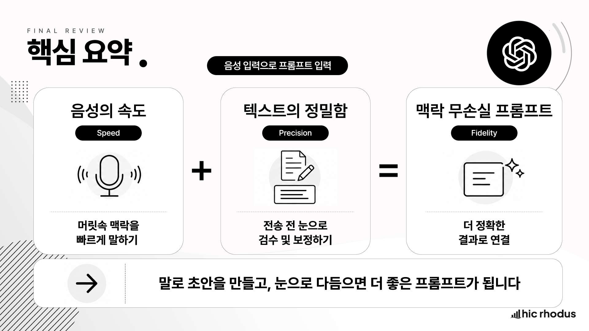

# 04-4. 음성 입력: 긴 프롬프트 빠르게 만들기

## 1. 이 강의에서 배울 내용

이번 강의에서는 ChatGPT 의 **음성 입력** 기능을 다룹니다.

ChatGPT 를 쓰다 보면 머릿속에는 설명할 내용이 많은데, 막상 입력창 앞에서는 짧게 쓰게 되는 경우가 많습니다. 특히 모바일 환경이나 이동 중에는 긴 프롬프트를 타이핑하기가 더 어렵습니다.

프로젝트 배경, 조건, 예외 상황, 원하는 형식까지 모두 적으려면 시간이 오래 걸립니다. 그러다 보면 중요한 조건을 빠뜨리기 쉽고, 결과물도 그만큼 두루뭉술해집니다.

이럴 때 사용할 수 있는 방법이 음성 입력입니다.

이 강의를 통해 다음 내용을 익힐 수 있습니다.

* 음성 입력이 무엇인지 이해할 수 있습니다.
* 음성 입력과 음성 모드의 차이를 구분할 수 있습니다.
* 업무 맥락이 풍부한 긴 프롬프트를 말로 빠르게 작성할 수 있습니다.
* 음성 입력 후 전송 전에 숫자, 조건, 출력 형식을 검수할 수 있습니다.
* 전사 정확도를 높이는 말하기 방법을 익힐 수 있습니다.
* 업무에서 음성 입력을 사용할 때 필요한 보안 기준을 이해할 수 있습니다.
* 음성 입력을 보고서, 회의록, 이메일, 교육 콘텐츠 기획에 활용할 수 있습니다.

## 2. 왜 음성 입력이 필요한가

ChatGPT 의 답변 품질은 모델 성능만으로 결정되지 않습니다.

사용자가 얼마나 충분한 맥락을 제공했는지가 매우 중요합니다.

예를 들어 아래처럼 요청할 수 있습니다.

<pre><code>월간 영업 실적 요약해줘.</code></pre>

이 요청만으로도 ChatGPT 는 답변을 생성할 수 있습니다. 하지만 어떤 부서의 실적인지, 보고 대상이 누구인지, 어떤 수치를 반영해야 하는지, 어떤 형식으로 작성해야 하는지 알 수 없습니다.

반면 아래처럼 요청하면 결과가 달라집니다.

<pre><code>나는 영업기획팀 담당자입니다.
다음 주 임원 보고에서 쓸 월간 영업 실적 요약 자료를 만들려고 합니다.
이번 달 매출은 전월 대비 8% 증가했지만, 신규 고객 수는 목표 대비 15% 부족했습니다.
보고서에는 매출 요약, 목표 대비 차이, 주요 원인, 다음 달 대응 계획을 포함해 주세요.
출력 형식은 임원 보고용 1페이지 요약문으로 작성해 주세요.</code></pre>

이 프롬프트에는 역할, 목적, 수치, 포함할 내용, 출력 형식이 들어 있습니다.

결과적으로 ChatGPT 는 훨씬 더 실무에 맞는 답변을 만들 수 있습니다.

문제는 이런 긴 프롬프트를 매번 키보드로 입력하기가 어렵다는 점입니다.

실무자는 머릿속에 많은 맥락을 가지고 있습니다. 하지만 타이핑 과정에서 다음 문제가 생깁니다.

* 타이핑 속도가 생각 속도를 따라가지 못합니다.
* 긴 배경 설명을 쓰다가 핵심 조건을 빠뜨립니다.
* 귀찮아서 짧게 입력합니다.
* 짧게 입력한 만큼 일반적인 답변을 받습니다.
* 다시 수정 요청을 반복하면서 시간이 더 걸립니다.

즉, ChatGPT 의 성능이 낮은 것이 아니라 **입력된 맥락이 부족해서 결과물이 약해지는 경우** 가 많습니다.

음성 입력은 이 문제를 줄여줍니다.

머릿속에 있는 업무 맥락을 말로 빠르게 풀어내고, 전송 전에 눈으로 확인한 뒤 수정할 수 있습니다.

정리하면 다음과 같습니다.

> 음성 입력의 목적은 단순히 빠르게 입력하는 것이 아니라, 업무 맥락을 손실 없이 프롬프트로 옮기는 것입니다.

## 3. 음성 입력이란 무엇인가

음성 입력은 사용자가 말한 내용을 텍스트로 변환해 ChatGPT 입력창에 넣어 주는 기능입니다.

쉽게 말하면 ChatGPT 입력창에서 사용하는 받아쓰기 기능입니다.

중요한 점은 음성 입력 결과가 바로 전송되는 것이 아니라, 먼저 입력창에 텍스트로 들어온다는 점입니다. 따라서 사용자는 전송 전에 내용을 확인하고 수정할 수 있습니다.

이 때문에 음성 입력은 업무용 긴 프롬프트 작성에 적합합니다.

예를 들어 다음과 같은 상황에서 유용합니다.

* 보고서 작성 조건을 길게 설명해야 할 때
* 회의 내용을 기억나는 대로 정리해야 할 때
* 이메일 초안의 상황과 톤을 상세히 설명해야 할 때
* 데이터 분석 요구사항을 현업 맥락과 함께 설명해야 할 때
* 교육 콘텐츠 기획 아이디어를 빠르게 풀어내야 할 때
* 모바일에서 긴 프롬프트를 입력해야 할 때

음성 입력은 최종본을 만드는 기능이라기보다, 긴 프롬프트의 초안을 빠르게 만드는 기능입니다.

그래서 핵심 절차는 다음과 같습니다.

> 말로 초안을 만들고, 눈으로 보정한 뒤, 전송합니다.

## 4. 음성 입력과 음성 모드의 차이

ChatGPT 에는 음성과 관련된 기능이 여러 가지 있습니다.

처음에는 음성 입력과 음성 모드를 혼동하기 쉽습니다. 하지만 두 기능은 목적이 다릅니다.

| 구분      | 음성 입력                    | 음성 모드                   |
| ------- | ------------------------ | ----------------------- |
| 목적      | 말한 내용을 텍스트 프롬프트로 변환      | ChatGPT 와 실시간 음성 대화     |
| 결과      | 입력창에 텍스트가 들어감            | 음성으로 대화가 오감             |
| 전송 전 수정 | 가능                       | 어렵거나 제한적                |
| 적합한 업무  | 긴 프롬프트 작성, 조건 전달, 보고서 요청 | 아이디어 대화, 영어 회화, 빠른 질의응답 |
| 통제력     | 높음                       | 상대적으로 낮음                |
| 핵심 장점   | 전송 전에 눈으로 검수 가능          | 자연스럽고 빠른 대화             |

업무 프롬프트 작성에는 음성 모드보다 음성 입력이 더 적합한 경우가 많습니다.

이유는 명확합니다.

업무에서는 숫자, 금액, 일정, 조건, 출력 형식이 정확해야 합니다. 음성 입력은 전송 전에 텍스트를 확인하고 고칠 수 있으므로 이런 정보가 들어간 프롬프트에 적합합니다.

반대로 음성 모드는 실시간 대화에 가깝기 때문에 아이디어 발산, 영어 회화, 간단한 질의응답에 더 잘 맞습니다.

정리하면 다음과 같습니다.

> 정교한 업무 프롬프트는 음성 입력으로 작성합니다.
> 자연스러운 실시간 대화는 음성 모드로 진행합니다.

## 5. 음성 입력으로 긴 프롬프트 만들기

이번 실습의 목표는 단순히 마이크 아이콘을 눌러보는 것이 아닙니다.

목표는 **업무 맥락이 담긴 긴 프롬프트를 음성으로 만들고, 전송 전에 검수하는 것** 입니다.

상황은 다음과 같이 가정하겠습니다.

다음 주 임원 보고에서 사용할 월간 영업 실적 요약 자료를 만들려고 합니다. 이번 달 매출은 전월 대비 늘었지만, 신규 고객 수는 목표보다 부족한 상황입니다.

### 5.1 음성 입력 실행하기

ChatGPT 입력창에서 마이크 아이콘을 선택합니다.

그리고 아래 내용을 자연스럽게 말합니다.

<pre><code>나는 영업기획팀 담당자입니다.
다음 주 임원 보고에서 쓸 월간 영업 실적 요약 자료를 만들려고 합니다.
이번 달 매출은 전월 대비 8% 증가했지만, 신규 고객 수는 목표 대비 15% 부족했습니다.
보고서에는 매출 요약, 목표 대비 차이, 주요 원인, 다음 달 대응 계획을 포함해 주세요.
출력 형식은 임원 보고용 1페이지 요약문으로 작성해 주세요.</code></pre>

말이 끝나면 확인 버튼을 누릅니다.

그러면 방금 말한 내용이 입력창에 텍스트로 들어옵니다.

이 단계에서 중요한 것은 바로 전송하지 않는 것입니다.

음성 입력은 빠른 초안을 만드는 단계입니다. 전송 전 검수까지 해야 실무용 입력이 됩니다.

### 5.2 전송 전 검수하기

음성 입력 후에는 반드시 텍스트를 확인합니다.

검수할 항목은 다음과 같습니다.

| 검수 항목 | 확인 내용                             |
| ----- | --------------------------------- |
| 숫자    | 8%, 15% 같은 수치가 정확한가               |
| 역할    | 영업기획팀 담당자라는 맥락이 들어갔는가             |
| 목적    | 임원 보고용 자료라는 목적이 들어갔는가             |
| 포함 내용 | 매출 요약, 목표 대비 차이, 원인, 대응 계획이 들어갔는가 |
| 출력 형식 | 1페이지 요약문이라는 형식이 들어갔는가             |
| 민감 정보 | 실제 회사명, 고객명, 내부 시스템명이 들어가지 않았는가   |

수정할 부분이 있다면 키보드로 고칩니다.

예를 들어 `8%` 가 `팔 퍼센트` 로 이상하게 입력되었거나, `15%` 가 누락되었다면 해당 부분만 수정합니다.

출력 형식이 빠졌다면 마지막에 아래 문장을 추가합니다.

<pre><code>출력 형식은 임원 보고용 1페이지 요약문으로 작성해 주세요.</code></pre>

검수가 끝난 뒤 전송합니다.

이 과정의 핵심은 다음입니다.

> 말로 빠르게 입력하고, 전송 전에 눈으로 정확도를 맞춥니다.

## 6. 음성 입력이 한 덩어리 문단으로 들어왔을 때

음성 입력을 사용하면 말한 내용이 한 덩어리 문단으로 입력되는 경우가 많습니다.

이 상태로 바로 전송해도 ChatGPT 가 이해할 수는 있습니다. 하지만 조건이 많다면 문단을 나누고 목록으로 정리하는 것이 더 좋습니다.

예를 들어 음성 입력 결과가 아래처럼 한 문단으로 들어왔다고 가정해 보겠습니다.

<pre><code>나는 영업기획팀 담당자입니다 다음 주 임원 보고에서 쓸 월간 영업 실적 요약 자료를 만들려고 합니다 이번 달 매출은 전월 대비 8% 증가했지만 신규 고객 수는 목표 대비 15% 부족했습니다 보고서에는 매출 요약 목표 대비 차이 주요 원인 다음 달 대응 계획을 포함해 주세요 출력 형식은 임원 보고용 1페이지 요약문으로 작성해 주세요</code></pre>

이때 전송 전에 아래처럼 정리할 수 있습니다.

<pre><code>나는 영업기획팀 담당자입니다.

다음 주 임원 보고에서 쓸 월간 영업 실적 요약 자료를 만들려고 합니다.

상황:
- 이번 달 매출은 전월 대비 8% 증가했습니다.
- 신규 고객 수는 목표 대비 15% 부족했습니다.

포함할 내용:
- 매출 요약
- 목표 대비 차이
- 주요 원인
- 다음 달 대응 계획

출력 형식:
- 임원 보고용 1페이지 요약문</code></pre>

이렇게 바꾸면 두 가지 장점이 있습니다.

첫째, 사용자가 빠진 조건을 찾기 쉬워집니다.

둘째, ChatGPT 가 요청 사항과 조건과 출력 형식을 더 명확하게 구분할 수 있습니다.

줄을 나누고 싶을 때는 사용 환경에 따라 `Shift + Enter` 를 사용할 수 있습니다.

정리하면 다음과 같습니다.

> 음성 입력으로 초안을 만들고, 전송 전에는 문단과 목록으로 정리합니다.

## 7. 전사 정확도를 높이는 말하기 방법

음성 인식은 단어 하나하나를 기계적으로 받아쓰는 것이 아닙니다.

앞뒤 문맥을 보고 문장으로 해석합니다. 따라서 단어를 끊어서 말하기보다, 완전한 문장으로 자연스럽게 말하는 것이 더 좋습니다.

### 7.1 좋지 않은 발화 방식

아래처럼 단어를 끊어 말하면 문맥 정보가 부족해집니다.

<pre><code>신규... 프로젝트... 예산... 1억... 기간... 3개월...</code></pre>

이렇게 말하면 음성 인식이 단어 사이의 관계를 파악하기 어렵습니다.

### 7.2 좋은 발화 방식

아래처럼 완전한 문장으로 말하는 것이 좋습니다.

<pre><code>신규 프로젝트 기획안을 작성하려고 합니다.
전체 예산은 1억 원이고, 실행 기간은 3개월입니다.
단, 외부 협력사는 2곳 이하로 제한하고, 기존 시스템과 연동 가능해야 합니다.</code></pre>

이 방식은 문맥이 살아 있기 때문에 전사 정확도가 높아집니다.

### 7.3 말하기 요령

음성 입력을 사용할 때는 다음 원칙을 지키면 좋습니다.

| 원칙              | 설명                         |
| --------------- | -------------------------- |
| 문장으로 말하기        | 단어를 나열하지 말고 완전한 문장으로 말합니다. |
| 숫자는 천천히 말하기     | 퍼센트, 금액, 날짜는 또박또박 말합니다.    |
| 조건은 순서대로 말하기    | 첫째, 둘째, 셋째처럼 구분하면 좋습니다.    |
| 출력 형식을 마지막에 말하기 | 마지막에 원하는 결과물 형식을 분명히 말합니다. |
| 너무 긴 침묵 피하기     | 긴 침묵이 있으면 입력이 끊길 수 있습니다.   |
| 조용한 환경 사용       | 주변 소음이 적을수록 전사 품질이 좋아집니다.  |
| 전송 전 확인         | 음성 입력 후 바로 전송하지 않고 검수합니다.  |

음성 입력은 익숙해질수록 훨씬 편해집니다.

처음에는 어색하더라도 “역할, 상황, 조건, 출력 형식” 순서로 말하는 습관을 들이면 긴 프롬프트를 빠르게 만들 수 있습니다.

## 8. 추천 발화 구조

긴 프롬프트를 말로 작성할 때는 머릿속에 구조를 잡아두면 좋습니다.

아래 구조를 기본 템플릿처럼 사용할 수 있습니다.

<pre><code>나는 [역할]입니다.

[상황]을 해결하려고 합니다.

목적은 [목적]입니다.

조건은 다음과 같습니다.

첫째, [조건 1].
둘째, [조건 2].
셋째, [조건 3].
넷째, [조건 4].
다섯째, [조건 5].

출력 형식은 [결과물 형식]으로 작성해 주세요.</code></pre>

예를 들어 교육 담당자라면 다음처럼 말할 수 있습니다.

<pre><code>나는 사내 교육 담당자입니다.

신입사원을 대상으로 ChatGPT 기본 활용 교육을 준비하려고 합니다.

목적은 신입사원들이 업무 문서 작성과 정보 정리에 ChatGPT 를 안전하게 활용하도록 돕는 것입니다.

조건은 다음과 같습니다.

첫째, 교육 시간은 2시간입니다.
둘째, 수강생은 ChatGPT 를 처음 사용하는 사람들입니다.
셋째, 실습은 이메일 작성과 회의록 요약 중심으로 구성해 주세요.
넷째, 회사 기밀이나 개인정보를 입력하지 않는 보안 원칙을 반드시 포함해 주세요.
다섯째, 교육 후 바로 사용할 수 있는 체크리스트를 제공해 주세요.

출력 형식은 교육 목차와 실습안으로 작성해 주세요.</code></pre>

이런 구조를 사용하면 말로 입력해도 프롬프트가 흐트러지지 않습니다.

## 9. 업무에서 사용할 때의 보안 기준

음성 입력은 편리하지만, 업무에서 사용할 때는 주의해야 합니다.

타이핑할 때는 단어를 보면서 입력하기 때문에 민감정보를 어느 정도 의식할 수 있습니다. 하지만 말로 설명하다 보면 실제 회사명, 고객명, 개인명, 내부 프로젝트명, 계약 금액을 무심코 말하기 쉽습니다.

그래서 음성 입력을 켜기 전에 먼저 익명화 기준을 정해야 합니다.

### 9.1 익명화 기준

업무에서 음성 입력을 사용할 때는 다음 기준을 적용합니다.

| 민감 정보 유형 | 안전한 표현             |
| -------- | ------------------ |
| 실제 회사명   | A사                 |
| 고객명      | B사, 주요 고객사         |
| 부서명      | B부서, 현업 부서         |
| 개인명      | 담당자 C, 팀장 D        |
| 내부 시스템명  | 내부 시스템, 정산 시스템     |
| 정확한 예산   | 수억 원 규모, 약 1억 원 내외 |
| 계약 조건    | 주요 계약 조건, 세부 조항    |
| 프로젝트명    | 신규 프로젝트, 프로젝트 X    |

예를 들어 아래처럼 말하지 않습니다.

<pre><code>우리 회사의 실제 고객사인 ○○전자와 체결한 3억 7천만 원 계약 조건을 바탕으로...</code></pre>

대신 아래처럼 말합니다.

<pre><code>A사가 주요 고객사와 체결한 수억 원 규모의 계약을 바탕으로...</code></pre>

### 9.2 전송 전 보안 검수

음성 입력이 끝난 뒤에는 반드시 보안 검수를 합니다.

다음 항목이 들어갔는지 확인합니다.

* 실제 회사명
* 고객명
* 개인명
* 내부 시스템명
* 계약 금액
* 계좌 정보
* 주민등록번호
* 고객 개인정보
* 공개되지 않은 전략
* 보안 등급이 높은 문서 내용

이 중 하나라도 포함되어 있다면 전송 전에 삭제하거나 익명화합니다.

음성 입력은 편리하지만, 넣으면 안 되는 정보까지 편하게 들어가게 만들 수 있습니다.

따라서 업무에서는 다음 원칙을 지켜야 합니다.

> 음성 입력 전에는 익명화 기준을 정하고, 전송 전에는 반드시 텍스트를 검수합니다.

## 10. 업무 예시 1: 신규 프로젝트 기획안 초안

### 10.1 부족한 요청

<pre><code>신규 프로젝트 기획안 작성해줘.</code></pre>

이 요청은 너무 짧습니다.

ChatGPT 는 프로젝트 목적, 예산, 일정, 제약 조건, 이해관계자, 출력 형식을 알 수 없습니다.

### 10.2 음성 입력으로 개선한 요청

<pre><code>나는 기획팀 담당자입니다.

신규 사내 업무 자동화 프로젝트의 기획안 초안을 작성하려고 합니다.

프로젝트의 목적은 반복적인 보고서 작성 시간을 줄이는 것입니다.
현재 각 부서 담당자가 매주 Excel 파일을 취합하고, 수작업으로 요약표를 만든 뒤, PowerPoint 에 붙여넣고 있습니다.

이번 프로젝트의 조건은 다음과 같습니다.

첫째, 초기 예산은 1억 원 이내입니다.
둘째, 구축 기간은 3개월 이내여야 합니다.
셋째, 현업 사용자가 별도 코딩 없이 사용할 수 있어야 합니다.
넷째, 기존 Excel 파일을 완전히 폐기하지 않고, Power Query 또는 Power BI 와 연계하는 방향이 좋습니다.
다섯째, 개인정보가 포함된 원본 데이터는 외부 SaaS 로 업로드하지 않는다는 조건이 있습니다.

출력 형식은 1페이지 기획안 초안으로 작성해 주세요.
구성은 추진 배경, 현재 문제, 개선 방향, 예상 효과, 추진 일정, 리스크와 대응 방안으로 나누어 주세요.</code></pre>

이 프롬프트는 길지만 음성으로 말하면 비교적 빠르게 만들 수 있습니다.

핵심은 프로젝트의 배경, 문제, 조건, 출력 형식을 모두 전달했다는 점입니다.

### 10.3 기대 결과물

이 프롬프트로는 다음과 같은 결과를 기대할 수 있습니다.

* 프로젝트 기획안 초안
* 추진 배경과 문제 정의
* 예산, 기간, 보안 조건이 반영된 실행 방향
* 후속 회의에 사용할 수 있는 문서 구조

## 11. 업무 예시 2: 회의 후 정리

회의가 끝난 뒤 기억나는 내용을 음성으로 말하고, ChatGPT 에게 회의록 초안으로 정리하게 할 수 있습니다.

### 11.1 프롬프트 예시

<pre><code>나는 회의 진행자입니다.

방금 진행한 회의 내용을 기억나는 대로 말하겠습니다.

이 내용을 바탕으로 회의록 초안을 작성해 주세요.

구성은 다음과 같이 정리해 주세요.

- 회의 목적
- 주요 논의 내용
- 결정 사항
- 미결 이슈
- 담당자별 액션 아이템
- 후속 확인 일정

단, 실제 개인명은 담당자 A, 담당자 B 로 익명화해 주세요.</code></pre>

이후 회의 내용을 말로 이어서 입력합니다.

예를 들어 다음처럼 말할 수 있습니다.

<pre><code>오늘 회의에서는 신규 대시보드 구축 일정과 데이터 제공 방식에 대해 논의했습니다.
현업 부서는 매주 월요일까지 Excel 파일을 제공하기로 했고, 분석팀은 수요일까지 Power BI 초안을 업데이트하기로 했습니다.
다만 고객 데이터의 일부 필드에 개인정보가 포함될 수 있어, 원본 데이터 제공 전에 비식별화 기준을 다시 확인하기로 했습니다.</code></pre>

### 11.2 활용 포인트

회의 후 정리는 타이핑보다 말로 하는 것이 더 빠를 때가 많습니다.

기억나는 내용을 먼저 음성으로 풀어낸 뒤, ChatGPT 에게 구조화하게 하면 회의록 초안을 빠르게 만들 수 있습니다.

단, 실제 이름과 민감정보는 말하기 전부터 익명화 기준을 정해야 합니다.

## 12. 업무 예시 3: 데이터 분석 요구사항 정리

데이터 분석 업무에서는 현업의 요구사항이 모호하게 전달되는 경우가 많습니다.

음성 입력을 사용하면 분석 담당자가 들은 배경과 의도를 더 풍부하게 설명할 수 있습니다.

### 12.1 프롬프트 예시

<pre><code>나는 데이터 분석 담당자입니다.

현업 부서에서 요청한 대시보드 요구사항을 정리하려고 합니다.

요청 배경은 부서별 실적을 매주 수작업으로 취합하고 있어 보고 시간이 오래 걸린다는 것입니다.

분석 대상 데이터는 월별 매출 데이터와 고객 문의 데이터입니다.
주요 분석 축은 기간, 부서, 상품군, 고객 유형입니다.

보고 싶은 지표는 다음과 같습니다.

첫째, 월별 매출 추이입니다.
둘째, 부서별 목표 대비 달성률입니다.
셋째, 상품군별 매출 비중입니다.
넷째, 고객 문의 유형별 건수입니다.
다섯째, 전월 대비 증감률입니다.

이 내용을 바탕으로 Power BI 대시보드 요구사항 정의서를 작성해 주세요.

출력 형식은 분석 목적, 사용자, 주요 지표, 필터 조건, 화면 구성, 데이터 준비사항으로 나누어 주세요.</code></pre>

### 12.2 활용 포인트

이런 요구사항은 타이핑으로 쓰면 길어지기 때문에 중간에 빠지는 조건이 생기기 쉽습니다.

음성 입력을 사용하면 현업과의 대화에서 기억나는 내용을 빠르게 프롬프트로 만들 수 있습니다.

그 후 전송 전에 지표명, 필터 조건, 출력 형식을 정리하면 됩니다.

## 13. 업무 예시 4: 교육 콘텐츠 기획

강사는 머릿속에 있는 교육 흐름을 음성으로 빠르게 설명한 뒤, ChatGPT 에게 커리큘럼, 실습, 예제, 체크리스트로 구조화하게 할 수 있습니다.

### 13.1 프롬프트 예시

<pre><code>나는 기업 교육 강사입니다.

신입사원을 대상으로 ChatGPT 기본 활용 강의를 준비하고 있습니다.

교육 시간은 2시간이고, 수강생 수준은 입문자입니다.

교육에서 반드시 다룰 내용은 다음과 같습니다.

첫째, ChatGPT 와 검색엔진의 차이입니다.
둘째, 좋은 프롬프트를 작성하기 위한 기본 원칙입니다.
셋째, 업무 이메일과 회의록 요약 실습입니다.
넷째, 회사 기밀과 개인정보를 입력하지 않는 보안 원칙입니다.
다섯째, 교육 후 바로 사용할 수 있는 프롬프트 체크리스트입니다.

이 내용을 바탕으로 교육 모듈 초안을 작성해 주세요.

구성은 학습 목표, 핵심 개념, 대표 예시, 실습 절차, 결과 확인, 실무 적용으로 나누어 주세요.</code></pre>

### 13.2 활용 포인트

교육 콘텐츠 기획은 생각의 흐름이 중요합니다.

처음부터 완벽하게 타이핑하려고 하면 오히려 아이디어가 끊길 수 있습니다. 먼저 음성 입력으로 전체 흐름을 말하고, 이후 텍스트를 구조화하는 방식이 더 효율적입니다.

## 14. 전문 용어 전사 오류 줄이기

음성 입력은 전문 용어, 영문 약어, 제품명, 코드 관련 용어를 잘못 전사할 수 있습니다.

예를 들어 다음과 같은 문제가 생길 수 있습니다.

| 내가 말한 표현 | 잘못 전사될 수 있는 표현 | 원하는 표현      |
| -------- | -------------- | ----------- |
| 파워 쿼리    | 파워쿼리           | Power Query |
| 파워 피벗    | 파워피벗           | Power Pivot |
| 디액스      | 디엑스            | DAX         |
| 파이테스트    | 파이 테스트         | pytest      |
| 리액트 훅스   | 리액트 훅스         | React hooks |

이런 오류는 완전히 없앨 수는 없지만, 맞춤 설정이나 맞춤형 지침을 활용해 줄일 수 있습니다.

예를 들어 자주 사용하는 용어를 아래처럼 정리해 둘 수 있습니다.

<pre><code>내가 음성 입력을 사용해 질문할 때, 일부 기술 용어가 한국어 음차로 전사될 수 있습니다.

답변을 생성하기 전에 문맥을 고려하여 아래 표현을 자동으로 교정해 주세요.

- "파워 쿼리" 또는 "파워쿼리"는 "Power Query" 로 해석해 주세요.
- "파워 피벗" 또는 "파워피벗"은 "Power Pivot" 으로 해석해 주세요.
- "디액스" 또는 "디엑스"는 "DAX" 로 해석해 주세요.
- "파이테스트" 또는 "파이 테스트"는 "pytest" 로 해석해 주세요.
- "리액트 훅스"는 "React hooks" 로 해석해 주세요.

단, 실제 사용자가 한국어 표현을 의도한 경우에는 문맥을 우선해 주세요.</code></pre>

이런 지침은 데이터 분석, 개발, 제조, 법률, 의료처럼 전문 용어가 많은 업무에서 특히 유용합니다.

다만 맞춤형 지침은 모든 오류를 자동으로 해결하는 기능은 아닙니다. 전송 전 검수는 여전히 필요합니다.

## 15. 타이핑 입력과 음성 입력 비교 실습

이번에는 타이핑과 음성 입력을 비교해 보겠습니다.

### 15.1 실습 문장

아래 문장을 사용합니다.

<pre><code>나는 영업기획팀 담당자입니다.
다음 주 임원 보고에서 사용할 월간 영업 실적 요약 자료를 만들려고 합니다.
이번 달 매출은 전월 대비 8% 증가했지만, 신규 고객 수는 목표 대비 15% 부족했습니다.
특히 수도권 대형 거래처의 발주 지연이 주요 원인입니다.
보고서에는 매출 요약, 목표 대비 차이, 주요 원인, 다음 달 대응 계획을 포함해 주세요.
출력 형식은 임원 보고용 1페이지 요약문으로 작성해 주세요.</code></pre>

### 15.2 타이핑 입력

1. ChatGPT 입력창을 엽니다.
2. 시간을 측정합니다.
3. 위 문장을 키보드로 직접 입력합니다.
4. 입력이 끝나면 소요 시간을 기록합니다.
5. 전송하지 않고 입력창을 비웁니다.

확인할 항목은 다음과 같습니다.

* 입력 시간이 얼마나 걸렸는가?
* 오타가 있었는가?
* 문장을 줄이거나 생략했는가?
* 숫자와 출력 형식이 정확히 들어갔는가?

### 15.3 음성 입력

1. ChatGPT 입력창에서 마이크 아이콘을 선택합니다.
2. 같은 문장을 자연스럽게 말합니다.
3. 음성 입력이 끝나면 변환된 텍스트를 확인합니다.
4. 숫자, 조건, 출력 형식이 정확히 전사되었는지 확인합니다.
5. 필요한 부분만 키보드로 수정합니다.
6. 전체 시간을 기록합니다.

### 15.4 비교표

결과를 아래 표에 기록해 보세요.

| 구분     | 소요 시간 | 오타 수 | 누락된 조건 | 수정 필요 정도 |
| ------ | ----- | ---- | ------ | -------- |
| 타이핑 입력 |       |      |        |          |
| 음성 입력  |       |      |        |          |

이 실습에서 중요한 것은 음성 입력이 항상 완벽하다는 결론을 내리는 것이 아닙니다.

핵심은 긴 프롬프트의 초안을 빠르게 만들고, 전송 전 검수로 품질을 보정할 수 있다는 점을 체감하는 것입니다.

## 16. 음성 입력 사용 체크리스트

음성 입력을 사용하기 전후로 아래 항목을 확인합니다.

| 단계   | 체크 항목                                  |
| ---- | -------------------------------------- |
| 입력 전 | 조용한 환경인가                               |
| 입력 전 | 마이크가 정상 작동하는가                          |
| 입력 전 | 실제 회사명, 고객명, 개인명을 말하지 않도록 익명화 기준을 정했는가 |
| 입력 중 | 단어가 아니라 문장으로 말하고 있는가                   |
| 입력 중 | 조건을 첫째, 둘째, 셋째처럼 나누어 말하고 있는가           |
| 입력 후 | 숫자, 날짜, 금액이 정확히 전사되었는가                 |
| 입력 후 | 출력 형식이 빠지지 않았는가                        |
| 입력 후 | 민감정보가 텍스트에 남아 있지 않은가                   |
| 입력 후 | 필요한 경우 문단과 목록으로 정리했는가                  |
| 전송 전 | 최종적으로 한 번 더 읽어보았는가                     |

이 체크리스트의 핵심은 전송 전 검수입니다.

음성 입력은 편리하지만, 검수 없이 바로 전송하면 오히려 위험할 수 있습니다.

## 17. 흔한 오류와 해결 방법

| 오류 상황             | 원인                              | 해결 방법                                |
| ----------------- | ------------------------------- | ------------------------------------ |
| 음성이 엉뚱한 외국어로 변환됨  | 자동 언어 감지가 주변 소음이나 짧은 발화를 잘못 해석함 | 첫 문장을 완전한 한국어 문장으로 말하고, 주변 소음을 줄입니다. |
| 전사 결과에 오타가 많음     | 마이크 위치가 멀거나 주변 소음이 큼            | 헤드셋 마이크를 사용하거나 조용한 공간에서 말합니다.        |
| 숫자나 금액이 틀리게 전사됨   | 발화가 빠르거나 단위가 불명확함               | 숫자는 천천히 말하고 전송 전 반드시 확인합니다.          |
| 전문 용어가 한글 음차로 전사됨 | 음성 인식이 발음 기반으로 처리함              | 맞춤형 지침에 자주 쓰는 용어 교정 규칙을 등록합니다.       |
| 문장이 너무 장황하게 들어옴   | 말한 내용을 그대로 전사했기 때문              | 전송 전 문단을 나누고 조건을 목록화합니다.             |
| 음성 모드로 들어가 버림     | 음성 입력과 음성 모드 아이콘을 혼동함           | 전송 전 텍스트가 입력창에 남는 방식인지 확인합니다.        |
| 회사 기밀이 그대로 입력됨    | 말하면서 무의식적으로 실제 명칭을 말함           | 음성 입력 전 익명화 규칙을 정하고, 전송 전 삭제합니다.     |
| 답변 품질이 낮음         | 길게 말했지만 출력 형식이 불명확함             | 마지막 문장에 “출력 형식은...” 을 반드시 포함합니다.     |

## 18. 실습하기

이번 강의에서는 음성 입력으로 업무용 긴 프롬프트를 직접 만들어 봅니다.

### 18.1 실습 1: 음성 입력으로 보고서 프롬프트 만들기

ChatGPT 입력창에서 마이크 아이콘을 선택합니다.

아래 내용을 말합니다.

<pre><code>나는 영업기획팀 담당자입니다.
다음 주 임원 보고에서 쓸 월간 영업 실적 요약 자료를 만들려고 합니다.
이번 달 매출은 전월 대비 8% 증가했지만, 신규 고객 수는 목표 대비 15% 부족했습니다.
보고서에는 매출 요약, 목표 대비 차이, 주요 원인, 다음 달 대응 계획을 포함해 주세요.
출력 형식은 임원 보고용 1페이지 요약문으로 작성해 주세요.</code></pre>

입력이 끝나면 텍스트를 확인합니다.

다음 항목을 검수합니다.

* 8% 가 정확히 들어갔는가?
* 15% 가 정확히 들어갔는가?
* 임원 보고용 1페이지 요약문이 들어갔는가?
* 포함할 내용 네 가지가 모두 들어갔는가?

검수 후 전송합니다.

### 18.2 실습 2: 100단어 이상 업무 프롬프트 작성하기

다음 업무 상황 중 하나를 선택합니다.

| 선택 | 역할         | 상황                  | 최종 결과물      |
| -- | ---------- | ------------------- | ----------- |
| A  | 기획팀 담당자    | 신규 프로젝트 기획안 작성      | 1페이지 기획안 초안 |
| B  | 인사팀 담당자    | 관리자 교육 프로그램 설계      | 교육 목차와 실습안  |
| C  | 영업팀 담당자    | 거래처 미팅 후속 메일 작성     | 후속 메일 초안    |
| D  | 데이터 분석 담당자 | 대시보드 요구사항 정리        | 분석 요구사항 문서  |
| E  | 교육 담당자     | 사내 ChatGPT 교육 과정 기획 | 교육 커리큘럼 초안  |

선택한 상황에 맞춰 아래 구조로 1분 이상 말해 봅니다.

<pre><code>나는 [역할]입니다.

[상황]을 해결하려고 합니다.

목적은 [목적]입니다.

조건은 다음과 같습니다.

첫째, [조건 1].
둘째, [조건 2].
셋째, [조건 3].
넷째, [조건 4].
다섯째, [조건 5].

출력 형식은 [결과물 형식]으로 작성해 주세요.</code></pre>

음성 입력이 끝나면 전송 전에 텍스트를 확인하고 수정합니다.

### 18.3 실습 3: 민감 정보 익명화하기

아래 가상 상황을 사용합니다.

<pre><code>A사는 외부 협력사와 함께 신규 데이터 분석 프로젝트를 준비하고 있습니다.
실제 회사명, 고객명, 예산 상세, 내부 시스템명은 외부에 노출되면 안 됩니다.</code></pre>

음성 입력을 사용할 때 다음처럼 익명화해서 말합니다.

<pre><code>나는 A사의 프로젝트 담당자입니다.

외부 협력사와 진행할 데이터 분석 프로젝트의 추진 계획 초안을 만들려고 합니다.

실제 회사명, 고객명, 개인명, 내부 시스템명은 사용하지 말고 익명화된 표현만 사용해 주세요.

프로젝트의 목적은 여러 부서에서 관리하는 Excel 기반 실적 데이터를 통합해 정기 보고 시간을 줄이는 것입니다.

예산은 구체적인 금액 대신 수억 원 규모로 표현해 주세요.

출력 형식은 내부 검토용 프로젝트 추진 계획 초안으로 작성해 주세요.

구성은 추진 배경, 현재 문제, 개선 방향, 예상 일정, 보안 유의사항, 협력사 역할 분담으로 나누어 주세요.</code></pre>

전송 전 텍스트에 실제 회사명이나 고객명이 들어가지 않았는지 확인합니다.

## 19. 실습 완료 기준

이번 강의의 실습은 다음 기준으로 완료할 수 있습니다.

* 음성 입력과 음성 모드의 차이를 설명할 수 있다.
* ChatGPT 입력창에서 음성 입력을 실행했다.
* 음성 입력으로 긴 업무 프롬프트를 작성했다.
* 입력된 텍스트에서 숫자, 조건, 출력 형식을 검수했다.
* 필요한 경우 문단과 목록으로 정리했다.
* 100단어 이상 분량의 업무 프롬프트를 음성으로 작성해 보았다.
* 민감 정보를 익명화한 뒤 음성 입력을 사용했다.
* 음성 입력은 최종본이 아니라 빠른 초안이라는 점을 이해했다.

## 20. 핵심 정리

* 음성 입력은 사용자의 말을 텍스트로 변환해 ChatGPT 입력창에 넣어 주는 기능입니다.
* 음성 입력은 전송 전 검수가 가능하므로 업무용 긴 프롬프트 작성에 적합합니다.
* 음성 모드는 실시간 대화에 적합하고, 음성 입력은 정교한 프롬프트 작성에 적합합니다.
* 음성 입력의 핵심 절차는 “말로 초안, 눈으로 보정”입니다.
* 음성 입력은 최종본이 아니라 빠른 초안을 만드는 단계로 이해해야 합니다.
* 단어를 끊어 말하기보다 완전한 문장으로 말하면 전사 품질이 좋아집니다.
* 숫자, 금액, 날짜, 출력 형식은 전송 전에 반드시 확인해야 합니다.
* 업무에서 음성 입력을 사용할 때는 실제 회사명, 고객명, 개인명, 내부 시스템명을 익명화해야 합니다.
* 전문 용어가 자주 틀리면 맞춤형 지침에 교정 규칙을 등록할 수 있습니다.
* 음성 입력의 진짜 목적은 빠른 입력이 아니라, 더 풍부한 맥락을 제공해 더 나은 업무 산출물을 만드는 것입니다.

## 21. 영상으로 학습하기

<iframe width="560" height="315" src="https://www.youtube.com/embed/SD_-NsZ1x2M?si=bStR2YIPpPIpDDzA" title="YouTube video player" frameborder="0" allow="accelerometer; autoplay; clipboard-write; encrypted-media; gyroscope; picture-in-picture; web-share" referrerpolicy="strict-origin-when-cross-origin" allowfullscreen></iframe>
