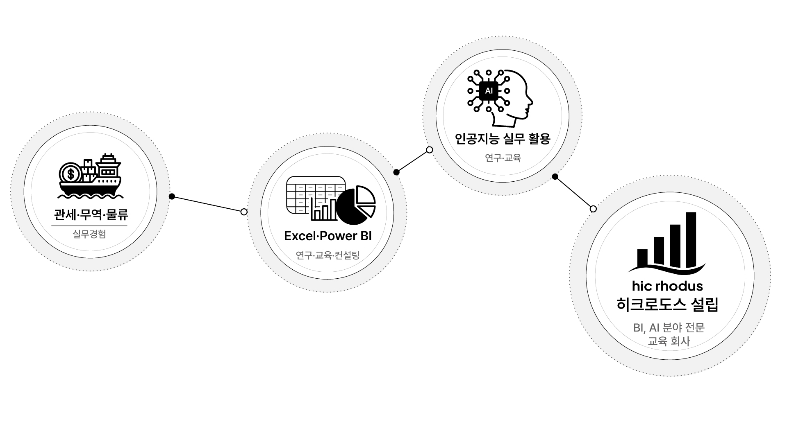
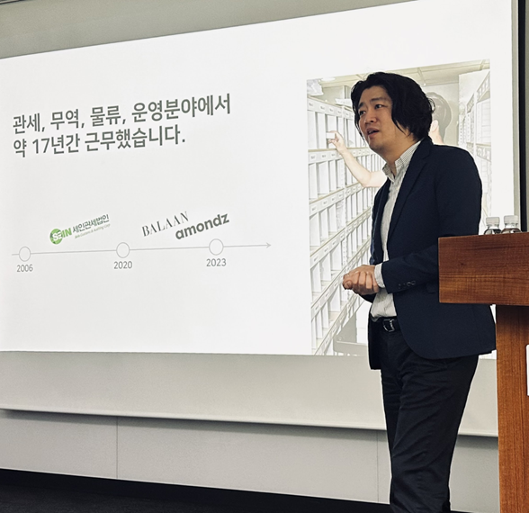

# 엑셀 강사가 ChatGPT를 가르치게 된 이유

저는 관세·무역·물류 현장에서 약 17년 동안 일했습니다.

수입 신고, 물류 운영, 재고와 일정 관리처럼 숫자와 문서가 끊임없이 쌓이는 일이었습니다. 새로운 도구를 연구하는 것이 본업은 아니었습니다. 정해진 시간 안에 실수를 줄이고, 반복되는 일을 조금이라도 더 효율적으로 처리해야 했을 뿐입니다.

그 과정에서 Excel을 깊이 사용하게 됐습니다. 일을 더 잘하기 위해 도구를 배웠고, 도구를 배우다 보니 업무의 구조가 보이기 시작했습니다. 나중에는 Power BI로 데이터를 연결하고 시각화했으며, 지금은 생성형 AI를 실제 업무에 어떻게 연결할 수 있는지 연구하고 교육하고 있습니다.

돌이켜보면 Excel에서 Power BI로, 다시 ChatGPT로 관심 분야가 바뀐 것처럼 보입니다. 하지만 제가 계속 붙잡고 있던 질문은 하나였습니다.

> 좋은 도구를 사용하면 우리의 일을 얼마나 더 잘할 수 있을까?



## 도구보다 먼저 일이 있었습니다

Excel을 처음 배울 때부터 강사가 되려고 했던 것은 아닙니다. 실무에서 같은 자료를 반복해서 정리하고, 여러 파일의 숫자를 대조하고, 결과를 보고해야 했습니다. 수작업을 줄이려고 수식을 익혔고, 데이터가 많아지자 피벗 테이블과 Power Query를 사용했습니다.

도구의 기능은 문제를 해결하는 과정에서 배웠습니다.

그래서 저는 새로운 소프트웨어를 배울 때 기능 목록부터 외우는 방법을 선호하지 않습니다. 먼저 내가 해결하려는 문제가 무엇인지 확인합니다. 그다음 그 문제를 해결하는 데 필요한 기능을 찾습니다.

이 순서는 ChatGPT를 배울 때도 같습니다.

많은 사람이 AI를 접하면 가장 먼저 “어떤 프롬프트를 입력해야 하나요?”라고 묻습니다. 하지만 프롬프트보다 먼저 필요한 것은 내가 하는 일에 대한 설명입니다.

- 어떤 문제를 해결해야 하는가
- 어떤 결과물이 필요한가
- 반드시 지켜야 할 조건은 무엇인가
- 내가 이미 알고 있는 정보는 무엇인가
- AI가 만든 결과를 무엇으로 판단할 것인가

이 질문에 답하지 못하면 아무리 정교한 프롬프트를 사용해도 결과는 원론적일 수밖에 없습니다.

## AI는 일을 모르는 사람을 전문가로 만들어 주지 않습니다

ChatGPT를 사용하면 문장과 이미지를 빠르게 만들 수 있습니다. 자료를 정리하고 아이디어를 확장하는 속도도 놀랄 만큼 빨라집니다. 이런 경험 때문에 AI가 사람의 일을 모두 대신할 것처럼 느껴지기도 합니다.

하지만 실제 업무에서는 속도만으로 충분하지 않습니다.

무엇이 중요한지 선택해야 하고, 사실과 추정을 구분해야 하며, 조직의 상황과 제약을 반영해야 합니다. 잘못된 수치나 표현이 들어갔을 때 그것을 발견하고 수정할 수도 있어야 합니다.

AI는 이런 판단을 자동으로 책임져 주지 않습니다. 오히려 내가 가진 지식과 경험을 크게 증폭합니다. 업무를 잘 이해하는 사람이 사용하면 강력한 협업 파트너가 되지만, 판단 기준이 없다면 그럴듯한 오류를 더 빠르게 만들 수도 있습니다.

제가 ChatGPT를 ‘딸깍 하면 결과가 나오는 자동 생성 버튼’으로 설명하지 않는 이유입니다.

## Excel을 가르치며 배운 것이 AI 교육의 기준이 됐습니다

Excel과 Power BI를 교육하면서 자주 확인한 사실이 있습니다. 기능을 많이 설명한다고 해서 학습자가 업무에 더 잘 적용하는 것은 아니라는 점입니다.

함수를 알고 있어도 어떤 문제에서 사용해야 하는지 모르면 활용하기 어렵습니다. 차트를 만들 수 있어도 무엇을 비교하고 전달해야 하는지 모르면 좋은 보고서가 되지 않습니다.

AI 교육도 마찬가지였습니다.

프롬프트 예시를 많이 제공하는 것만으로는 부족했습니다. ChatGPT의 답을 어떻게 검토하는지, 대화를 어떻게 이어가는지, 파일과 웹 검색을 언제 사용하는지, 결과를 실제 문서와 업무 흐름으로 어떻게 옮기는지까지 연결해야 했습니다.



그래서 제가 만드는 강의는 대체로 다음 순서를 따릅니다.

1. 먼저 해결할 문제를 이해합니다.
2. 필요한 개념과 도구를 연결합니다.
3. 실제 화면에서 직접 수행합니다.
4. 결과가 맞는지 확인합니다.
5. 자신의 업무에 적용할 방법을 찾습니다.

ChatGPT 마스터 클래스도 이 원칙에서 시작했습니다.

## 새로운 기능을 쫓기보다 기본기를 만들고 싶었습니다

생성형 AI는 매우 빠르게 변합니다. 어제 없던 기능이 오늘 추가되고, 화면의 메뉴와 이름도 달라집니다. 새로운 소식을 모두 따라가려 하면 배우기도 전에 지치기 쉽습니다.

그래서 변화가 빠를수록 변하지 않는 기본기가 필요하다고 생각했습니다.

- 원하는 결과를 구체적으로 설명하는 법
- 필요한 맥락과 근거를 제공하는 법
- AI의 답변을 검토하고 수정하는 법
- 개인정보와 기밀정보를 구분하는 법
- 하나의 답변을 실제 업무 결과물로 발전시키는 법

이 기본기를 갖추면 기능이 달라져도 다시 배울 수 있습니다. 반대로 특정 버튼과 프롬프트 문장만 외우면 화면이 바뀌는 순간 다시 처음으로 돌아가게 됩니다.

## 내 일을 먼저 설명해 보는 작은 실습

ChatGPT를 열기 전에 자신의 업무 하나를 골라 다음 문장을 완성해 보세요.

```text
내가 반복해서 수행하는 업무는 [업무]입니다.
이 업무를 하는 이유는 [목적]입니다.
완료된 결과물은 [형태]여야 합니다.
반드시 지켜야 할 조건은 [조건]입니다.
현재 가장 많은 시간이 드는 부분은 [작업]입니다.
```

완성한 문장을 ChatGPT에 입력하고 다음과 같이 요청합니다.

```text
위 업무에서 내가 AI와 협업할 수 있는 지점을 찾아 주세요.

업무 전체를 자동화한다고 가정하지 말고,
1. 사람이 판단해야 할 일
2. AI가 초안을 만들 수 있는 일
3. 반복을 줄일 수 있는 일
4. 결과를 검증해야 하는 일
로 나누어 설명해 주세요.
```

화면에서 확인할 것은 거창한 자동화 계획이 아닙니다. 내가 하던 일을 더 작은 단계로 설명할 수 있게 됐는지, 사람과 AI의 역할이 구분됐는지를 봐야 합니다.

이 작업이 ChatGPT 활용의 출발점입니다. AI에게 무엇을 시킬지 고민하기 전에, 내가 어떤 일을 하고 있는지 설명하는 것입니다.

## 제가 ChatGPT를 가르치는 이유

저는 오랫동안 현장에서 일했고, 일을 더 잘하기 위해 Excel과 Power BI를 배웠습니다. 이후 그 경험을 교육과 콘텐츠로 만들었고, 지금은 생성형 AI를 같은 질문으로 바라보고 있습니다.

ChatGPT를 가르치는 이유는 새로운 도구가 유행하기 때문만은 아닙니다. 좋은 도구를 제대로 사용하는 사람이 자신의 경험과 지식을 더 큰 가치로 바꿀 수 있다고 믿기 때문입니다.

AI가 우리의 일을 모두 대신하지는 않을 것입니다. 하지만 자신의 일을 이해하고, AI와 함께 생각하고 만들고 검토할 수 있는 사람의 역량은 분명히 더 커질 것입니다.

히크로도스는 Excel, Power BI와 생성형 AI의 실무 활용을 연구하고 교육합니다. ChatGPT를 기초부터 실무 활용까지 순서대로 배우고 싶다면 [무료 ChatGPT 마스터 클래스](https://wikidocs.net/book/20536)에서 이어서 학습할 수 있습니다.

강의 요청, 콘텐츠 협업, 기업 교육과 컨설팅을 포함한 모든 문의는 [hicrhodus@hicrhodus.com](mailto:hicrhodus@hicrhodus.com)으로 보내 주세요.

## 영상으로 이어서 보기

아래 영상에서는 저의 실무 배경과 ChatGPT 마스터 클래스를 만들게 된 이유를 직접 설명합니다.

<!-- 브런치 발행 시 아래 URL을 붙여 넣어 영상 임베드를 생성하고, 재생 여부를 확인한다. -->

https://www.youtube.com/watch?v=7_DJj_cks4c
