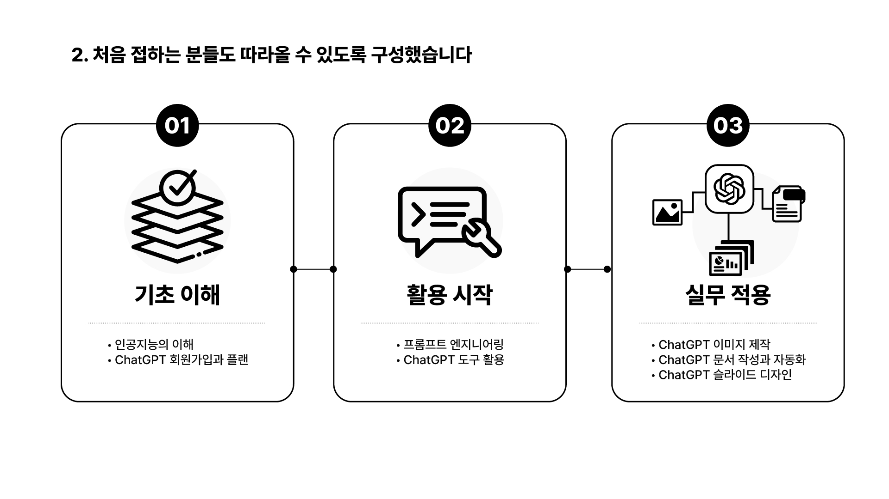
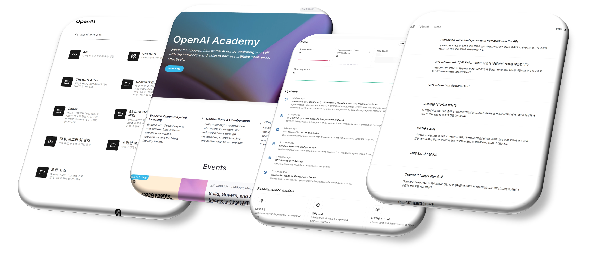

# ChatGPT 배우는 순서 02｜초보자가 먼저 익힐 핵심 기능

> 기능을 하나씩 따라 하기 전에 전체 학습 지도를 잡아야 길을 잃지 않습니다

ChatGPT를 처음 배운다면 **기초 이해 → 대화와 프롬프트 → 자료 조사와 문서 작성 → 업무 흐름 연결** 순서가 좋습니다. 최신 기능을 무작정 따라 하기보다, 질문하고 답을 검토하는 기본기를 만든 뒤 자신의 업무에 필요한 기능을 연결해야 오래 사용할 수 있습니다.

이 글에서는 ChatGPT 초보자가 무엇부터 어떤 순서로 공부하면 좋은지 정리하고, 자신의 수준에 맞는 4주 학습 계획을 만드는 프롬프트까지 제공합니다.

## 이 글의 핵심 요약

- 처음에는 계정·화면·대화 구조와 AI 답변의 한계를 이해합니다.
- 다음에는 목표·맥락·조건·출력 형식을 설명하고 후속 질문하는 법을 익힙니다.
- 그다음 파일, 웹 검색, 리서치와 문서 작성을 실제 업무에 연결합니다.
- 마지막에는 프로젝트와 반복 작업 등으로 자신의 업무 흐름을 정리합니다.
- 기능 제공 범위는 플랜과 업데이트에 따라 달라질 수 있으므로 발행 시점의 공식 안내와 실제 화면을 확인합니다.

## ChatGPT 공부가 막막한 이유

ChatGPT의 대화창은 단순해 보이지만 할 수 있는 일은 많습니다.

질문과 아이디어 정리, 파일 분석, 웹 검색, 심층 리서치, 이메일과 보고서 작성, 프로젝트 관리, 반복 작업 예약, 이미지 생성과 편집까지 이어집니다. 누군가는 프롬프트부터 배우라고 하고, 누군가는 최신 기능부터 써 보라고 합니다.

처음부터 모든 기능을 배우려 하면 각각의 버튼은 기억해도 언제 왜 사용해야 하는지는 연결되지 않습니다.

예를 들어 웹 검색은 단순히 검색 버튼을 누르는 일이 아닙니다. 찾으려는 정보의 기준을 정하고, 출처와 날짜를 확인하고, 중요한 주장을 원문과 대조해야 합니다. 업무 글쓰기도 한 문장으로 완성본을 요청하는 일이 아니라 생각을 꺼내고, 구조를 만들고, 근거를 넣고, 독자에게 맞게 수정하는 과정입니다.

따라서 ChatGPT 학습에는 기능 목록보다 **사용의 순서**가 필요합니다.

당장 해결해야 할 일이 있다면 필요한 기능부터 골라 배워도 됩니다. 다만 ChatGPT를 처음 접한다면 전체 과정을 한 번은 순서대로 경험하는 편이 좋습니다. 앞 단계의 기본기가 뒤 단계의 결과 품질과 안전성을 결정하기 때문입니다.

## 1단계｜ChatGPT의 기본과 한계 이해하기

첫 단계에서는 능숙하게 사용하는 것보다 안전하게 시작하는 것이 중요합니다.

먼저 다음 내용을 확인합니다.

- 대화가 어떤 방식으로 이어지는가
- 화면의 각 영역과 주요 입력 방법은 무엇인가
- 맞춤 설정과 기억 기능은 어떤 정보를 활용하는가
- 플랜에 따라 사용할 수 있는 기능이 어떻게 달라지는가
- ChatGPT는 왜 틀린 답이나 오래된 정보를 만들 수 있는가
- 개인정보와 회사 기밀은 어떻게 구분해야 하는가

이 단계의 완료 기준은 “기능을 모두 사용했다”가 아닙니다. ChatGPT가 잘하는 일과 사람이 직접 확인해야 하는 일을 구분할 수 있으면 됩니다.

무료 플랜으로도 기본 대화와 프롬프트 연습을 시작할 수 있습니다. 다만 기능과 사용량은 플랜과 시점에 따라 달라질 수 있으므로, 현재 계정 화면과 공식 안내를 함께 확인하세요.

## 2단계｜질문보다 좋은 대화를 만드는 법 익히기

기본을 이해했다면 원하는 결과를 설명하고 답변을 개선하는 연습을 합니다.

좋은 요청에는 보통 네 가지가 들어갑니다.

1. 목표: 무엇을 만들거나 해결하려는가
2. 맥락: 누구를 위한 어떤 상황인가
3. 조건: 반드시 지키거나 피해야 할 것은 무엇인가
4. 출력 형식: 표, 목록, 이메일 등 어떤 형태가 필요한가

프롬프트 공식을 외우는 것부터 시작할 필요는 없습니다. 먼저 대화 구조, 정보 보호와 결과 검토를 이해한 뒤 목표·맥락·조건·출력 형식을 하나씩 추가하는 편이 좋습니다.

한 번의 요청으로 끝내지 않는 것도 중요합니다. 첫 답을 받은 뒤 부족한 근거를 추가하고, 표현을 고치고, 완료 기준으로 다시 평가하면서 결과를 발전시킵니다.

이 단계의 완료 기준은 저장해 둔 프롬프트 개수가 아니라, **첫 답변을 자신의 목적에 맞게 수정할 수 있는가**입니다.

## 3단계｜자료 조사와 문서 작성에 적용하기

다음에는 ChatGPT를 실제 결과물에 연결합니다.

- 사진과 파일을 추가하기 전에 민감정보를 점검합니다.
- 웹 검색 결과의 출처와 최신성을 확인합니다.
- 복잡한 조사에는 목적, 범위와 결과 형식을 먼저 지정합니다.
- 이메일, 보고서와 기획서는 개요부터 만들고 근거를 넣습니다.
- 표와 코드처럼 복사해 사용할 결과는 읽기 좋은 형식으로 요청합니다.
- AI가 만든 결과는 원문, 수치와 조직 기준으로 검토합니다.

이 단계에서는 “사용해 봤다”보다 “내 업무 결과물이 실제로 달라졌다”를 완료 기준으로 삼습니다.

처음부터 복잡한 업무를 맡길 필요는 없습니다. 이메일 초안이나 회의 내용 정리처럼 사람이 쉽게 검토할 수 있는 작은 작업 하나를 골라 반복한 뒤, 정확성과 효율이 확인되면 적용 범위를 넓히세요.

## 4단계｜업무 흐름으로 연결하기

여러 기능을 사용할 수 있게 됐다면 흩어진 대화와 자료를 하나의 업무 흐름으로 묶습니다.

예를 들어 장기 프로젝트라면 관련 대화와 참고자료를 함께 관리하고, 정해진 시각에 반복하는 정보 확인 업무는 예약 작업으로 분리할 수 있습니다. 이미지가 필요한 보고서라면 목적과 규격을 먼저 정한 뒤 생성하고, 실제 사용 전에 글자·브랜드·저작권 요소를 검수합니다.

현재 OpenAI 공식 문서에서도 프로젝트, 예약 작업과 이미지 생성은 각각 별도의 작업 방식으로 안내합니다. 기능의 사용 가능 여부와 화면은 계정, 플랜과 업데이트에 따라 달라질 수 있으므로 실제 사용 전 공식 안내를 확인하는 편이 안전합니다.

- 프로젝트: https://learn.chatgpt.com/docs/projects
- 예약 작업: https://learn.chatgpt.com/docs/automations
- 이미지 생성: https://learn.chatgpt.com/docs/image-generation

이 단계의 목표는 기능을 많이 연결하는 것이 아닙니다. 반복되는 한 가지 업무가 더 빠르고 정확하게 끝나도록 작은 흐름을 완성하는 것입니다.

모든 최신 기능을 즉시 따라갈 필요도 없습니다. 목표를 설명하고, 근거를 제공하고, 결과를 검토하는 기본기를 먼저 갖추면 기능이 바뀌어도 자신의 업무 흐름 안에서 다시 판단할 수 있습니다.

## 나에게 맞는 출발점 찾기

현재 상태와 가장 가까운 항목을 골라 보세요.

### A. ChatGPT를 거의 사용하지 않았다

계정, 화면, 기본 대화와 결과 검토부터 시작합니다. 처음부터 자동화를 목표로 잡지 말고 질문하고 답을 확인하는 경험을 충분히 쌓습니다.

### B. 간단한 질문과 검색에만 사용한다

목표·맥락·조건·출력 형식을 넣는 연습과 후속 질문으로 결과를 개선하는 연습이 필요합니다. 맞춤 설정과 기억 기능도 함께 점검합니다.

### C. 파일과 글쓰기에 사용하지만 결과가 들쭉날쭉하다

근거 범위를 정하고, 작업을 여러 단계로 나누고, 완료 기준을 제시합니다. 검색과 리서치 결과의 출처를 직접 확인하는 습관도 필요합니다.

### D. 여러 기능을 쓰지만 업무 흐름으로 연결되지 않는다

프로젝트를 기준으로 자료와 대화를 묶고, 사람의 판단과 AI의 역할을 나눕니다. 반복 업무는 작은 단위부터 예약하거나 표준 절차로 정리합니다.

## 실습｜나만의 4주 ChatGPT 학습 계획 만들기

아래 프롬프트에서 대괄호 안을 채워 ChatGPT에 입력해 보세요.

~~~text
나는 ChatGPT를 체계적으로 배우려고 합니다.

현재 사용 수준:
[처음 사용 / 간단한 질문 / 파일·글쓰기 활용 / 여러 기능 사용]

주로 해결하고 싶은 업무:
[업무를 구체적으로 작성]

일주일에 학습할 수 있는 시간:
[시간]

4주 학습 계획을 다음 순서로 만들어 주세요.
1주차: 기초 이해와 안전한 사용
2주차: 대화와 프롬프트
3주차: 자료 조사와 문서 작성
4주차: 업무 흐름으로 연결

각 주차마다 다음 내용을 포함해 주세요.
- 반드시 이해할 개념
- 직접 수행할 실습
- 완료 여부를 확인할 기준
- 실제 업무에 적용할 작은 과제
- 예상 소요 시간

내가 제공하지 않은 업무 상황은 임의로 가정하지 말고,
계획에 꼭 필요한 정보가 있으면 먼저 질문해 주세요.
~~~

### 계획을 받은 뒤 확인할 것

- 현재 수준보다 지나치게 어려운 기능부터 시작하지 않는가
- 매주 실제로 수행할 실습이 있는가
- “배운다”가 아니라 확인 가능한 완료 기준이 있는가
- 자신의 실제 업무에 적용할 작은 과제가 있는가
- 주어진 학습 시간 안에 실행 가능한 분량인가

항목이 너무 많다면 줄여 달라고 요청하세요. 많은 기능을 얕게 체험하는 것보다 한 가지 결과물을 끝까지 만들어 보는 편이 좋습니다.

## ChatGPT를 잘 배운다는 것

ChatGPT를 잘 사용한다는 것은 모든 기능을 기억하는 일이 아닙니다.

내가 해결하려는 문제를 이해하고, 적절한 기능을 선택하고, 필요한 맥락을 제공하고, 결과를 검토해 실제 업무에 적용하는 일입니다.

학습 순서는 다음처럼 정리할 수 있습니다.

> 이해하기 → 대화하기 → 조사하기 → 만들기 → 업무 흐름으로 연결하기

이 지도를 가지고 시작하면 새로운 기능이 등장해도 어디에 놓아야 할지 판단할 수 있습니다. 기능을 외우는 대신 계속 학습할 수 있는 기준을 갖게 됩니다.

---

Excel, Power BI와 생성형 AI의 실무 활용을 연구하고 교육합니다. **히크로도스**는 좋은 도구를 제대로 사용해 개인과 조직의 업무 생산성을 높이는 방법을 만듭니다.

ChatGPT 마스터 클래스의 전체 강의와 실습 자료는 아래에서 무료로 학습할 수 있습니다.

https://www.hicrhodus.com/classes/305648

강의 요청, 기업 교육, 컨설팅과 콘텐츠 협업을 포함한 모든 문의는 **hicrhodus@hicrhodus.com**으로 보내 주세요.

## 영상으로 따라 하기

이 글은 히크로도스 오리지널 **ChatGPT 마스터 클래스**의 과정 소개 강의를 바탕으로 정리했습니다. 학습 대상과 전체 과정, 기능을 배우는 순서는 아래 영상에서 확인할 수 있습니다.

https://www.youtube.com/watch?v=RtzPdhQZ63A

<!-- 네이버 발행 메모
카테고리: AI
태그: ChatGPT배우는순서, ChatGPT초보, ChatGPT공부, 프롬프트, 생성형AI, 업무자동화, 히크로도스
대표 이미지 후보: assets/01-2-1_2structure.jpg
YouTube 링크를 글의 마지막에 붙여 임베드를 생성하고 재생 여부를 확인한다.
-->
