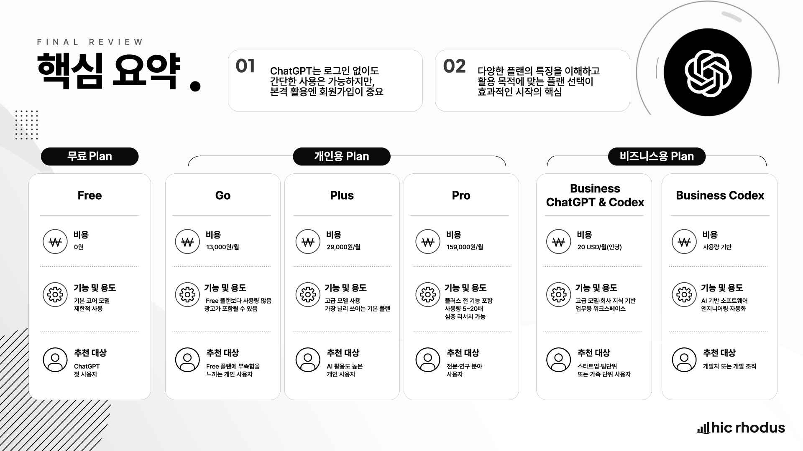

# ChatGPT 요금제 비교 04｜무료와 유료 플랜 선택 기준

> 비싼 플랜보다 사용 빈도·업무 범위·협업과 보안 요구에 맞는 플랜이 좋습니다

ChatGPT를 처음 시작한다면 무료 플랜으로 실제 업무를 먼저 시험해 보는 것이 좋습니다. 사용량 제한이 자주 업무를 막거나, 더 많은 기능과 작업량이 필요해질 때 개인용 유료 플랜을 검토하면 됩니다. 여러 사람이 회사 자료를 다룬다면 개인 플랜의 가격보다 조직용 워크스페이스와 관리·보안 기능을 먼저 봐야 합니다.

플랜은 기능 이름만 비교해서 고르기 어렵습니다. **누가, 얼마나 자주, 어떤 자료로, 어떤 책임 아래 사용하는지**가 선택 기준입니다.

## 이 글의 핵심 요약

- 처음 사용하는 개인은 Free로 자신의 활용 목적을 확인합니다.
- 가벼운 유료 사용은 Go, 정기적인 개인 업무 활용은 Plus를 검토합니다.
- 사용량과 고급 작업 요구가 큰 개인은 Pro가 후보입니다.
- 여러 구성원이 회사 자료로 협업하면 Business 또는 Enterprise를 검토합니다.
- 지역·플랫폼·계정에 따라 가격과 기능이 달라질 수 있으므로 결제 직전 공식 화면을 확인합니다.

## 현재 ChatGPT 플랜을 한눈에 보기

OpenAI 공식 가격 안내에는 개인용으로 Free, Go, Plus, Pro가, 조직용으로 Business와 Enterprise·Edu가 제시되어 있습니다.

2026년 10월 7일 공식 문서에 표시된 미국 달러 기준 가격은 다음과 같습니다.

| 플랜 | 공식 표시 가격 | 적합한 출발점 |
| --- | ---: | --- |
| Free | 월 0달러 | 처음 체험하고 기본 대화를 익히는 개인 |
| Go | 월 8달러 | 가벼운 유료 사용과 기본 사용량 확장이 필요한 개인 |
| Plus | 월 20달러 | ChatGPT를 정기적으로 학습·업무에 사용하는 개인 |
| Pro | 월 100달러부터 | 높은 사용량과 고급 작업을 자주 수행하는 개인 |
| Business | 연간 결제 시 사용자당 월 20달러, 월간 결제 시 25달러 | 2명 이상 조직의 공동 사용과 관리 |
| Enterprise·Edu | 영업 문의 | 대규모 도입, 고급 관리·보안·거버넌스가 필요한 조직 |

가격, 제공 기능과 사용량은 변경될 수 있고 실제 결제 금액은 지역·세금·결제 조건에 따라 달라질 수 있습니다. 결제 전에는 아래 공식 가격 페이지와 자신의 업그레이드 화면을 확인하세요.

https://learn.chatgpt.com/docs/pricing

## Free｜먼저 실제 사용 목적을 확인합니다

Free 플랜은 ChatGPT를 처음 접하고 기본적인 대화를 익히는 출발점입니다.

다음과 같은 경우 무료 플랜으로 시작해도 충분합니다.

- ChatGPT를 이제 막 배우기 시작했습니다.
- 가끔 질문하거나 문장을 다듬습니다.
- 자신의 업무에 어떤 도움이 되는지 아직 확실하지 않습니다.
- 유료 결제 전에 실제 사용 습관을 확인하고 싶습니다.

중요한 것은 무료 플랜에서 모든 기능을 체험하는 것이 아닙니다. 자신의 실제 업무 세 가지를 수행해 보고 결과의 유용성과 검토 부담을 확인하는 것입니다.

## Go와 Plus｜개인 업무에서 반복 사용합니다

Go는 Free보다 조금 더 여유 있는 가벼운 유료 사용을 원하는 개인에게 적합한 출발점입니다. 실제 제공 여부와 기능은 지역과 계정에 따라 확인해야 합니다.

Plus는 ChatGPT를 학습과 업무에 정기적으로 사용하는 개인에게 적합합니다. 문서 작성, 자료 조사, 파일 기반 작업처럼 대화보다 넓은 범위로 활용하면서 무료 사용량이 자주 부족해질 때 검토할 수 있습니다.

두 플랜을 비교할 때는 “어느 플랜이 더 좋나”보다 다음을 확인하세요.

- 일주일에 며칠 사용하는가
- 사용량 제한 때문에 작업이 중단되는가
- 파일·검색·이미지 등 필요한 기능이 현재 플랜에서 제공되는가
- 중요한 업무를 어느 정도 자주 수행하는가
- 추가 비용보다 절약되는 시간이 더 큰가

## Pro｜높은 사용량이 실제 성과로 이어질 때 선택합니다

Pro는 단순히 더 좋은 답변을 기대해서 선택하기보다, 높은 사용량과 고급 작업이 반복되는 개인에게 적합합니다.

다음 상황이 지속된다면 검토할 수 있습니다.

- 장시간 이어지는 복잡한 작업을 자주 수행합니다.
- 사용량 제한이 실제 업무 일정에 반복적으로 영향을 줍니다.
- 여러 파일과 도구를 사용하는 무거운 작업이 많습니다.
- 추가 비용을 상쇄할 만큼 시간 절약이나 매출 기여가 분명합니다.

가끔 어려운 질문을 한다는 이유만으로 가장 높은 플랜이 필요한 것은 아닙니다. 한 달 동안 실제 사용량과 업무 효과를 기록한 뒤 결정하는 편이 좋습니다.

## Business와 Enterprise｜조직의 관리 기준으로 판단합니다

여러 사람이 회사 자료를 사용한다면 개인별 유료 계정을 나눠 쓰는 것보다 조직용 플랜을 검토해야 합니다.

Business는 전용 워크스페이스, 사용자 관리, SAML SSO와 MFA 같은 기본 관리 기능이 필요한 조직을 대상으로 합니다. 공식 안내는 비즈니스 데이터가 기본적으로 모델 학습에 사용되지 않는다고 설명합니다.

Enterprise와 Edu는 더 큰 조직에서 역할 기반 접근, 감사 로그, 데이터 보존과 거주지 제어 등 고급 관리가 필요할 때 검토합니다.

조직용 플랜은 가격만으로 결정하지 않습니다.

- 누가 계정을 만들고 회수하는가
- 어떤 자료를 입력할 수 있는가
- 대화와 결과물을 누가 관리하는가
- 퇴사·이동 시 접근 권한을 어떻게 처리하는가
- 감사와 보안 정책을 어떻게 적용하는가
- 사용량과 비용을 누가 점검하는가

기업 도입에서는 “기능을 더 많이 쓸 수 있는가”보다 “조직이 책임 있게 관리할 수 있는가”가 더 중요한 기준입니다.

## 실습｜7일 사용 기록으로 플랜 결정하기

결제 화면을 보기 전에 일주일 동안 실제 사용을 기록해 보세요.

| 기록 항목 | 작성 내용 |
| --- | --- |
| 사용한 날짜 | 일주일 중 실제 사용한 날 |
| 수행한 업무 | 이메일, 보고서, 검색, 파일 분석 등 |
| 제한 경험 | 사용량이나 기능 때문에 멈춘 작업 |
| 절약한 시간 | 기존 방식과 비교한 대략적인 시간 |
| 검토 부담 | 사실 확인과 수정에 든 시간 |
| 민감정보 여부 | 개인정보·회사 자료 포함 여부 |
| 협업 인원 | 혼자 또는 여러 구성원 |

일주일 뒤 다음 순서로 판단합니다.

1. 실제 사용이 드물다면 Free를 유지합니다.
2. 개인이 반복 사용하고 제한이 자주 발생하면 Go 또는 Plus를 비교합니다.
3. 높은 사용량이 업무 성과와 연결되면 Pro를 검토합니다.
4. 여러 사람이 회사 자료를 다룬다면 Business·Enterprise의 관리 요건을 검토합니다.
5. 결제 직전 현재 가격, 기능, 사용량과 해지 조건을 다시 확인합니다.

## 회원가입 후 첫 대화까지 완료하기

처음 시작한다면 웹 브라우저에서 chatgpt.com에 접속해 계정을 만듭니다. Google, Apple, Microsoft 계정 또는 이메일을 사용할 수 있으며, 회사 업무에 사용할 때는 조직의 계정 정책을 먼저 확인하세요.

로그인한 뒤 아래 문장으로 첫 대화를 시작해 봅니다.

~~~text
ChatGPT를 업무에 처음 사용하려고 합니다.

내가 주로 하는 업무는 [업무]입니다.
일주일에 [횟수] 정도 반복합니다.

무료 플랜에서 먼저 시험해 볼 만한 작은 작업 세 가지를 제안해 주세요.
각 작업마다 입력할 정보, 기대 결과와 사람이 확인할 항목을 알려 주세요.
내가 제공하지 않은 업무 상황은 임의로 가정하지 마세요.
~~~

이 세 가지를 실제로 수행해 본 뒤 유료 플랜이 필요한지 판단하세요. 소개 페이지의 기능 목록보다 자신의 사용 기록이 더 정확한 선택 근거가 됩니다.

## 가장 좋은 플랜은 필요한 순간에 선택한 플랜입니다

처음부터 유료 플랜을 선택해야 ChatGPT를 제대로 배울 수 있는 것은 아닙니다. 무료 플랜으로 실제 업무를 시험하고, 반복되는 불편과 필요한 기능이 분명해졌을 때 업그레이드해도 늦지 않습니다.

반대로 여러 사람이 회사 자료를 다루는데 개인 플랜만 비교해서도 안 됩니다. 이 경우에는 계정 관리, 데이터 정책과 감사 기준이 먼저입니다.

가격보다 사용 목적과 책임 범위를 기준으로 선택하세요. 플랜은 좋은 결과를 자동으로 보장하지 않지만, 자신에게 맞는 작업 환경은 꾸준한 활용을 돕습니다.

---

Excel, Power BI와 생성형 AI의 실무 활용을 연구하고 교육합니다. **히크로도스**는 좋은 도구를 제대로 사용해 개인과 조직의 업무 생산성을 높이는 방법을 만듭니다.

ChatGPT 마스터 클래스의 전체 강의와 실습 자료는 아래에서 무료로 학습할 수 있습니다.

https://www.hicrhodus.com/classes/305648

강의 요청, 기업 교육, 컨설팅과 콘텐츠 협업을 포함한 모든 문의는 **hicrhodus@hicrhodus.com**으로 보내 주세요.

## 영상으로 따라 하기

이 글은 히크로도스 오리지널 **ChatGPT 마스터 클래스**의 ‘ChatGPT 시작하기: 회원가입과 플랜’ 강의를 바탕으로 정리했습니다. 가입 과정과 플랜 구조는 아래 영상에서 화면과 함께 확인할 수 있습니다. 영상 촬영 이후 가격과 기능이 달라졌을 수 있으므로 결제 전 공식 화면을 다시 확인하세요.

https://www.youtube.com/watch?v=Ik3Ip-sSaTY

<!-- 네이버 발행 메모
카테고리: AI
태그: ChatGPT요금제, ChatGPT무료, ChatGPTPlus, ChatGPTPro, 생성형AI, AI업무활용, 히크로도스
대표 이미지 후보: assets/02-2-3_summary.jpg
가격 기준일: 2026-10-07
발행 직전 공식 가격 페이지와 실제 업그레이드 화면을 재확인한다.
YouTube 링크를 글의 마지막에 붙여 임베드를 생성하고 재생 여부를 확인한다.
-->
