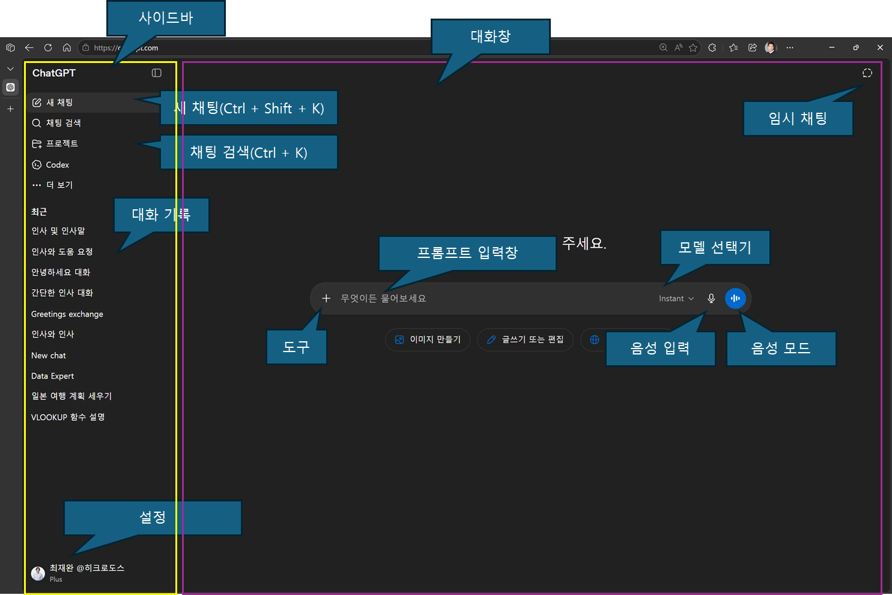
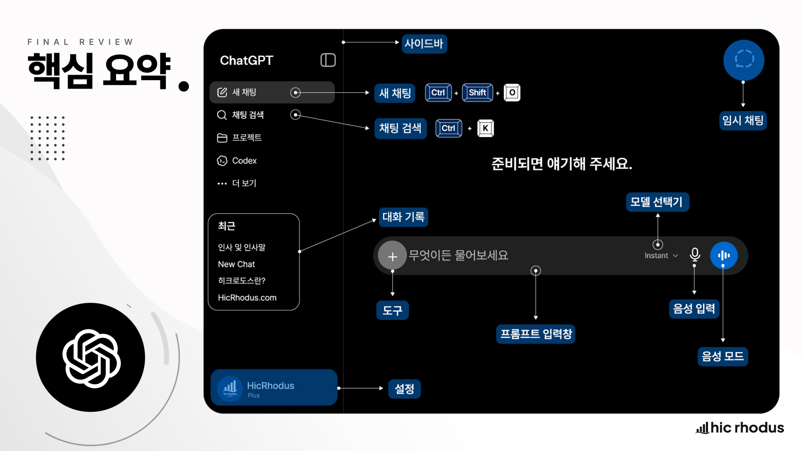

# ChatGPT 화면 구성 05｜처음 보는 메뉴와 버튼 읽는 법

> 버튼 이름을 외우기보다 대화 관리·작업·입력 영역의 역할을 이해해야 합니다

ChatGPT 화면을 처음 보면 가운데 입력창만 눈에 들어옵니다. 하지만 업무에 제대로 활용하려면 이전 대화를 찾는 영역, 현재 작업을 진행하는 영역, 파일과 도구를 추가하는 입력 영역을 구분할 수 있어야 합니다.

화면은 업데이트와 플랜에 따라 달라질 수 있습니다. 특정 버튼 위치를 외우기보다 **어디에서 대화를 관리하고, 어디에서 작업하며, 어디에서 입력과 도구를 선택하는지**를 이해하면 화면이 바뀌어도 적응할 수 있습니다.

## 이 글의 핵심 요약

- 사이드바는 새 대화, 이전 대화와 설정을 관리하는 공간입니다.
- 중앙 화면은 답변을 읽고 결과물을 검토하는 작업 공간입니다.
- 입력창은 질문뿐 아니라 파일·검색·이미지·음성 등 작업 방법을 지정하는 출발점입니다.
- 같은 목적은 한 대화에서 이어 가고, 주제가 달라지면 새 채팅으로 분리합니다.
- 표시되는 기능은 플랜·플랫폼·지역·업데이트에 따라 달라질 수 있습니다.

## 화면은 세 영역으로 나누어 봅니다

ChatGPT 웹 화면은 다음 세 영역으로 이해하면 쉽습니다.

| 영역 | 주된 역할 | 먼저 확인할 것 |
| --- | --- | --- |
| 사이드바 | 새 채팅, 대화 목록, 검색, 설정 | 이전 작업을 어디에서 찾는가 |
| 중앙 작업 영역 | 대화와 결과물 확인 | 현재 어떤 대화·작업을 보고 있는가 |
| 입력 영역 | 프롬프트, 파일, 도구, 음성 | 무엇을 어떤 방식으로 요청할 것인가 |

모바일이나 데스크톱 앱에서는 위치와 아이콘이 달라질 수 있지만 역할은 비슷합니다.

## 사이드바｜대화와 설정을 관리합니다

사이드바는 새 채팅을 시작하고 이전 대화를 다시 찾는 공간입니다.

ChatGPT는 같은 대화 안에서 앞서 나눈 맥락을 참고합니다. 따라서 같은 목표의 작업은 한 대화에서 이어 가고, 목적이 완전히 달라지면 새 채팅으로 분리하는 편이 좋습니다.

예를 들어 다음 두 작업은 별도 대화가 적절합니다.

- 고객사 교육 제안서 작성
- 개인 여행 일정 계획

반면 제안서의 개요를 만들고, 본문을 작성하고, 문장을 수정하는 과정은 같은 대화에서 이어 가는 편이 자연스럽습니다.

대화가 많아지면 제목만 훑지 말고 검색 기능을 사용하세요. 기억나는 키워드, 고객사명, 결과물 종류로 찾으면 이전 맥락을 다시 활용할 수 있습니다.

설정 메뉴에서는 계정, 플랜, 개인화, 데이터와 알림 등 사용 환경을 확인할 수 있습니다. 중요한 것은 모든 설정을 한 번에 바꾸는 것이 아니라, 업무 사용 전에 개인정보·데이터 관련 항목과 개인화 상태를 먼저 점검하는 것입니다.

## 중앙 작업 영역｜답변을 읽고 검토합니다

중앙 영역은 ChatGPT의 답변과 작업 결과를 확인하는 공간입니다.

답변을 읽을 때는 내용만 보지 말고 다음 행동도 결정해야 합니다.

- 그대로 사용할 수 있는 부분은 무엇인가
- 사실과 수치를 다시 확인할 부분은 무엇인가
- 추가해야 할 맥락이나 자료는 무엇인가
- 수정할 형식과 표현은 무엇인가
- 새 대화로 분리해야 할 정도로 목적이 달라졌는가

상단에는 모델이나 작업 방식을 선택하는 메뉴가 표시될 수 있습니다. 제공되는 선택지는 플랜과 화면에 따라 달라지므로 특정 모델명을 외우기보다 “빠른 일상 작업인지, 더 깊은 분석이 필요한지”를 기준으로 선택하세요.

OpenAI 공식 안내도 간단한 질문과 초안은 대화에서 시작하고, 더 큰 작업은 필요한 맥락과 도구를 추가한 뒤 검토 가능한 결과로 발전시키는 흐름을 설명합니다.

https://learn.chatgpt.com/docs/use-chatgpt

## 입력창｜질문과 작업 방법을 함께 지정합니다

화면 아래쪽 입력창은 단순히 글자를 입력하는 칸이 아닙니다. ChatGPT에 목표를 설명하고 필요한 자료와 도구를 연결하는 작업 출발점입니다.

입력 영역에서는 계정과 플랜에 따라 다음과 같은 기능이 표시될 수 있습니다.

- 질문과 요청 입력
- 사진·문서·스프레드시트 등 파일 추가
- 웹 검색과 자료 조사
- 이미지 생성
- 연결된 앱이나 자료원 사용
- 음성 입력과 음성 대화
- 결과물 형식과 작업 모드 선택

도구가 보인다고 모두 사용할 필요는 없습니다. 먼저 원하는 결과를 정하고, 그 결과에 필요한 도구만 선택하세요.

예를 들어 최신 정책을 확인하려면 웹 검색과 출처가 필요하고, 첨부된 표를 분석하려면 파일과 분석 기준이 필요합니다. 도구는 목적을 대신하지 않고 목적을 수행하는 방법을 확장합니다.

## 음성 입력과 음성 모드는 다릅니다

비슷해 보이지만 두 기능의 목적은 다릅니다.

| 구분 | 음성 입력 | 음성 모드 |
| --- | --- | --- |
| 역할 | 말한 내용을 텍스트로 변환 | ChatGPT와 음성으로 대화 |
| 확인 방식 | 전송 전 문장을 읽고 수정 | 말로 질문하고 음성 답변 청취 |
| 적합한 상황 | 긴 요청 초안, 빠른 메모 | 아이디어 발산, 이동 중 대화, 회화 연습 |

업무용 요청은 음성으로 입력했더라도 전송 전에 이름·수치·전문용어가 정확한지 확인하세요. 주변 사람의 개인정보나 회의 내용이 의도하지 않게 포함되지 않았는지도 점검해야 합니다.

## 임시 채팅과 일반 채팅을 구분합니다

임시 채팅은 일반 대화 기록과 개인화의 영향을 줄이고 일회성으로 대화하고 싶을 때 사용할 수 있습니다. 화면과 제공 방식은 계정에 따라 달라질 수 있습니다.

다만 임시 채팅은 회사 기밀을 자유롭게 입력해도 된다는 뜻이 아닙니다. 기록 방식과 별개로 개인정보, 고객정보, 계약정보와 영업비밀은 조직의 정책과 계정 조건을 먼저 확인해야 합니다.

즉, 임시 채팅은 대화 관리 방식이지 보안 정책을 대신하는 기능이 아닙니다.

## 실습｜5분 동안 화면의 역할 확인하기

현재 ChatGPT 화면에서 다음 작업을 순서대로 수행해 보세요.

1. 새 채팅을 시작합니다.
2. 아래 프롬프트를 입력하고 답변을 받습니다.
3. 같은 대화에서 후속 질문을 한 번 보냅니다.
4. 새 채팅을 하나 더 만든 뒤 첫 대화를 검색해 다시 엽니다.
5. 설정 메뉴에서 개인화와 데이터 관련 항목의 위치를 확인합니다.
6. 입력창에서 파일·검색·음성 관련 버튼이 어디에 있는지 확인합니다.
7. 실제로 사용하지 않을 기능은 실행하지 않고 위치와 역할만 확인합니다.

첫 프롬프트는 다음처럼 간단하게 시작합니다.

~~~text
ChatGPT 화면을 처음 익히고 있습니다.
지금부터 간단한 업무 메모를 정리해 주세요.

메모:
내일까지 회의 안건을 세 개로 정리하고
각 안건의 담당자와 준비 자료를 확인해야 합니다.

결과는 안건, 담당자, 준비 자료 열을 가진 표로 작성해 주세요.
정보가 없는 칸에는 추측하지 말고 ‘확인 필요’라고 표시해 주세요.
~~~

답변을 받은 뒤 다음 후속 요청을 보냅니다.

~~~text
표에서 내가 오늘 확인해야 할 항목만 별도 목록으로 정리해 주세요.
~~~

## 화면을 이해했다는 완료 기준

다음 질문에 답할 수 있으면 기본 화면을 이해한 것입니다.

- 새 주제를 어디에서 시작하는가
- 이전 대화를 어떻게 검색하고 다시 여는가
- 계정과 개인화·데이터 설정을 어디에서 확인하는가
- 질문과 파일을 어디에서 입력하는가
- 결과를 받은 뒤 같은 대화에서 어떻게 수정하는가
- 음성 입력과 음성 대화가 어떻게 다른가
- 화면에 보이는 기능이 계정마다 다를 수 있다는 점을 알고 있는가

버튼의 정확한 위치는 바뀔 수 있습니다. 그러나 대화를 관리하고, 필요한 맥락을 제공하고, 결과를 검토하는 작업 흐름은 그대로 유지됩니다.

---

Excel, Power BI와 생성형 AI의 실무 활용을 연구하고 교육합니다. **히크로도스**는 좋은 도구를 제대로 사용해 개인과 조직의 업무 생산성을 높이는 방법을 만듭니다.

ChatGPT 마스터 클래스의 전체 강의와 실습 자료는 아래에서 무료로 학습할 수 있습니다.

https://www.hicrhodus.com/classes/305648

강의 요청, 기업 교육, 컨설팅과 콘텐츠 협업을 포함한 모든 문의는 **hicrhodus@hicrhodus.com**으로 보내 주세요.

## 영상으로 따라 하기

이 글은 히크로도스 오리지널 **ChatGPT 마스터 클래스**의 ‘ChatGPT UI’ 강의를 바탕으로 정리했습니다. 사이드바, 입력창과 주요 기능의 위치는 아래 영상에서 화면과 함께 확인할 수 있습니다. 영상 촬영 이후 일부 버튼의 이름과 위치가 달라졌을 수 있습니다.

https://www.youtube.com/watch?v=Ynv9UWgBV7c

<!-- 네이버 발행 메모
카테고리: AI
태그: ChatGPT화면, ChatGPT사용법, ChatGPTUI, ChatGPT초보, 생성형AI, AI업무활용, 히크로도스
대표 이미지 후보: assets/02-3-1_UI.png
발행 직전 실제 웹 화면에서 메뉴 이름과 위치를 재확인한다.
YouTube 링크를 글의 마지막에 붙여 임베드를 생성하고 재생 여부를 확인한다.
-->
